# Beadwork (bw) — a community fork of Beads Viewer


> **A community-maintained fork of [beads_viewer](https://github.com/Dicklesworthstone/beads_viewer), the terminal interface for the [Beads](https://github.com/steveyegge/beads) issue tracker.**

## Why this fork?

The original [beads_viewer](https://github.com/Dicklesworthstone/beads_viewer) by [@Dicklesworthstone](https://github.com/Dicklesworthstone) is an excellent piece of software. The architecture, the graph analysis engine, the robot protocol for AI agents: it's one of the best TUIs out there. Full credit goes to him for the design and implementation.

Per the project's [contribution guidelines](https://github.com/Dicklesworthstone/beads_viewer/blob/main/CONTRIBUTING.md), beads_viewer does not accept external pull requests. Feature requests and bug reports are welcome and the maintainer does incorporate community feedback, but the codebase is maintained solely by its author. That's a perfectly valid approach that keeps the project focused and avoids the overhead of reviewing external code.

**Beadwork** exists because I'm a long-time TUI user (K9s, Emacs) with strong opinions about navigation, keybindings, and information density. Rather than filing feature requests for changes that reflect personal workflow preferences, it made more sense to maintain a fork where I can build exactly the UX I want, and share it with anyone who feels the same way.

No hard feelings toward the original project. This is simply a differentiated offering: same powerful foundation, different UX choices. The goal is to expand the overall user base of the [Beads](https://github.com/steveyegge/beads) ecosystem by catering to different preferences.

### What's different from the original?

- **Open to contributions**: PRs are welcome here
- **Renamed binary**: `bw` instead of `bv`, so both can coexist on the same machine
- **Tree view with split pane**: hierarchical issue view with a detail panel alongside
- **Sort improvements**: persistent sort order, sort indicator in the header
- **Opinionated UX defaults**: navigation and layout choices shaped by Emacs/K9s habits

### What's the same?

All the core functionality from beads_viewer is preserved: list view, kanban board, graph view, insights dashboard, robot mode for AI agents, and the full graph analysis engine (PageRank, betweenness, HITS, critical path, and more). The excellent architecture and design are entirely [@Dicklesworthstone](https://github.com/Dicklesworthstone)'s work.

<div align="center" style="margin: 1.2em 0;">
  <table>
    <tr>
      <td align="center" style="padding: 8px;">
        
        <div><sub>Main split view: fast list + rich details</sub></div>
      </td>
      <td align="center" style="padding: 8px;">
        
        <div><sub>Kanban board (`b`) for flow at a glance</sub></div>
      </td>
    </tr>
    <tr>
      <td align="center" style="padding: 8px;">
        
        <div><sub>Insights panel: PageRank, critical path, cycles</sub></div>
      </td>
      <td align="center" style="padding: 8px;">
        
        <div><sub>Graph view (`g`): navigate the dependency DAG</sub></div>
      </td>
    </tr>
  </table>
</div>

## Installation

Requires [Go 1.22+](https://go.dev/dl/).

```bash
git clone https://github.com/vanderheijden86/beadwork.git
cd beadwork
make install
```

This installs the `bw` binary to your `$GOPATH/bin`. Make sure that directory is on your `PATH`.

For best display, use a terminal with a [Nerd Font](https://www.nerdfonts.com/).

---

## 🤖 Agent Quickstart (Robot Mode)

⚠️ **Never run bare `bv` in an agent context** — it launches the interactive TUI. Always use `--robot-*`.

```bash
# 1) Start with triage (single-call mega-command)
bv --robot-triage

# 2) Minimal mode: just the top pick + claim command
bv --robot-next

# 3) Token-optimized output (TOON)
bv --robot-triage --format toon
export BW_OUTPUT_FORMAT=toon

# 4) Full robot help
bv --robot-help
```

**Output conventions**
- stdout = JSON/TOON data only
- stderr = diagnostics
- exit 0 = success

## 💡 TL;DR

`bv` is a high-performance **Terminal User Interface (TUI)** for browsing and managing tasks in projects that use the **Beads** issue tracking system. 

**Why you'd care:**
*   **Speed:** Browse thousands of issues instantly with zero network latency.
*   **Focus:** Stay in your terminal and use Vim-style keys (`j`/`k`) to navigate.
*   **Intelligence:** It visualizes your project as a **dependency graph**, automatically highlighting bottlenecks, cycles, and critical paths that traditional list-based trackers miss.
*   **AI-Ready:** It provides structured, pre-computed insights for AI coding agents, acting as a "brain" for your project's task management.

---

## 📖 The Core Experience

At its heart, `bv` is about **viewing your work nicely**.

### ⚡ Fast, Fluid Browsing
No web page loads, no heavy clients. `bv` starts instantly and lets you fly through your issue backlog using standard Vim keys (`j`/`k`).
*   **Split-View Dashboard:** On wider screens, see your list on the left and full details on the right.
*   **Markdown Rendering:** Issue descriptions, comments, and notes are beautifully rendered with syntax highlighting, headers, and lists.
*   **Instant Filtering:** Zero-latency filtering. Press `o` for Open, `c` for Closed, or `r` for Ready (unblocked) tasks.
*   **Live Reload:** Watches `.beads/beads.jsonl` and refreshes lists, details, and insights automatically when the file changes—no restart needed.

### 🔎 Rich Context
Don't just read the title. `bv` gives you the full picture:
*   **Comments & History:** Scroll through the full conversation history of any task.
*   **Metadata:** Instantly see Assignees, Labels, Priority badges, and creation dates.
*   **Search:** Powerful fuzzy search (`/`) finds issues by ID, title, or content instantly.

### 🎯 Focused Workflows
*   **Kanban Board:** Press `b` to switch to a columnar view (Open, In Progress, Blocked, Closed) to visualize flow.
*   **Visual Graph:** Press `g` to explore the dependency tree visually.
*   **Insights:** Press `i` to see graph metrics and bottlenecks.
*   **History View:** Press `h` to see the timeline of changes, correlating git commits with bead modifications. On wider terminals, enjoy a responsive three-pane layout showing commits, affected beads, and details.
*   **Ultra-Wide Mode:** On large monitors, the list expands to show extra columns like sparklines and label tags.

### 🛠️ Quick Actions
*   **Export:** Press `E` to export all issues to a timestamped Markdown file with Mermaid diagrams.
*   **Graph Export (CLI):** `bv --robot-graph` outputs the dependency graph as JSON, DOT (Graphviz), or Mermaid format. Use `--graph-format=dot` for rendering with Graphviz, or `--graph-root=ID --graph-depth=3` to extract focused subgraphs.
*   **Copy:** Press `C` to copy the selected issue as formatted Markdown to your clipboard.
*   **Edit:** Press `O` to open the `.beads/beads.jsonl` file in your preferred GUI editor.
*   **Time-Travel:** Press `t` to compare against any git revision, or `T` for quick HEAD~5 comparison. Combined with History view (`h`), you can navigate to any commit and see exactly what changed.

### 🔌 Automation Hooks
Configure pre- and post-export hooks in `.bv/hooks.yaml` to run validations, notifications, or uploads. Defaults: pre-export hooks fail fast on errors (`on_error: fail`), post-export hooks log and continue (`on_error: continue`). Empty commands are ignored with a warning for safety. Hook env includes `BW_EXPORT_PATH`, `BW_EXPORT_FORMAT`, `BW_ISSUE_COUNT`, `BW_TIMESTAMP`, plus any custom `env` entries.

---

## 🤖 Ready-made Blurb to Drop Into Your AGENTS.md or CLAUDE.md Files

```
### Using bv as an AI sidecar

bv is a graph-aware triage engine for Beads projects (.beads/beads.jsonl). Instead of parsing JSONL or hallucinating graph traversal, use robot flags for deterministic, dependency-aware outputs with precomputed metrics (PageRank, betweenness, critical path, cycles, HITS, eigenvector, k-core).

**Scope boundary:** bv handles *what to work on* (triage, priority, planning). For agent-to-agent coordination (messaging, work claiming, file reservations), use [MCP Agent Mail](https://github.com/Dicklesworthstone/mcp_agent_mail).

**⚠️ CRITICAL: Use ONLY `--robot-*` flags. Bare `bv` launches an interactive TUI that blocks your session.**

#### The Workflow: Start With Triage

**`bv --robot-triage` is your single entry point.** It returns everything you need in one call:
- `quick_ref`: at-a-glance counts + top 3 picks
- `recommendations`: ranked actionable items with scores, reasons, unblock info
- `quick_wins`: low-effort high-impact items
- `blockers_to_clear`: items that unblock the most downstream work
- `project_health`: status/type/priority distributions, graph metrics
- `commands`: copy-paste shell commands for next steps

bv --robot-triage        # THE MEGA-COMMAND: start here
bv --robot-next          # Minimal: just the single top pick + claim command

# Token-optimized output (TOON) for lower LLM context usage:
bv --robot-triage --format toon
export BW_OUTPUT_FORMAT=toon
bv --robot-next

#### Other Commands

**Planning:**
| Command | Returns |
|---------|---------|
| `--robot-plan` | Parallel execution tracks with `unblocks` lists |
| `--robot-priority` | Priority misalignment detection with confidence |

**Graph Analysis:**
| Command | Returns |
|---------|---------|
| `--robot-insights` | Full metrics: PageRank, betweenness, HITS (hubs/authorities), eigenvector, critical path, cycles, k-core, articulation points, slack |
| `--robot-label-health` | Per-label health: `health_level` (healthy\|warning\|critical), `velocity_score`, `staleness`, `blocked_count` |
| `--robot-label-flow` | Cross-label dependency: `flow_matrix`, `dependencies`, `bottleneck_labels` |
| `--robot-label-attention [--attention-limit=N]` | Attention-ranked labels by: (pagerank × staleness × block_impact) / velocity |

**History & Change Tracking:**
| Command | Returns |
|---------|---------|
| `--robot-history` | Bead-to-commit correlations: `stats`, `histories` (per-bead events/commits/milestones), `commit_index` |
| `--robot-diff --diff-since <ref>` | Changes since ref: new/closed/modified issues, cycles introduced/resolved |

**Other Commands:**
| Command | Returns |
|---------|---------|
| `--robot-burndown <sprint>` | Sprint burndown, scope changes, at-risk items |
| `--robot-forecast <id\|all>` | ETA predictions with dependency-aware scheduling |
| `--robot-alerts` | Stale issues, blocking cascades, priority mismatches |
| `--robot-suggest` | Hygiene: duplicates, missing deps, label suggestions, cycle breaks |
| `--robot-graph [--graph-format=json\|dot\|mermaid]` | Dependency graph export |
| `--export-graph <file.html>` | Self-contained interactive HTML visualization |

#### Scoping & Filtering

bv --robot-plan --label backend              # Scope to label's subgraph
bv --robot-insights --as-of HEAD~30          # Historical point-in-time
bv --recipe actionable --robot-plan          # Pre-filter: ready to work (no blockers)
bv --recipe high-impact --robot-triage       # Pre-filter: top PageRank scores
bv --robot-triage --robot-triage-by-track    # Group by parallel work streams
bv --robot-triage --robot-triage-by-label    # Group by domain

#### Understanding Robot Output

**All robot JSON includes:**
- `data_hash` — Fingerprint of source beads.jsonl (verify consistency across calls)
- `status` — Per-metric state: `computed|approx|timeout|skipped` + elapsed ms
- `as_of` / `as_of_commit` — Present when using `--as-of`; contains ref and resolved SHA

**Two-phase analysis:**
- **Phase 1 (instant):** degree, topo sort, density — always available immediately
- **Phase 2 (async, 500ms timeout):** PageRank, betweenness, HITS, eigenvector, cycles — check `status` flags

**For large graphs (>500 nodes):** Some metrics may be approximated or skipped. Always check `status`.

#### jq Quick Reference

bv --robot-triage | jq '.quick_ref'                        # At-a-glance summary
bv --robot-triage | jq '.recommendations[0]'               # Top recommendation
bv --robot-plan | jq '.plan.summary.highest_impact'        # Best unblock target
bv --robot-insights | jq '.status'                         # Check metric readiness
bv --robot-insights | jq '.Cycles'                         # Circular deps (must fix!)
bv --robot-label-health | jq '.results.labels[] | select(.health_level == "critical")'

**Performance:** Phase 1 instant, Phase 2 async (500ms timeout). Prefer `--robot-plan` over `--robot-insights` when speed matters. Results cached by data hash.

Use bv instead of parsing beads.jsonl—it computes PageRank, critical paths, cycles, and parallel tracks deterministically.
```

### Automatic Integration

`bv` can automatically add the above instructions to your project's agent file:

- **On first run**, bv checks for AGENTS.md (or similar files) and offers to inject the blurb if not present
- Choose **"Yes"** to add the instructions, **"No"** to skip, or **"Don't ask again"** to remember your preference
- Preferences are stored per-project in `~/.config/bv/agent-prompts/`

**Supported Files** (checked in order):
1. `AGENTS.md` (preferred)
2. `CLAUDE.md`
3. `agents.md`
4. `claude.md`

**Manual Control:**

```bash
bd agents --show              # Display current blurb content
bd agents --check             # Check if blurb is present in agent file
bd agents --add               # Add blurb to agent file
bd agents --remove            # Remove blurb from agent file
bd agents --clear-preference  # Reset the "don't ask again" preference
```

**Version Tracking:**

The blurb uses HTML comment markers for version tracking:
```
<!-- bv-agent-instructions-v1 -->
... content ...
<!-- end-bv-agent-instructions -->
```

When a new version of the blurb is released, `bv` can detect the outdated version and offer to update it.

---

## 📐 Architecture & Design

`bv` treats your project as a **Directed Acyclic Graph (DAG)**, not just a list. This allows it to derive insights about what is *truly* important.

```mermaid
graph TD
    %% Soft Pastel Theme — Refined
    classDef data fill:#e3f2fd,stroke:#90caf9,stroke-width:2px,color:#1565c0,rx:8
    classDef logic fill:#fff8e1,stroke:#ffcc80,stroke-width:2px,color:#e65100,rx:8
    classDef ui fill:#f3e5f5,stroke:#ce93d8,stroke-width:2px,color:#6a1b9a,rx:8
    classDef output fill:#e8f5e9,stroke:#a5d6a7,stroke-width:2px,color:#2e7d32,rx:8

    subgraph storage [" 📂 Data Layer "]
        A[".beads/beads.jsonl<br/>JSONL Issue Store"]:::data
    end

    subgraph engine [" ⚙️ Analysis Engine "]
        B["Loader"]:::logic
        C["Graph Builder"]:::logic
        D["9 Metrics<br/>PageRank · Betweenness · HITS..."]:::logic
    end

    subgraph interface [" 🖥️ TUI Layer "]
        E["Bubble Tea Model"]:::ui
        F["List View"]:::ui
        G["Graph View"]:::ui
        G2["Tree View"]:::ui
        H["Insights Dashboard"]:::ui
    end

    subgraph outputs [" 📤 Outputs "]
        I["--robot-insights<br/>JSON for AI Agents"]:::output
        J["--export-md<br/>Markdown Report"]:::output
    end

    A --> B
    B --> C
    C --> D
    D --> E
    D --> I
    D --> J
    E --> F
    E --> G
    E --> G2
    E --> H

    linkStyle 0,1,2 stroke:#90caf9,stroke-width:2px
    linkStyle 3,4,5 stroke:#ffcc80,stroke-width:2px
    linkStyle 6,7,8,9 stroke:#ce93d8,stroke-width:2px
```



### Key Metrics & Algorithms
`bv` computes **9 graph-theoretic metrics** to surface hidden project dynamics:

| # | Metric | What It Measures | Key Insight |
|---|--------|------------------|-------------|
| 1 | **PageRank** | Recursive dependency importance | Foundational blockers |
| 2 | **Betweenness** | Shortest-path traffic | Bottlenecks & bridges |
| 3 | **HITS** | Hub/Authority duality | Epics vs. utilities |
| 4 | **Critical Path** | Longest dependency chain | Keystones with zero slack |
| 5 | **Eigenvector** | Influence via neighbors | Strategic dependencies |
| 6 | **Degree** | Direct connection counts | Immediate blockers/blocked |
| 7 | **Density** | Edge-to-node ratio | Project coupling health |
| 8 | **Cycles** | Circular dependencies | Structural errors |
| 9 | **Topo Sort** | Valid execution order | Work queue foundation |

### 1. PageRank (Dependency Authority)
**The Math:** Originally designed to rank web pages by "importance" based on incoming links, PageRank models a "random surfer" walking the graph. In our dependency graph (u → v implies u depends on v), we treat dependencies as "votes" of importance.
$$
PR(v) = \frac{1-d}{N} + d \sum_{u \in M(v)} \frac{PR(u)}{L(u)}
$$

**The Intuition:** If many tasks depend on Task A, or if a single very important Task B depends on Task A, then Task A implicitly becomes "heavy." A random walker following dependency links will frequently get stuck at Task A.

**Pragmatic Meaning:** **Foundational Blocks.** High PageRank tasks are the bedrock of your project. They are rarely "features" in the user-facing sense; they are often schemas, core libraries, or architectural decisions. Breaking them breaks the graph.

### 2. Betweenness Centrality (Bottlenecks)
**The Math:** Defined as the fraction of all shortest paths in the network that pass through a given node $v$.
$$C_B(v) = \sum_{s \neq v \neq t} \frac{\sigma_{st}(v)}{\sigma_{st}}$$

**The Intuition:** Imagine information (or progress) flowing from every task to every other task along the most efficient route. "Bridge nodes" that connect otherwise isolated clusters (e.g., the Frontend cluster and the Backend cluster) will see a massive amount of traffic.

**Pragmatic Meaning:** **Gatekeepers & Bottlenecks.** A task with high Betweenness is a choke point. It might be an API contract that both the mobile app and the server team are waiting on. If this task is delayed, it doesn't just block one thread; it prevents entire sub-teams from synchronizing.

### 3. HITS (Hubs & Authorities)
**The Math:** An iterative algorithm that defines two scores for every node:
*   **Authority:** The sum of Hub scores of nodes pointing to it.
*   **Hub:** The sum of Authority scores of nodes it points to.

**The Intuition:** This models a "mutually reinforcing" relationship. Good libraries (Authorities) are used by many applications. Good applications (Hubs) use many good libraries.

**Pragmatic Meaning:** **Epics vs. Infrastructure.**
*   **High Hub Score:** These are your **Epics** or **Product Features**. They aggregate many dependencies to deliver value.
*   **High Authority Score:** These are your **Utilities**. They provide value to many consumers.

### 4. Critical Path (Longest Path in DAG)
**The Math:** In a DAG, the longest path represents the minimum time required to complete the project (assuming infinite parallelism). `bv` computes this recursively:
$$Impact(u) = 1 + \max(\{Impact(v) \mid u \to v\})$$

**The Intuition:** If you hold the graph by its "leaf" nodes (tasks with no dependencies) and let it dangle, the tasks at the very top that support the longest chains are carrying the most weight.

**Pragmatic Meaning:** **Keystones.** A Keystone task is one where *any* delay translates 1:1 into a delay for the final project delivery. These tasks have zero "slack."

### 5. Eigenvector Centrality (Influential Neighbors)
**The Math:** Eigenvector centrality measures a node's influence by considering not just its connections, but the importance of those connections. A node with few but highly influential neighbors can score higher than a node with many unimportant neighbors.
$$x_i = \frac{1}{\lambda} \sum_{j \in N(i)} x_j$$

Where $\lambda$ is the largest eigenvalue of the adjacency matrix and $N(i)$ are neighbors of node $i$.

**The Intuition:** It's not just *how many* connections you have, but *who* you're connected to. Being depended on by a critical task makes you more important than being depended on by many trivial tasks.

**Pragmatic Meaning:** **Strategic Dependencies.** High Eigenvector tasks are connected to the "power players" in your graph. They may not have many direct dependents, but their dependents are themselves critical.

### 6. Degree Centrality (Direct Connections)
**The Math:** The simplest centrality measure—just count the edges.
$$C_D^{in}(v) = |\{u : u \to v\}|$$

$$C_D^{out}(v) = |\{u : v \to u\}|$$

**The Intuition:**
*   **In-Degree:** How many tasks depend on me? (I am a blocker)
*   **Out-Degree:** How many tasks do I depend on? (I am blocked)

**Pragmatic Meaning:** **Immediate Impact.**
*   **High In-Degree:** This task is a direct blocker for many others. Completing it immediately unblocks work.
*   **High Out-Degree:** This task has many prerequisites. It's likely to be blocked and should be scheduled later in the execution plan.

### 7. Graph Density (Interconnectedness)
**The Math:** Density measures how "connected" the graph is relative to its maximum possible connections.
$$D = \frac{|E|}{|V|(|V|-1)}$$

Where $|E|$ is the edge count and $|V|$ is the node count. For a directed graph, the maximum edges is $|V|(|V|-1)$.

**The Intuition:** A density of 0.0 means no dependencies exist (isolated tasks). A density approaching 1.0 means everything depends on everything (pathological complexity).

**Pragmatic Meaning:** **Project Health Indicator.**
*   **Low Density (< 0.05):** Healthy. Tasks are relatively independent and can be parallelized.
*   **Medium Density (0.05 - 0.15):** Normal. Reasonable interconnection reflecting real-world dependencies.
*   **High Density (> 0.15):** Warning. Overly coupled project. Consider breaking into smaller modules.

### 8. Cycle Detection (Circular Dependencies)
**The Math:** A cycle in a directed graph is a path v₁ → v₂ → ⋯ → vₖ → v₁ where the start and end nodes are identical. `bv` uses Tarjan's algorithm variant via `topo.DirectedCyclesIn` to enumerate all elementary cycles.

**The Intuition:** If A depends on B, and B depends on A, neither can ever be completed. This is a logical impossibility that must be resolved.

**Pragmatic Meaning:** **Structural Errors.** Cycles are **bugs in your project plan**, not just warnings. They indicate:
*   Misclassified dependencies (A doesn't really block B, or vice versa)
*   Missing intermediate tasks (A and B both depend on an unstated C)
*   Scope confusion (A and B should be merged into a single task)

### 9. Topological Sort (Execution Order)
**The Math:** A topological ordering of a DAG is a linear sequence of all vertices such that for every edge u → v, vertex u appears before v in the sequence. Only acyclic graphs have valid topological orderings.

**The Intuition:** If you must complete tasks in dependency order, topological sort gives you *a* valid order (there may be many).

**Pragmatic Meaning:** **Work Queue.** The topological order is the foundation of `bv`'s execution planning. Combined with priority weights, it generates the "what to work on next" recommendations that power `--robot-plan`.

---

## 🤖 The Robot Protocol (AI Interface)

`bv` bridges the gap between raw data and AI agents. Agents struggle with graph algorithms; `bv` solves this by acting as a deterministic "sidecar" that offloads the cognitive burden of graph traversal.


### The "Cognitive Offloading" Strategy
The primary design goal of the Robot Protocol is **Cognitive Offloading**.
Large Language Models (LLMs) are probabilistic engines; they are excellent at semantic reasoning (coding, writing) but notoriously unreliable at algorithmic graph traversal (finding cycles, computing shortest paths). The two-phase analyzer returns degree/topo/density immediately and completes PageRank/Betweenness/HITS/Eigenvector/Critical Path/Cycles asynchronously with size-aware timeouts and hashed caching, so repeat robot calls stay fast when the graph hasn’t changed.

If you feed an Agent raw `beads.jsonl` data, you are forcing the Agent to:
1.  Parse thousands of lines of JSON.
2.  Reconstruct the dependency graph in its context window.
3.  "Hallucinate" a path traversal or cycle check.

`bv` solves this by providing a deterministic graph engine sidecar.

### Why `bv` vs. Raw Beads?
Using `beads` directly gives an agent *data*. Using `bv --robot-insights` gives an agent *intelligence*.

| Capability | Raw Beads (JSONL) | `bv` Robot Mode |
| :--- | :--- | :--- |
| **Query** | "List all issues." | "List the top 5 bottlenecks blocking the release." |
| **Context Cost** | High (Linear with issue count). | Low (Fixed summary struct). |
| **Graph Logic** | Agent must infer/compute. | Pre-computed (PageRank/Brandes). |
| **Safety** | Agent might miss a cycle. | Cycles explicitly flagged. |

### Agent Usage Patterns
Agents typically use `bv` in three phases:

1.  **Triage & Orientation:**
    Before starting a session, the agent runs `bv --robot-insights`. It receives a lightweight JSON summary of the project's structural health. It immediately knows:
    *   "I should not work on Task C yet because it depends on Task B, which is a Bottleneck."
    *   "The graph has a cycle (A->B->A); I must fix this structural error before adding new features."

2.  **Impact Analysis:**
    When asked to "refactor the login module," the agent checks the **PageRank** and **Impact Scores** of the relevant beads. If the scores are high, the agent knows this is a high-risk change with many downstream dependents, prompting it to run more comprehensive tests.

3.  **Execution Planning:**
    Instead of guessing the order of operations, the agent uses `bv`'s topological sort to generate a strictly linearized plan.

**JSON Output Schema (`--robot-insights`):**
The output is designed to be strictly typed and easily parseable by tools like `jq` or standard JSON libraries.
```json
{
  "bottlenecks": [
    { "id": "CORE-123", "value": 0.45 }
  ],
  "keystones": [
    { "id": "API-001", "value": 12.0 }
  ],
  "influencers": [
    { "id": "AUTH-007", "value": 0.82 }
  ],
  "hubs": [
    { "id": "EPIC-100", "value": 0.67 }
  ],
  "authorities": [
    { "id": "UTIL-050", "value": 0.91 }
  ],
  "cycles": [
    ["TASK-A", "TASK-B", "TASK-A"]
  ],
  "clusterDensity": 0.045,
  "stats": {
    "pageRank": { "CORE-123": 0.15, "...": "..." },
    "betweenness": { "CORE-123": 0.45, "...": "..." },
    "eigenvector": { "AUTH-007": 0.82, "...": "..." },
    "hubs": { "EPIC-100": 0.67, "...": "..." },
    "authorities": { "UTIL-050": 0.91, "...": "..." },
    "inDegree": { "CORE-123": 5, "...": "..." },
    "outDegree": { "CORE-123": 2, "...": "..." },
    "criticalPathScore": { "API-001": 12.0, "...": "..." },
    "density": 0.045,
    "topologicalOrder": ["CORE-123", "API-001", "..."]
  }
}
```

| Field | Metric | What It Contains |
|-------|--------|------------------|
| `bottlenecks` | Betweenness | Top nodes bridging graph clusters |
| `keystones` | Critical Path | Top nodes on longest dependency chains |
| `influencers` | Eigenvector | Top nodes connected to important neighbors |
| `hubs` | HITS Hub | Top dependency aggregators (Epics) |
| `authorities` | HITS Authority | Top prerequisite providers (Utilities) |
| `cycles` | Cycle Detection | All circular dependency paths |
| `clusterDensity` | Density | Overall graph interconnectedness |
| `stats` | All Metrics | Full raw data for custom analysis |

---

## 🎨 TUI Engineering & Craftsmanship

`bv` is built with the **Bubble Tea** framework, ensuring a glitch-free, 60fps experience. It features an adaptive layout engine that responds to terminal resize events and a custom ASCII/Unicode graph renderer.

```mermaid
flowchart LR
    classDef core fill:#fef3e2,stroke:#f5d0a9,stroke-width:2px,color:#8b5a2b
    classDef engine fill:#f0e6f6,stroke:#d4b8e0,stroke-width:2px,color:#5d3a6b
    classDef ui fill:#e6f3e6,stroke:#b8d9b8,stroke-width:2px,color:#2d5a2d
    classDef output fill:#e8f4f8,stroke:#b8d4e3,stroke-width:2px,color:#2c5f7c

    INPUT["⌨️ Input<br/>Keys · Mouse · Resize"]:::core
    MODEL["🫖 Model<br/>Issues · Stats · Focus"]:::core
    GRAPH["🧮 Graph Engine<br/>PageRank · HITS · Cycles"]:::engine
    VIEWS["🖼️ Views<br/>List · Board · Graph · Tree · Insights"]:::ui
    LAYOUT["📐 Layout<br/>Mobile · Split · Wide"]:::ui
    TERM["🖥️ Terminal<br/>60fps Output"]:::output

    INPUT -->|tea.Msg| MODEL
    GRAPH -->|metrics| MODEL
    MODEL -->|state| VIEWS
    VIEWS --> LAYOUT
    LAYOUT --> TERM

    linkStyle 0 stroke:#f5d0a9,stroke-width:2px
    linkStyle 1 stroke:#d4b8e0,stroke-width:2px
    linkStyle 2 stroke:#b8d9b8,stroke-width:2px
    linkStyle 3,4 stroke:#b8d4e3,stroke-width:2px
```



### 1. Adaptive Layout Engine
`bv` doesn't just dump text; it calculates geometry on every render cycle.
*   **Dynamic Resizing:** The `View()` function inspects the current terminal width (`msg.Width`) on every frame.
*   **Breakpoint Logic:**
    *   `< 100 cols`: **Mobile Mode**. List takes 100% width.
    *   `> 100 cols`: **Split Mode**. List takes 40%, Details take 60%.
    *   `> 140 cols`: **Ultra-Wide**. List injects extra columns (Sparklines, Labels) that are normally hidden.
*   **Padding Awareness:** The layout engine explicitly accounts for borders (2 chars) and padding (2 chars) to prevent "off-by-one" wrapping errors that plague many TUIs.

### 2. Zero-Latency Virtualization
Rendering 10,000 issues would choke a naive terminal app. `bv` implements **Viewport Virtualization**:
*   **Windowing:** We only render the slice of rows currently visible in the terminal window.
*   **Pre-Computation:** Graph metrics (PageRank, etc.) are computed *once* at startup in a separate goroutine, not on every frame. The underlying graph uses a compact adjacency-list implementation that's 50-100× faster than naive map-backed approaches.
*   **Detail Caching:** The Markdown renderer is instantiated lazily and reused, avoiding expensive regex recompilation.

### 3. Visual Graph Engine (`pkg/ui/graph.go`)
We built a custom 2D ASCII/Unicode rendering engine from scratch to visualize the dependency graph.
*   **Canvas Abstraction:** A 2D grid of `rune` cells and `style` pointers allows us to draw "pixels" in the terminal.
*   **Manhattan Routing:** Edges are drawn using orthogonal lines with proper Unicode corner characters ( `╭`, `─`, `╮`, `│`, `╰`, `╯`) to minimize visual noise.
*   **Topological Layering:** Nodes are arranged in layers based on their "Impact Depth," ensuring that dependencies always flow downwards.

### 4. Thematic Consistency
We use **[Lipgloss](https://github.com/charmbracelet/lipgloss)** to enforce a strict design system.
*   **Semantic Colors:** Colors are defined semantically (`Theme.Blocked`, `Theme.Open`) rather than hardcoded hex values. This allows `bv` to switch between "Dracula" (Dark) and "Light" modes seamlessly.
*   **Status Indicators:** We use Nerd Font glyphs (`🐛`, `✨`, `🔥`) paired with color coding to convey status instantly without reading text.

---

## 📈 Visual Data Encoding: Sparklines & Heatmaps

In dense information environments like the terminal, text is expensive. `bv` employs high-density data visualization techniques (`pkg/ui/visuals.go`) inspired by Edward Tufte to convey complex metrics in minimal space.

### 1. Unicode Sparklines
When viewing the list in Ultra-Wide mode, `bv` renders a "Graph Score" column using Unicode block characters (` `, `▂`, `▃`, `▄`, `▅`, `▆`, `▇`, `█`).
*   **The Math:** `RenderSparkline(val, width)` normalizes a float value (0.0 - 1.0) against the available character width. It calculates the precise block height for each character cell to create a continuous bar chart effect.
*   **The Utility:** This allows you to scan a list of 50 issues and instantly spot the "spikes" in complexity or centrality without reading a single number.

### 2. Semantic Heatmaps
We don't just use random colors. `pkg/ui/visuals.go` implements a perceptually uniform color ramp (`GetHeatmapColor`) that maps metric intensity to a gradient:
*   `0.0 - 0.2`: **Low** (Gray/Dim)
*   `0.2 - 0.5`: **Mid** (Blue/Cool)
*   `0.5 - 0.8`: **High** (Purple/Warm)
*   `0.8 - 1.0`: **Peak** (Pink/Hot)
This visual encoding is applied to badges in the Insights Dashboard, allowing you to differentiate between "somewhat important" and "critically urgent" tasks at a glance.

---

## 🔍 Search Architecture

In a project with thousands of issues, you cannot afford to wait for a backend query. `bv` implements a **composite, in-memory fuzzy search** that feels instantaneous.

### The "Flattened Vector" Index
Instead of searching fields individually (which requires complex UI controls), `bv` flattens every issue into a single searchable "vector" at load time.
The `FilterValue()` method constructs a composite string containing:
*   **Core Identity:** ID (`"CORE-123"`) and Title (`"Fix login race condition"`)
*   **Metadata:** Status (`"open"`), Type (`"bug"`), Priority
*   **Context:** Assignee (`"@steve"`) and Labels (`"frontend, v1.0"`)

### Fuzzy Subsequence Matching
When you press `/`, the search engine performs a **fuzzy subsequence match** against this composite vector.
*   **Example:** Typing `"log fix"` successfully matches `"Fix login race condition"`.
*   **Example:** Typing `"steve bug"` finds bugs assigned to Steve.
*   **Example:** Typing `"open v1.0"` filters for open items in the v1.0 release.

### Performance Characteristics
*   **Zero Allocation:** The search index is built once during the initial load (`loader.LoadIssues`).
*   **Client-Side Filtering:** Filtering happens entirely within the render loop. There is no database latency, no network round-trip, and no "loading" spinner.
*   **Stable Sort:** Search results maintain the topological and priority sorting of the main list, ensuring that even filtered views reflect the project's true priorities.

---

## 🧜 Mermaid Integration: Diagrams in the Terminal?

A common question is: *"How do you render complex diagrams in a text-only terminal?"*

`bv` approaches this problem in two ways:

### 1. The Native Graph Visualizer (`g`)
For the interactive TUI, we built a specialized **ASCII/Unicode Graph Engine** (`pkg/ui/graph.go`) that replicates the core value of a Mermaid flowchart without requiring graphical protocol support (like Sixel).
*   **Topological Layering:** Nodes are automatically sorted by their dependency depth.
*   **Orthogonal Routing:** Connections use box-drawing characters (`│`, `─`, `╭`, `╯`) to draw clean, right-angled paths that avoid crossing through node text.
*   **Adaptive Canvas:** The virtual canvas expands infinitely, but the viewport (`pkg/ui/viewport.go`) clips rendering to exactly what fits on your screen, panning smoothly with `h`/`j`/`k`/`l`.

### 2. The Export Engine (`--export-md`)
For external reporting, `bv` includes a robust **Mermaid Generator** (`pkg/export/markdown.go`).
*   **Sanitization:** It automatically escapes unsafe characters in issue titles to prevent syntax errors in the Mermaid parser.
*   **Collision-Proof IDs:** When sanitization would collide (e.g., symbol-only IDs), nodes get a stable hash suffix so edges never merge or disappear.
*   **Class-Based Styling:** Nodes are assigned CSS classes (`classDef open`, `classDef blocked`) based on their status, so the resulting diagram visually matches the TUI's color scheme when rendered on GitHub or GitLab.
*   **Semantic Edges:** Blockers are rendered with thick arrows (`==>`), while loose relations use dashed lines (`-.->`), encoding the *severity* of the link into the visual syntax.


---

## 📸 Graph Export (`--robot-graph`)

Export the dependency graph in multiple formats for visualization, documentation, or integration with other tools:

```bash
bv --robot-graph                              # JSON (default)
bv --robot-graph --graph-format=dot           # Graphviz DOT
bv --robot-graph --graph-format=mermaid       # Mermaid diagram

# Focused subgraph extraction
bv --robot-graph --graph-root=bv-123          # Subgraph from specific root
bv --robot-graph --graph-root=bv-123 --graph-depth=3  # Limited depth
```

### Output Formats

| Format | Use Case | Rendering |
|--------|----------|-----------|
| `json` | Programmatic processing, custom visualization | Parse with jq or code |
| `dot` | High-quality static images | `dot -Tpng file.dot -o graph.png` |
| `mermaid` | Embed in Markdown, GitHub rendering | Paste into docs |

### Subgraph Extraction

For large projects, extract focused views around specific issues:

- **`--graph-root=ID`**: Start from a specific issue and include all its dependencies and dependents
- **`--graph-depth=N`**: Limit traversal to N levels (0 = unlimited)

### JSON Schema

```json
{
  "nodes": [
    { "id": "bv-123", "title": "Fix auth", "status": "open", "priority": 1 }
  ],
  "edges": [
    { "from": "bv-124", "to": "bv-123", "type": "blocks" }
  ],
  "metadata": {
    "data_hash": "abc123",
    "node_count": 45,
    "edge_count": 62
  }
}
```

---

## 🌌 Interactive Graph Visualization (`--export-graph`)

For deep exploration of complex dependency structures, `bv` generates **self-contained HTML visualizations** powered by a force-directed graph engine. Unlike static exports, these are fully interactive—pan, zoom, filter, and drill into individual beads without any server or dependencies.

```bash
# Generate interactive HTML graph
bv --export-graph graph.html                    # Export to specific file
bv --export-graph                               # Auto-generate timestamped filename
bv --export-graph --graph-title "Q4 Sprint"     # Custom title
bv --export-graph --graph-include-closed        # Include closed issues
```

### Why Interactive Graph Visualization?

Traditional list-based views show tasks in isolation. The interactive graph reveals the **hidden structure** of your project:

- **Dependency Chains**: See at a glance which tasks are blocking others, and trace critical paths through your backlog
- **Bottleneck Detection**: Nodes sized by PageRank/betweenness instantly reveal which items have outsized impact
- **Cluster Discovery**: Force-directed layout naturally groups related work, exposing team boundaries or feature clusters
- **Context Switching**: Hover over any node to see full details—description, design notes, acceptance criteria—without leaving the visualization

### What's Included in the Export

Each HTML file is **completely self-contained** (typically 400KB-1MB depending on project size):

| Component | Description |
|-----------|-------------|
| **Full Bead Data** | Title, description, design, acceptance criteria, notes, labels, timestamps |
| **Graph Metrics** | PageRank, betweenness, critical path score, slack, hub/authority scores |
| **Triage Analysis** | Complete triage recommendations with scores and reasons |
| **Git Correlation** | Commit history linked to each bead (when available) |
| **Dependency Map** | Full blocked-by/blocks relationships with visual edges |

### Interface Overview

The visualization provides a rich, keyboard-driven interface:

```
┌─────────────────────────────────────────────────────────────────────────────┐
│  📊 Project Graph | [Search...] | Layout ▾ | Filters ▾ | 🔥 📋 ⭐ ☀️ ❓    │
├──────────────────────┬──────────────────────────────────────────────────────┤
│                      │                                                      │
│   Bead Details       │              Force-Directed Graph                    │
│   ═══════════════    │                                                      │
│   ID: bv-xyz         │         ●───────●                                    │
│   Title: Feature X   │        /│\      │                                    │
│                      │       ● ● ●     ●───●                                │
│   Description:       │         │           │                                │
│   [markdown...]      │         ●───────────●                                │
│                      │                                                      │
│   Graph Metrics:     │              ┌──────────────────┐                    │
│   PageRank: 2.34%    │              │ Low ▰▰▰▰ High   │  <- Heatmap Legend │
│   Betweenness: 0.12  │              └──────────────────┘                    │
│   Critical Path: 4.0 │         ┌─────────────┐                              │
│                      │         │ Mini-map    │                              │
│   Blocked By: [...]  │         └─────────────┘                              │
│   Blocks: [...]      │                                                      │
└──────────────────────┴──────────────────────────────────────────────────────┘
```

### Visual Encoding

Nodes encode multiple dimensions of information simultaneously:

| Visual Property | Meaning |
|-----------------|---------|
| **Color** | Status: 🟢 Open, 🟠 In Progress, 🔴 Blocked, ⚫ Closed |
| **Size** | Configurable metric (PageRank, betweenness, critical path, in-degree) |
| **Shape** | Type: ● Feature, ▲ Bug, ■ Task, ◆ Epic |
| **Glow** | Golden halo on hover shows connected subgraph (2-hop neighbors) |
| **Edge Color** | Pink edges indicate critical path connections |

### Keyboard Shortcuts

The visualization is fully keyboard-driven:

| Key | Action | Key | Action |
|-----|--------|-----|--------|
| `?` | Help overlay | `D` | Dock/detach detail panel |
| `F` | Fit all in view | `L` | Toggle light/dark mode |
| `R` | Reset to defaults | `H` | Toggle heatmap coloring |
| `Space` | Fullscreen | `T` | Top nodes panel |
| `Esc` | Clear/cancel | `G` | Triage panel |
| `1-4` | Layout modes | `Y` | Recently viewed |
| `P` | Path finder mode | | |

### Features

**Filtering & Search**
- **Full-text search**: Find beads by ID, title, or content with live preview
- **Status filter**: Open, In Progress, Blocked, Closed
- **Type filter**: Feature, Bug, Task, Epic
- **Priority filter**: P0 (Critical) through P4 (Backlog)
- **Label filter**: Dynamically populated from your data

**Navigation**
- **Path Finder**: Press `P`, then click two nodes to find and highlight the shortest path between them
- **Recently Viewed**: Press `Y` to see your navigation history and jump back to previous nodes
- **Mini-map**: Overview in the corner shows your current viewport position

**Panels**
- **Docked Detail Panel**: Left sidebar shows full bead information on hover (default)
- **Floating Mode**: Press `D` to detach the panel for floating tooltip-style display
- **Triage Panel**: Shows top recommendations with scores and reasoning
- **Top Nodes**: Lists highest PageRank nodes for quick navigation

**Customization**
- **Layout Modes**: Force-directed (default), DAG top-down, DAG left-right, Radial
- **Size Metric**: Choose what determines node size (PageRank, betweenness, critical path, in-degree)
- **Light/Dark Mode**: Full theme support with proper contrast
- **Preferences Saved**: Theme and layout choices persist via localStorage

### Use Cases

| Scenario | How the Graph Helps |
|----------|---------------------|
| **Sprint Planning** | Identify which items unblock the most downstream work |
| **Stakeholder Updates** | Share a single HTML file—no setup required to view |
| **Architecture Review** | Spot unexpected dependencies between features |
| **Onboarding** | New team members can explore the codebase's work structure |
| **Retrospectives** | Visualize completed work and remaining blockers |

### Example Workflow

```bash
# 1. Generate the visualization
bv --export-graph sprint_review.html --graph-title "Sprint 42 Review"

# 2. Open in browser
open sprint_review.html    # macOS
xdg-open sprint_review.html  # Linux
start sprint_review.html   # Windows

# 3. Share with team
# The HTML file is self-contained—just send it or host anywhere
```

### Technical Notes

- **No Server Required**: Everything runs client-side in the browser
- **Offline Capable**: Works completely offline once opened
- **Modern Browsers**: Tested on Chrome, Firefox, Safari, Edge
- **Performance**: Handles 500+ nodes smoothly with WebGL-accelerated rendering
- **File Size**: Typically 400KB-1MB depending on project size and content

---

## 📄 The Status Report Engine

`bv` isn't just for personal browsing; it's a communication tool. The `--export-md` flag generates a **Management-Ready Status Report** that converts your repo state into a polished document suitable for stakeholders.

### 1. The "Hybrid Document" Architecture
The exporter (`pkg/export/markdown.go`) constructs a document that bridges human readability and visual data:
*   **Summary at a Glance:** Top-level statistics (Total, Open, Blocked, Closed) give immediate health context.
*   **Embedded Graph:** It injects the full dependency graph as a Mermaid diagram *right into the document*. On platforms like GitHub or GitLab, this renders as an interactive chart.
*   **Anchor Navigation:** A generated Table of Contents uses URL-friendly slugs (`#core-123-refactor-login`) to link directly to specific issue details, allowing readers to jump between the high-level graph and low-level specs.

### 2. Semantic Formatting
We don't just dump JSON values. The exporter applies specific formatting rules to ensure the report looks professional:
*   **Metadata Tables:** Key fields (Assignee, Priority, Status) are aligned in GFM (GitHub Flavored Markdown) tables with emoji indicators.
*   **Conversation threading:** Comments are rendered as blockquotes (`>`) with relative timestamps, preserving the flow of discussion distinct from the technical spec.
*   **Intelligent Sorting:** The report doesn't list issues ID-sequentially. It applies the same priority logic as the TUI: **Open Critical** issues appear first, ensuring the reader focuses on what matters now.

---

## ⏳ Time-Travel: Snapshot Diffing & Git History

One of `bv`'s most powerful capabilities is **Time-Travel**—the ability to compare your project's state across any two points in git history. This transforms `bv` from a "viewer" into a **progress tracking and regression detection system**.

### The Snapshot Model
`bv` captures the complete state of your project at any moment:


### What Gets Tracked
The `SnapshotDiff` captures every meaningful change:

| Category | Tracked Changes |
|----------|-----------------|
| **Issues** | New, Closed, Reopened, Removed, Modified |
| **Fields** | Title, Status, Priority, Tags, Dependencies |
| **Graph** | New Cycles, Resolved Cycles |
| **Metrics** | Δ PageRank, Δ Betweenness, Δ Density |

### Git History Integration (`pkg/loader/git.go`)
The `GitLoader` enables loading issues from **any git revision**:

```go
loader := NewGitLoader("/path/to/repo")

// Load from various references
current, _ := loader.LoadAt("HEAD")
lastWeek, _ := loader.LoadAt("HEAD~7")
release, _ := loader.LoadAt("v1.0.0")
byDate, _ := loader.LoadAt("main@{2024-01-15}")
```

**Cache Architecture:**
- Revisions are resolved to commit SHAs for stable caching
- Thread-safe `sync.RWMutex` protects concurrent access
- 5-minute TTL prevents stale data while avoiding redundant git calls

### Use Cases
1. **Sprint Retrospectives:** "How many issues did we close this sprint?"
2. **Regression Detection:** "Did we accidentally reintroduce a dependency cycle?"
3. **Trend Analysis:** "Is our graph density increasing? Are we creating too many dependencies?"
4. **Release Notes:** "Generate a diff of all changes between v1.0 and v2.0"

---

## 🍳 Recipe System: Declarative View Configuration

Instead of memorizing CLI flags or repeatedly setting filters, `bv` supports **Recipes**—YAML-based view configurations that can be saved, shared, and version-controlled.

### Recipe Structure
```yaml
# .beads/recipes/sprint-review.yaml
name: sprint-review
description: "Issues touched in the current sprint"

filters:
  status: [open, in_progress, closed]
  updated_after: "14d"              # Relative time: 14 days ago
  exclude_tags: [backlog, icebox]

sort:
  field: updated
  direction: desc
  secondary:
    field: priority
    direction: asc

view:
  columns: [id, title, status, priority, updated]
  show_metrics: true
  max_items: 50

export:
  format: markdown
  include_graph: true
```

### Filter Capabilities

| Filter | Type | Examples |
|--------|------|----------|
| `status` | Array | `[open, closed, blocked, in_progress]` |
| `priority` | Array | `[0, 1]` (P0 and P1 only) |
| `tags` | Array | `[frontend, urgent]` |
| `exclude_tags` | Array | `[wontfix, duplicate]` |
| `created_after` | Relative/ISO | `"7d"`, `"2w"`, `"2024-01-01"` |
| `updated_before` | Relative/ISO | `"30d"`, `"1m"` |
| `actionable` | Boolean | `true` = no open blockers |
| `has_blockers` | Boolean | `true` = waiting on dependencies |
| `id_prefix` | String | `"bv-"` for project filtering |
| `title_contains` | String | Substring search |

### Built-in Recipes
`bv` ships with 11 pre-configured recipes:

| Recipe | Purpose |
|--------|---------|
| `default` | All open issues sorted by priority |
| `actionable` | Ready to work (no blockers) |
| `recent` | Updated in last 7 days |
| `blocked` | Waiting on dependencies |
| `high-impact` | Top PageRank scores |
| `stale` | Open but untouched for 30+ days |
| `triage` | Sorted by computed triage score (impact + unblocking potential) |
| `closed` | Recently closed issues |
| `release-cut` | Closed in last 14 days (for changelog generation) |
| `quick-wins` | Easy P2/P3 items with no blockers |
| `bottlenecks` | High betweenness nodes (project bottlenecks) |

### Using Recipes
```bash
# Interactive picker (press 'R' in TUI)
bv

# Direct recipe invocation
bv --recipe actionable
bv --recipe high-impact

# Custom recipe file
bv --recipe .beads/recipes/sprint-review.yaml
```

---

## 🎯 Composite Impact Scoring

Traditional issue trackers sort by a single dimension—usually priority. `bv` computes a **multi-factor Impact Score** that blends graph-theoretic metrics with temporal and priority signals.

### The Scoring Formula
$$
\text{Impact} = 0.30 \cdot \text{PageRank} + 0.30 \cdot \text{Betweenness} + 0.20 \cdot \text{BlockerRatio} + 0.10 \cdot \text{Staleness} + 0.10 \cdot \text{PriorityBoost}
$$

### Component Breakdown

| Component | Weight | What It Measures |
|-----------|--------|------------------|
| **PageRank** | 30% | Recursive dependency importance |
| **Betweenness** | 30% | Bottleneck/bridge position |
| **BlockerRatio** | 20% | Direct dependents (In-Degree) |
| **Staleness** | 10% | Days since last update (aging) |
| **PriorityBoost** | 10% | Human-assigned priority |

### Why These Weights?
- **60% Graph Metrics:** The structure of dependencies is the primary driver of true importance.
- **20% Blocker Ratio:** Direct dependents matter for immediate unblocking.
- **10% Staleness:** Old issues deserve attention; they may be forgotten blockers.
- **10% Priority:** Human judgment is valuable but can be outdated or politically biased.

### Score Output
```json
{
  "issue_id": "CORE-123",
  "title": "Refactor auth module",
  "score": 0.847,
  "breakdown": {
    "pagerank": 0.27,
    "betweenness": 0.25,
    "blocker_ratio": 0.18,
    "staleness": 0.07,
    "priority_boost": 0.08
  }
}
```

### Priority Recommendations
`bv` generates **actionable recommendations** when the computed impact score diverges significantly from the human-assigned priority:

> ⚠️ **CORE-123** has Impact Score 0.85 but Priority P3.
> *Reason: High PageRank (foundational dependency) + High Betweenness (bottleneck)*
> **Recommendation:** Consider escalating to P1.

### Priority Hints Overlay

Press `p` in the list view to toggle **Priority Hints**—inline visual indicators showing which issues have misaligned priorities:

```
┌──────────────────────────────────────────────────────────────┐
│  OPEN     CORE-123 ⬆ Database schema migration       P3  🟢 │
│  OPEN     UI-456     Login page styling              P2  🟢 │
│  BLOCKED  API-789  ⬇ Legacy endpoint wrapper         P1  🔴 │
└──────────────────────────────────────────────────────────────┘
        ⬆ = Impact suggests higher priority (red arrow)
        ⬇ = Impact suggests lower priority (teal arrow)
```

This provides at-a-glance feedback on whether your priority assignments match the computed graph importance.

---

## 🛤️ Parallel Execution Planning

When you ask "What should I work on next?", `bv` doesn't just pick the highest-priority item. It generates a **complete execution plan** that respects dependencies and identifies opportunities for parallel work.

### Track-Based Planning
The planner uses **Union-Find** to identify connected components in the dependency graph, grouping related issues into independent "tracks" that can be worked on concurrently.

```mermaid
graph TD
    %%{init: {'theme': 'base', 'themeVariables': { 'primaryColor': '#e8f5e9', 'lineColor': '#90a4ae'}}}%%

    subgraph track_a ["🅰️ Track A: Auth System"]
        A1["AUTH-001<br/>P1 · Unblocks 3"]:::actionable
        A2["AUTH-002"]:::blocked
        A3["AUTH-003"]:::blocked
    end

    subgraph track_b ["🅱️ Track B: UI Polish"]
        B1["UI-101<br/>P2 · Unblocks 1"]:::actionable
        B2["UI-102"]:::blocked
    end

    subgraph track_c ["🅲 Track C: Independent"]
        C1["DOCS-001<br/>P3 · Unblocks 0"]:::actionable
    end

    A1 --> A2
    A2 --> A3
    B1 --> B2

    classDef actionable fill:#c8e6c9,stroke:#81c784,stroke-width:2px,color:#2e7d32
    classDef blocked fill:#ffcdd2,stroke:#e57373,stroke-width:2px,color:#c62828

    linkStyle 0,1,2 stroke:#81c784,stroke-width:2px
```



### Plan Output (`--robot-plan`)
```json
{
  "tracks": [
    {
      "track_id": "track-A",
      "reason": "Independent work stream",
      "items": [
        { "id": "AUTH-001", "priority": 1, "unblocks": ["AUTH-002", "AUTH-003", "API-005"] }
      ]
    },
    {
      "track_id": "track-B",
      "reason": "Independent work stream",
      "items": [
        { "id": "UI-101", "priority": 2, "unblocks": ["UI-102"] }
      ]
    }
  ],
  "total_actionable": 3,
  "total_blocked": 5,
  "summary": {
    "highest_impact": "AUTH-001",
    "impact_reason": "Unblocks 3 tasks",
    "unblocks_count": 3
  }
}
```

### The Algorithm
1. **Identify Actionable Issues:** Filter to non-closed issues with no open blockers.
2. **Compute Unblocks:** For each actionable issue, calculate what becomes unblocked if it's completed.
3. **Find Connected Components:** Use Union-Find to group issues by their dependency relationships.
4. **Build Tracks:** Create parallel tracks from each component, sorted by priority within each track.
5. **Compute Summary:** Identify the single highest-impact issue (most downstream unblocks).

### Benefits for AI Agents
- **Deterministic:** Same input always produces same plan (no LLM hallucination).
- **Parallelism-Aware:** Multiple agents can grab different tracks without conflicts.
- **Impact-Ranked:** The `highest_impact` field tells agents exactly where to start.

---

## 🔬 Insights Dashboard: Interactive Graph Analysis

The Insights Dashboard (`i`) transforms abstract graph metrics into an **interactive exploration interface**. Instead of just showing numbers, it lets you drill into *why* a bead scores high and *what* that means for your project.

### The 6-Panel Layout

```
┌─────────────────────┬─────────────────────┬─────────────────────┐
│  🚧 Bottlenecks     │  🏛️ Keystones       │  🌐 Influencers     │
│  Betweenness        │  Impact Depth       │  Eigenvector        │
│  ─────────────────  │  ─────────────────  │  ─────────────────  │
│  ▸ 0.45 AUTH-001    │    12.0 CORE-123    │    0.82 API-007     │
│    0.38 API-005     │    10.0 DB-001      │    0.71 AUTH-001    │
└─────────────────────┴─────────────────────┴─────────────────────┘
┌─────────────────────┬─────────────────────┬─────────────────────┐
│  🛰️ Hubs            │  📚 Authorities     │  🔄 Cycles          │
│  HITS Hub Score     │  HITS Auth Score    │  Circular Deps      │
│  ─────────────────  │  ─────────────────  │  ─────────────────  │
│    0.67 EPIC-100    │    0.91 UTIL-050    │  ⚠ A → B → C → A    │
│    0.54 FEAT-200    │    0.78 LIB-010     │  ⚠ X → Y → X        │
└─────────────────────┴─────────────────────┴─────────────────────┘
```

### Panel Descriptions

| Panel | Metric | What It Shows | Actionable Insight |
|-------|--------|---------------|-------------------|
| **🚧 Bottlenecks** | Betweenness | Beads on many shortest paths | Prioritize to unblock parallel work |
| **🏛️ Keystones** | Impact Depth | Deep in dependency chains | Complete first—delays cascade |
| **🌐 Influencers** | Eigenvector | Connected to important beads | Review carefully before changes |
| **🛰️ Hubs** | HITS Hub | Aggregate many dependencies | Track for milestone completion |
| **📚 Authorities** | HITS Authority | Depended on by many hubs | Stabilize early—breaking ripples |
| **🔄 Cycles** | Tarjan SCC | Circular dependency loops | Must resolve—logical impossibility |

### The Detail Panel: Calculation Proofs

When you select a bead, the right-side **Detail Panel** shows not just the score, but the *proof*—the actual beads and values that contributed:

```
─── CALCULATION PROOF ───
BW(v) = Σ (σst(v) / σst) for all s≠v≠t

Betweenness Score: 0.452

Beads depending on this (5):
  ↓ UI-Login: Implement login form
  ↓ UI-Dashboard: User dashboard
  ↓ API-Auth: Authentication endpoint
  ... +2 more

This depends on (2):
  ↑ DB-Schema: User table migration
  ↑ CORE-Config: Environment setup

This bead lies on many shortest paths between
other beads, making it a critical junction.
```

### Dashboard Navigation

| Key | Action |
|-----|--------|
| `Tab` / `Shift+Tab` | Move between panels |
| `j` / `k` | Navigate within panel |
| `Enter` | Focus selected bead in main view |
| `e` | Toggle explanations |
| `i` | Exit dashboard |

---

## 📋 Kanban Board: Visual Workflow State

The Kanban Board (`b`) provides a **columnar workflow view** with intelligent swimlane grouping, visual dependency indicators, and rich card details. Empty columns automatically collapse to maximize screen real estate.

### Swimlane Grouping Modes

Press `s` to cycle through three grouping modes:

| Mode | Columns | Use Case |
|------|---------|----------|
| **Status** (default) | Open \| In Progress \| Blocked \| Closed | Workflow state tracking |
| **Priority** | P0 Critical \| P1 High \| P2 Medium \| P3+ Other | Urgency-based triage |
| **Type** | Bug \| Feature \| Task \| Epic | Work categorization |

The current mode is shown in the status bar. Each mode uses distinct column colors for quick visual identification.

### Visual Dependency Indicators

Card borders are **color-coded** to show dependency status at a glance:

```
┌─ 🔴 RED ──────────────────┐    ┌─ 🟡 YELLOW ─────────────────┐
│ BLOCKED                    │    │ HIGH-IMPACT                  │
│ This card has unresolved   │    │ This card blocks others.     │
│ dependencies. Work on      │    │ Completing it will unblock   │
│ blockers first.            │    │ downstream work.             │
└────────────────────────────┘    └──────────────────────────────┘

┌─ 🟢 GREEN ────────────────┐    ┌─ ⬜ DEFAULT ─────────────────┐
│ READY TO WORK              │    │ NORMAL                       │
│ Open issue with no         │    │ Standard priority, no        │
│ blockers. Pick this up!    │    │ blocking relationships.      │
└────────────────────────────┘    └──────────────────────────────┘
```

Search matches overlay with **purple** (current match) or **blue** (other matches) borders.

### Rich 4-Line Card Format

Each card displays comprehensive metadata in a compact format:

```
┌────────────────────────────────────┐
│ 🐛 P1 BUG-1234           3d       │  ← Line 1: Type, Priority, ID, Age
│ Fix authentication timeout         │  ← Line 2: Title (truncated)
│ 👤alice  ⛔3  →2  🏷️2             │  ← Line 3: Assignee, Blockers, Blocks, Labels
│ auth, backend, critical            │  ← Line 4: Label names
└────────────────────────────────────┘
```

| Element | Meaning |
|---------|---------|
| **Type Icon** | 🐛 Bug, ✨ Feature, 📝 Task, 🎯 Epic, 🔧 Chore |
| **Priority** | P0 (red), P1 (red), P2 (muted), P3+ (gray) |
| **Age Color** | 🟢 <7d (fresh), 🟡 7-30d (aging), 🔴 >30d (stale) |
| **⛔N** | Blocked by N issues |
| **→N** | Blocks N downstream issues |
| **🏷️N** | Has N labels |

### Column Statistics

Each column header shows aggregate statistics:

```
┌─────────────────────────────────────┐
│  IN PROGRESS (5)  🔥2 ⚠️1          │
└─────────────────────────────────────┘
         │          │   │
         │          │   └── ⚠️ Blocked items in this column
         │          └────── 🔥 P0/P1 critical items
         └───────────────── Total count
```

### Inline Card Expansion

Press `d` to expand the selected card inline, showing:
- Full issue description
- All blocking dependencies (with titles)
- All downstream dependents
- Complete label list
- Comments preview

Navigation (`j`/`k`) auto-collapses expanded cards for smooth browsing.

### Detail Panel

Press `Tab` to open a **side panel** with the full issue detail view (on wide terminals). Scroll with `Ctrl+J`/`Ctrl+K`.

### Board Navigation

| Key | Action |
|-----|--------|
| **Movement** | |
| `h` / `l` | Move between columns |
| `j` / `k` | Move within column |
| `gg` / `G` | Jump to top/bottom of column |
| `0` / `$` | First/last item in column |
| `H` / `L` | Jump to first/last column |
| `1-4` | Jump directly to column 1-4 |
| `Ctrl+D` / `Ctrl+U` | Page down/up |
| **Grouping & Display** | |
| `s` | Cycle swimlane mode (Status → Priority → Type) |
| `e` | Toggle empty column visibility |
| `d` | Expand/collapse inline card detail |
| `Tab` | Toggle side detail panel |
| **Search** | |
| `/` | Start search |
| `n` / `N` | Next/previous search match |
| `Esc` | Cancel search |
| **Filtering** | |
| `o` | Filter: Open only |
| `c` | Filter: Closed only |
| `r` | Filter: Ready (no blockers) |
| **Actions** | |
| `y` | Copy issue ID to clipboard |
| `V` | Preview related cass sessions (if cass installed) |
| `Enter` | Focus selected bead in detail view |
| `b` | Exit board view |

---

## 🔄 List Sorting: Multi-Dimensional Organization

Press `s` to cycle through **five distinct sort modes**, giving you instant control over how issues are organized. The current sort mode is displayed in the status bar.

### Sort Modes

| Mode | Key Display | Ordering Logic | Use Case |
|------|-------------|----------------|----------|
| **Default** | `Default` | Priority (asc) → Created (desc) | Standard priority-driven workflow |
| **Created ↑** | `Created ↑` | Creation date ascending (oldest first) | Audit: find long-standing issues |
| **Created ↓** | `Created ↓` | Creation date descending (newest first) | Review: see recently created work |
| **Priority** | `Priority` | Priority only (P0 → P4) | Pure priority triage |
| **Updated** | `Updated` | Last update descending (newest first) | Activity tracking: see active issues |

### Design Philosophy

The sort system uses a **stable secondary sort** to ensure deterministic ordering. When primary sort values are equal, issues fall back to ID ordering for consistency across sessions. This prevents the "shuffling list" problem where equal-priority items randomly reorder.

### Status Bar Indicator

```
┌────────────────────────────────────────────────────────────┐
│  📋 ISSUES                                    [Created ↓]  │
├────────────────────────────────────────────────────────────┤
│  OPEN   FEAT-789  Add dark mode toggle           P2  🟢   │
│  OPEN   BUG-456   Fix login race condition       P1  🟢   │
│  OPEN   TASK-123  Update documentation           P3  🟢   │
└────────────────────────────────────────────────────────────┘
```

The `[Created ↓]` badge instantly communicates the active sort mode without requiring you to remember which mode you're in.

---

## 🌲 Hierarchical Tree View: Parent-Child Visualization

Press `E` to open the **Hierarchical Tree View**—a collapsible tree that visualizes parent-child relationships between issues. Unlike the Graph View which shows all dependency types, the Tree View focuses exclusively on **structural hierarchy**: which issues are "part of" other issues.

### Why Parent-Child Matters

In complex projects, issues often have two distinct relationship types:
- **Blocking dependencies** (`blocks`/`blocked_by`): Task B cannot start until Task A completes
- **Parent-child relationships** (`parent`): Feature X contains Tasks A, B, and C as sub-work

The Tree View renders only parent-child relationships, creating a work breakdown structure (WBS) that answers questions like:
- "What sub-tasks make up this epic?"
- "Which feature does this bug belong to?"
- "How is work decomposed across the project?"

### Tree Layout

```
┌─────────────────────────────────────────────────────────────────────────────┐
│  🌲 TREE VIEW                                           3 roots · 12 nodes  │
├─────────────────────────────────────────────────────────────────────────────┤
│                                                                             │
│  ▾ 🎯 P1 EPIC-100   Auth System Overhaul                        ● open     │
│  │ ├─ ▸ ✨ P1 FEAT-101   Implement OAuth2 flow                  ● open     │
│  │ │   └─ • 📝 P2 TASK-102   Add token refresh logic            ○ closed   │
│  │ └─ • 🐛 P0 BUG-103   Fix session timeout race               ⚠ blocked  │
│  │                                                                          │
│  ▾ 🎯 P2 EPIC-200   UI Polish Sprint                            ● open     │
│  │ ├─ • ✨ P2 FEAT-201   Dark mode support                      ● open     │
│  │ └─ • ✨ P3 FEAT-202   Responsive layout                      ● open     │
│  │                                                                          │
│  • 📝 P3 TASK-300   Update documentation                        ● open     │
│                                                                             │
└─────────────────────────────────────────────────────────────────────────────┘
```

### Visual Encoding

| Element | Meaning |
|---------|---------|
| **▾ / ▸** | Expanded / Collapsed (has children) |
| **•** | Leaf node (no children) |
| **├─ / └─** | Tree branch connectors |
| **Type Icon** | 🎯 Epic, ✨ Feature, 🐛 Bug, 📝 Task, 🔧 Chore |
| **Priority** | P0 (critical red), P1 (high), P2 (medium gray), P3+ (muted) |
| **Status Dot** | ● Open (green), ◐ In Progress (yellow), ⚠ Blocked (red), ○ Closed (gray) |

### Tree Building Algorithm

The tree construction uses a **parent-child only** filter with intelligent root detection:

1. **Filter Dependencies**: Only `DepParentChild` type dependencies are considered; blocking and related dependencies are ignored
2. **Build Index**: Create a parent → children mapping for efficient traversal
3. **Identify Roots**: Issues with no parent (or whose parent doesn't exist in the dataset) become root nodes
4. **Recursive Build**: Depth-first traversal with cycle detection prevents infinite loops
5. **Sort Children**: Within each parent, children are sorted by: Priority (ascending) → Type (epic > feature > bug > task) → Creation Date (newest first)

**Handling Edge Cases:**
- **Orphan References**: If an issue references a parent that doesn't exist, it becomes a root node (not silently dropped)
- **Cycles**: Detected during traversal; cyclic nodes are rendered without recursing further
- **Deep Hierarchies**: No depth limit—the tree faithfully represents arbitrarily nested structures

### Tree Navigation

| Key | Action |
|-----|--------|
| **Movement** | |
| `j` / `k` / `↓` / `↑` | Move cursor down / up |
| `g` / `G` | Jump to first / last node |
| `Ctrl+D` / `Ctrl+U` | Page down / up (half viewport) |
| **Expand/Collapse** | |
| `Enter` / `Space` | Toggle expand/collapse on current node |
| `l` / `→` | Expand node, or move to first child if already expanded |
| `h` / `←` | Collapse node, or jump to parent if already collapsed |
| `o` | Expand all nodes in the tree |
| `O` | Collapse all nodes in the tree |
| **Integration** | |
| `Tab` | Sync selection to detail panel (in split view) |
| `E` / `Esc` | Exit tree view, return to list |

### Use Cases

| Scenario | How Tree View Helps |
|----------|---------------------|
| **Sprint Planning** | Expand epics to see all sub-work and estimate scope |
| **Progress Tracking** | Collapse completed branches, focus on open work |
| **Onboarding** | New team members understand project structure at a glance |
| **Refactoring** | See which tasks fall under a feature before restructuring |
| **Status Meetings** | Walk through the hierarchy top-down for stakeholder updates |

### Tree vs. Graph View

| Aspect | Tree View (`E`) | Graph View (`g`) |
|--------|-----------------|------------------|
| **Relationships** | Parent-child only | All dependency types |
| **Layout** | Indented hierarchy | Force-directed / DAG |
| **Focus** | Work breakdown structure | Dependency flow |
| **Navigation** | Vim-style (j/k/h/l) | Viewport panning |
| **Best For** | "What's inside this epic?" | "What blocks this task?" |

Both views complement each other: use Tree View to understand structure, Graph View to understand flow.

---

## 🎯 Actionable Plan View: Parallel Execution Tracks

Press `a` to open the **Actionable Plan View**—a structured display of work items grouped into independent execution tracks. This view transforms abstract graph analysis into a concrete "what to work on next" interface.

### Why Tracks Matter

Traditional priority lists show tasks in a single ordered queue. But in complex dependency graphs, some work streams are completely independent—working on one doesn't affect another. The Actionable Plan View identifies these **parallel tracks** using Union-Find connected component analysis, letting multiple agents or team members work concurrently without stepping on each other.

### Visual Layout

```
┌─────────────────────────────────────────────────────────────────────────────┐
│  🎯 ACTIONABLE PLAN                                      3 tracks · 8 items  │
├─────────────────────────────────────────────────────────────────────────────┤
│                                                                             │
│  ━━━ Track A: Auth System ━━━━━━━━━━━━━━━━━━━━━━━━━━━━━━━━━━━━━━━━━━━━━━━  │
│                                                                             │
│  ▸ 🎯 P1 AUTH-001   Implement OAuth2 flow                    unblocks 3    │
│    ✨ P2 AUTH-002   Add token refresh                        unblocks 1    │
│                                                                             │
│  ━━━ Track B: UI Polish ━━━━━━━━━━━━━━━━━━━━━━━━━━━━━━━━━━━━━━━━━━━━━━━━━  │
│                                                                             │
│    📝 P2 UI-101     Dark mode toggle                         unblocks 2    │
│    📝 P3 UI-102     Responsive layout                        unblocks 0    │
│                                                                             │
│  ━━━ Track C: Independent ━━━━━━━━━━━━━━━━━━━━━━━━━━━━━━━━━━━━━━━━━━━━━━━  │
│                                                                             │
│    📝 P3 DOCS-001   Update API documentation                 unblocks 0    │
│                                                                             │
├─────────────────────────────────────────────────────────────────────────────┤
│  Highest Impact: AUTH-001 (unblocks 3)                                      │
└─────────────────────────────────────────────────────────────────────────────┘
```

### What Makes an Item "Actionable"

An issue appears in the Actionable Plan when:
1. **Status is open or in_progress** (not closed)
2. **No open blockers** exist (all blocking dependencies are closed)

This ensures every item in the view can be started immediately without waiting on anything else.

### Unblock Analysis

Each item shows an **unblocks count**—the number of other issues that would become actionable if this item were completed. High unblock counts indicate **force multipliers**: completing them unlocks a cascade of downstream work.

The **Highest Impact** summary at the bottom identifies the single item that, when completed, unblocks the most additional work. This is your optimal "next thing to pick up."

### Navigation

| Key | Action |
|-----|--------|
| `j` / `k` | Move between items (across tracks) |
| `Enter` | Focus selected item in detail view |
| `a` / `Esc` | Exit actionable view |

### Use Cases

| Scenario | How Actionable View Helps |
|----------|---------------------------|
| **Solo Development** | Always know the highest-impact next task |
| **Team Standup** | Each person claims a different track |
| **AI Agent Dispatch** | Agents grab `highest_impact` deterministically |
| **Sprint Planning** | Estimate work by counting actionable items per track |

---

## 🔀 Flow Matrix View: Cross-Label Dependency Analysis

Press `f` to open the **Flow Matrix View**—an interactive dashboard visualizing how labels (domains/teams) depend on each other. This reveals cross-team bottlenecks that aren't visible in single-issue views.

### Why Cross-Label Flow Matters

In large projects, work is often organized by labels: `frontend`, `backend`, `api`, `auth`, `infra`. Dependencies between issues create implicit dependencies between *labels*. The Flow Matrix exposes these patterns:

- **Which team is blocking others the most?**
- **Which domain is waiting on the most external work?**
- **Where are the cross-team coordination bottlenecks?**

### Visual Layout

```
┌─────────────────────────────────────────────────────────────────────────────┐
│  🔀 FLOW MATRIX                                             5 labels · 23 deps │
├───────────────────────────────────────────┬─────────────────────────────────┤
│  LABELS                                   │  DETAIL                          │
│  ─────────────────────────────────────    │  ─────────────────────────────   │
│                                           │                                  │
│  ▸ 🔴 api      ━━━━━━━━━━ 0.72           │  Label: api                      │
│       outgoing: 8 → [auth, db, infra]    │  ──────────────────────          │
│       incoming: 3 ← [frontend, mobile]   │                                  │
│                                           │  Bottleneck Score: 0.72         │
│    🟡 auth     ━━━━━━━━   0.58           │  (top 20% = critical)            │
│       outgoing: 4 → [db]                 │                                  │
│       incoming: 5 ← [api, frontend]      │  Outgoing Dependencies:          │
│                                           │    → auth (3 issues)             │
│    🟢 frontend ━━━━━     0.31            │    → db (4 issues)               │
│       outgoing: 2 → [api]                │    → infra (1 issue)             │
│       incoming: 0                        │                                  │
│                                           │  Incoming Dependencies:          │
│    🟢 db       ━━━       0.22            │    ← frontend (2 issues)         │
│       outgoing: 0                        │    ← mobile (1 issue)            │
│       incoming: 7 ← [api, auth]          │                                  │
│                                           │  Critical Path: YES              │
└───────────────────────────────────────────┴─────────────────────────────────┘
```

### Bottleneck Score

The bottleneck score (0.0–1.0) measures how much a label blocks cross-domain work:

$$
\text{Bottleneck} = \frac{\text{Outgoing Deps}}{\text{Total Cross-Label Deps}} \times \text{Criticality Weight}
$$

| Score | Color | Meaning |
|-------|-------|---------|
| 0.7 – 1.0 | 🔴 Red | Critical bottleneck—prioritize unblocking |
| 0.4 – 0.7 | 🟡 Yellow | Moderate blocking—monitor closely |
| 0.0 – 0.4 | 🟢 Green | Healthy flow—no coordination issues |

### Drilldown Mode

Press `Enter` on a label to drill down into the specific issues creating cross-label dependencies:

```
┌─────────────────────────────────────────────────────────────────────────────┐
│  🔀 FLOW MATRIX > api → auth                                    3 issues    │
├─────────────────────────────────────────────────────────────────────────────┤
│                                                                             │
│    🐛 P1 API-123   Auth endpoint returns 500         blocks AUTH-456       │
│    ✨ P2 API-456   Add OAuth scope validation        blocks AUTH-789       │
│    📝 P2 API-789   Token refresh rate limiting       blocks AUTH-101       │
│                                                                             │
└─────────────────────────────────────────────────────────────────────────────┘
```

### Navigation

| Key | Action |
|-----|--------|
| `j` / `k` | Move between labels |
| `Tab` | Toggle focus between labels list and detail panel |
| `Enter` | Drill down into cross-label issues |
| `Esc` | Exit drilldown / Exit view |
| `f` / `q` | Exit flow matrix view |

### Robot Command

```bash
bv --robot-label-flow | jq '.flow.bottleneck_labels'
```

---

## 🎪 Attention View: Label Priority Ranking

Press `]` to open the **Attention View**—a ranked table of labels by attention score, helping you identify which project areas need focus.

### Attention Score Formula

The attention score combines multiple signals to surface neglected or problematic areas:

$$
\text{Attention} = \frac{\text{PageRank}_{\text{avg}} \times \text{Staleness} \times \text{BlockImpact}}{\text{Velocity} + \epsilon}
$$

| Component | What It Measures |
|-----------|------------------|
| **PageRank (avg)** | Average importance of issues in this label |
| **Staleness** | How long since issues were updated (higher = more stale) |
| **Block Impact** | How many issues are blocked within this label |
| **Velocity** | Completion rate (issues closed per week) |

High attention scores indicate labels that are both important and neglected—they need intervention.

### Visual Layout

```
┌─────────────────────────────────────────────────────────────────────────────┐
│  🎪 ATTENTION VIEW                                                          │
├──────┬────────────┬───────────┬─────────────────────────────────────────────┤
│ Rank │ Label      │ Attention │ Reason                                      │
├──────┼────────────┼───────────┼─────────────────────────────────────────────┤
│  1   │ api        │    2.45   │ blocked=5 stale=3 vel=0.8                   │
│  2   │ auth       │    1.89   │ blocked=2 stale=4 vel=1.2                   │
│  3   │ infra      │    1.23   │ blocked=1 stale=6 vel=0.5                   │
│  4   │ frontend   │    0.67   │ blocked=0 stale=1 vel=3.5                   │
│  5   │ docs       │    0.34   │ blocked=0 stale=2 vel=2.1                   │
└──────┴────────────┴───────────┴─────────────────────────────────────────────┘
```

### Interpreting Results

- **High Attention + Low Velocity**: Area is stuck—investigate blockers
- **High Attention + High Stale**: Work forgotten—resurface and reprioritize
- **Low Attention + High Velocity**: Healthy area—keep momentum
- **High Blocked Count**: Dependencies creating bottleneck

### Navigation

| Key | Action |
|-----|--------|
| `j` / `k` | Move between labels |
| `]` / `Esc` | Exit attention view |

### Robot Command

```bash
bv --robot-label-attention --attention-limit=10
```

---

## 📚 Shortcuts Sidebar: Persistent Keyboard Reference

Press `;` (semicolon) or `F2` to toggle the **Shortcuts Sidebar**—a persistent panel showing context-aware keyboard shortcuts alongside your current view.

### Why a Sidebar (Not Just Help)?

The `?` help overlay shows shortcuts but blocks your view. The shortcuts sidebar stays visible while you work, perfect for:
- Learning keyboard shortcuts without interrupting your flow
- Quick reference during complex navigation
- Teaching new users while pair programming

### Context Awareness

The sidebar automatically filters shortcuts to show only those relevant to your current view:

| Context | Shown Sections |
|---------|----------------|
| List View | Navigation, Filters, Views, Actions |
| Board View | Navigation, Board-specific, Swimlanes |
| Graph View | Navigation, Panning, Zoom |
| Insights | Navigation, Panels, Toggles |
| History | Navigation, View Modes, Timeline |

### Visual Layout

```
┌──────────────────────────────────────────────┬──────────────────────┐
│                                              │  ⌨️ SHORTCUTS         │
│                                              │  ──────────────────  │
│               Main Content Area              │                      │
│                                              │  Navigation          │
│           (List, Board, Graph, etc.)         │  j/k    Move ↓/↑     │
│                                              │  G/gg   End/Start    │
│                                              │  ^d/^u  Page ↓/↑     │
│                                              │                      │
│                                              │  Views               │
│                                              │  b      Board        │
│                                              │  g      Graph        │
│                                              │  i      Insights     │
│                                              │                      │
│                                              │  ; to hide           │
└──────────────────────────────────────────────┴──────────────────────┘
```

### Sidebar Controls

| Key | Action |
|-----|--------|
| `;` or `F2` | Toggle sidebar visibility |
| `Ctrl+J` | Scroll sidebar down (when visible) |
| `Ctrl+K` | Scroll sidebar up (when visible) |

The sidebar occupies a fixed 34-character width on the right edge of the terminal.

---

## 🎓 Interactive Tutorial System

Press `` ` `` (backtick) to open the **Interactive Tutorial**—a comprehensive multi-page walkthrough that teaches all bv features through rich, styled content.

### Tutorial Architecture

The tutorial uses a **component-based rendering system** that produces beautiful terminal output:

| Component | Purpose | Example |
|-----------|---------|---------|
| **Section** | Styled headers with underlines | `## Navigation` |
| **Paragraph** | Flowing text with proper wrapping | Explanation text |
| **KeyTable** | Aligned key-description pairs | `j/k` → Move up/down |
| **Tip** | Highlighted advice boxes | 💡 TIP: Press g to jump... |
| **Warning** | Alert boxes for important notes | ⚠️ WARN: This action... |
| **Code** | Syntax-highlighted code blocks | `bv --robot-triage` |
| **Bullet** | Styled bullet lists | • First item |
| **Tree** | Hierarchical structure display | Directory trees |
| **StatusFlow** | Visual workflow diagrams | Open → In Progress → Closed |
| **InfoBox** | Bordered information panels | Feature highlights |

### Tutorial Sections

The tutorial covers these topics in depth:

1. **Introduction** — What bv is and why it exists
2. **Core Concepts** — Beads, dependencies, labels, priorities
3. **List View** — Navigation, filtering, sorting
4. **Board View** — Kanban workflows, swimlanes
5. **Graph View** — Dependency visualization
6. **Tree View** — Parent-child hierarchies
7. **Insights Dashboard** — Graph metrics deep dive
8. **History View** — Git correlation
9. **Robot Protocol** — AI agent integration
10. **Workflows** — Triage, planning, sprint management

### Progress Tracking

The tutorial automatically tracks which pages you've viewed:

```
┌─────────────────────────────────────────────────────────────────────────────┐
│  📖 TUTORIAL                                           Page 3/10 · 30% ████░░░░│
├─────────────────────────────────────────────────────────────────────────────┤
│                                                                             │
│  ## List View Navigation                                                    │
│  ─────────────────────────                                                  │
│                                                                             │
│  The list view is your home base. Navigate with vim-style keys:             │
│                                                                             │
│    j / k       Move down / up                                               │
│    g / G       Jump to top / bottom                                         │
│    Ctrl+D/U    Page down / up                                               │
│                                                                             │
│  ╭──────────────────────────────────────────────────────────────────────╮   │
│  │ 💡 TIP  Press `/` to search, then type any part of an issue title   │   │
│  ╰──────────────────────────────────────────────────────────────────────╯   │
│                                                                             │
├─────────────────────────────────────────────────────────────────────────────┤
│  ← h previous │ l next → │ t TOC │ q close                                  │
└─────────────────────────────────────────────────────────────────────────────┘
```

Progress persists across sessions, so you can close bv and resume where you left off.

### Tutorial Navigation

| Key | Action |
|-----|--------|
| `h` / `l` or `←` / `→` | Previous / Next page |
| `j` / `k` | Scroll content up / down |
| `t` | Toggle Table of Contents |
| `g` / `G` | First / Last page |
| `q` / `Esc` | Close tutorial |

### Context-Sensitive Filtering

When you open the tutorial from a specific view (e.g., press `` ` `` while in Board view), the tutorial can filter to show only pages relevant to that context. This provides focused learning without overwhelming new users.

### Quick Reference vs. Full Tutorial

bv provides two help levels:

| Feature | Key | Purpose |
|---------|-----|---------|
| **Quick Reference** | `?` | Compact keyboard shortcuts for current view |
| **Full Tutorial** | `` ` `` | Multi-page walkthrough with examples |
| **Shortcuts Sidebar** | `;` | Persistent reference while working |

From Quick Reference, press `Space` to jump directly into the full tutorial.

---

## 📜 History View: Bead-to-Commit Correlation

Press `h` to open the **History View**—an interactive timeline that correlates beads with their related git commits. This bridges the gap between "what work was planned" and "what code was actually written."

### The Correlation Engine

The `pkg/correlation` package implements a **multi-strategy correlation system** that infers relationships between beads and commits using several techniques:


### Correlation Strategies

| Strategy | Weight | How It Works |
|----------|--------|--------------|
| **Explicit Mentions** | High | Commit message contains bead ID (e.g., `fix(auth): resolve race condition [BV-123]`) |
| **Temporal Proximity** | Medium | Commit timestamp falls within bead's active lifecycle window |
| **Co-Commit Analysis** | Medium | Files frequently modified together suggest shared purpose |
| **Path Matching** | Low | File paths match bead's label scope (e.g., `pkg/auth/*` for `auth` label) |

### Confidence Scoring

Each correlation receives a **confidence score** (0.0–1.0) computed by:

$$
\text{Confidence} = w_1 \cdot \text{Explicit} + w_2 \cdot \text{Temporal} + w_3 \cdot \text{CoCommit} + w_4 \cdot \text{Path}
$$

Default weights: Explicit=0.5, Temporal=0.25, CoCommit=0.15, Path=0.10

### History View Layout

The History View uses a **responsive three-pane layout** that adapts to terminal width:

| Width | Layout |
|-------|--------|
| **< 100** | Single pane: List with inline details |
| **100-160** | Two panes: List + Detail |
| **> 160** | Three panes: List + Timeline + Detail |

**Wide Terminal (3-pane) Layout:**
```
┌─────────────────────────────────────────────────────────────────────────────────┐
│  📜 HISTORY VIEW                                          [Bead Mode] [≥ 0.5]   │
├───────────────────────┬───────────────────┬─────────────────────────────────────┤
│  BEADS                │  TIMELINE         │  COMMIT DETAIL                      │
│  ─────────────────    │  ─────────────    │  ─────────────────────────          │
│ ▸ BV-123 (3 commits)  │    ┃              │  abc1234 - Fix auth race            │
│   🎯 BV-456 (1)       │   ━╋━ Jan 15      │  Author: alice@example.com          │
│   🔗 BV-789 (5)       │    ┃   ▪▪▪        │  Date:   2025-01-15 14:32           │
│   📁 BV-100 (2)       │   ━╋━ Jan 14      │  Confidence: 0.85 (explicit)        │
│                       │    ┃   ▪          │                                      │
│                       │   ━╋━ Jan 13      │  Files changed:                      │
│                       │    ┃   ▪▪▪▪▪      │    M pkg/auth/session.go            │
└───────────────────────┴───────────────────┴─────────────────────────────────────┘
```

### Timeline Panel (`t` Toggle)

Press `t` to show/hide the **Timeline Panel**—a visual density chart of project activity:

- **Vertical axis**: Time (newest at top)
- **Horizontal bars**: Activity density (commits per day)
- **Bar magnitude**: ▪ = 1-2, ▪▪ = 3-5, ▪▪▪ = 6-10, ▪▪▪▪ = 11+
- **Highlights**: Selected bead's commits are marked with `━`

Click or navigate to a date to filter the view to that time period.

### Causality Markers

Each bead-commit correlation shows its **detection method** as a visual marker:

| Marker | Meaning | Confidence |
|--------|---------|------------|
| **🎯 Direct** | Commit message explicitly mentions bead ID | High (0.8-1.0) |
| **🔗 Temporal** | Commit falls within bead's active lifecycle | Medium (0.4-0.7) |
| **📁 File** | Commit touches files associated with bead | Low (0.2-0.5) |

### View Modes

Press `v` to toggle between two view modes:

| Mode | Shows | Use Case |
|------|-------|----------|
| **Bead Mode** (default) | Beads grouped with their correlated commits | "What commits relate to this task?" |
| **Git Mode** | Commits chronologically with correlated beads | "What tasks did this commit touch?" |

### File-Centric Drill-Down (`f` Key)

Press `f` to switch to **File Mode**—a tree view of changed files grouped by directory:

```
┌─────────────────────────────────────────────────────────────────────────┐
│  📁 FILE MODE                                              [12 files]   │
├─────────────────────────────────────────────────────────────────────────┤
│  ▼ pkg/auth/                                                            │
│      session.go       42 changes   BV-123, BV-456                       │
│      token.go         18 changes   BV-123                               │
│      middleware.go    8 changes    BV-789                               │
│  ▼ pkg/api/                                                             │
│      handler.go       25 changes   BV-100                               │
│      routes.go        12 changes   BV-100, BV-456                       │
└─────────────────────────────────────────────────────────────────────────┘
```

Navigate to a file and press `Enter` to see all beads and commits that touched it.

### History Navigation

| Key | Action |
|-----|--------|
| **Navigation** | |
| `j` / `k` | Move in primary pane (beads or commits) |
| `J` / `K` | Move in secondary pane (commits or detail) |
| `Tab` | Cycle focus: List → Timeline → Detail |
| `Enter` | Expand/collapse or drill into selection |
| **View Modes** | |
| `v` | Toggle Bead Mode ↔ Git Mode |
| `f` | Toggle File-centric drill-down |
| `t` | Toggle Timeline panel visibility |
| **Filtering** | |
| `c` | Cycle confidence threshold (0.0 → 0.3 → 0.5 → 0.7) |
| `/` | Search commits or beads |
| **Actions** | |
| `y` | Copy selected commit SHA to clipboard |
| `o` | Open commit in browser (GitHub/GitLab) |
| `V` | Preview cass sessions for selected bead |
| `Esc` | Return to list view |

### Robot Command: `--robot-history`

```bash
bv --robot-history                          # Full history report
bv --robot-history --bead-history BV-123    # Single bead focus
bv --robot-history --history-since '30 days ago'
bv --robot-history --min-confidence 0.7     # High-confidence only
```

**Output Schema:**
```json
{
  "stats": {
    "total_beads": 58,
    "beads_with_commits": 42,
    "total_commits": 156,
    "avg_cycle_time_hours": 72.5,
    "method_distribution": {
      "explicit": 89,
      "temporal": 45,
      "cocommit": 22
    }
  },
  "histories": {
    "BV-123": {
      "events": [...],
      "commits": [...],
      "milestones": [...],
      "cycle_time_hours": 48.2
    }
  },
  "commit_index": {
    "abc1234": ["BV-123", "BV-456"]
  }
}
```

---

## 🔗 Correlation Analysis: Impact Network & Related Work

Beyond simple bead-to-commit correlation, `bv` provides **deep analysis** of how beads relate to each other through shared code changes. This helps identify hidden dependencies, find related work, and understand the true impact of changes.

### Impact Network Graph

The Impact Network visualizes **implicit relationships** between beads based on:


| Edge Type | Weight | Meaning |
|-----------|--------|---------|
| **Shared Commit** | High | A single commit references both beads (strong coupling) |
| **Shared File** | Medium | Both beads touched the same source file |
| **Dependency** | Explicit | Direct blocking relationship from issue tracker |

### Network Clusters

`bv` automatically detects **clusters** of tightly-connected beads using community detection:

```
┌─────────────────────────────────────────────────────────────────────────┐
│  🔗 IMPACT NETWORK                                        [3 clusters]  │
├─────────────────────────────────────────────────────────────────────────┤
│                                                                         │
│  ┌─── Cluster 1: Auth Module ───┐     ┌─── Cluster 2: API Layer ───┐   │
│  │  BV-123 ←──→ BV-456          │     │  BV-789 ←──→ BV-100        │   │
│  │    ↕           ↕              │     │    ↕                        │   │
│  │  BV-321 ←──→ BV-654          │────→│  BV-111                     │   │
│  └──────────────────────────────┘     └─────────────────────────────┘   │
│                                                                         │
│  Central bead: BV-123 (highest degree)                                 │
│  Internal connectivity: 0.85 (tightly coupled)                         │
│  External edges: 1 (to API layer cluster)                              │
└─────────────────────────────────────────────────────────────────────────┘
```

### File-to-Bead Lookup

Find all beads that have touched a specific file using `--robot-file-beads`:

```bash
bv --robot-file-beads pkg/ui/board.go
```

Returns beads sorted by recency with commit details:

```json
{
  "file_path": "pkg/ui/board.go",
  "total_beads": 21,
  "open_beads": [],
  "closed_beads": [
    {
      "bead_id": "bv-v67w",
      "title": "Board: Integration & Polish",
      "status": "closed",
      "commit_shas": ["abc123"],
      "last_touch": "2025-12-18T00:19:21-05:00",
      "total_changes": 17
    }
  ]
}
```

**Use cases:**
- **Code ownership**: "Who has worked on this file recently?"
- **Impact analysis**: "What work items are affected by this file?"
- **Bug investigation**: "What changes might have introduced this regression?"

### Orphan Commit Detection

Find commits that should be linked to beads but aren't using `--robot-orphans`:

```bash
bv --robot-orphans
```

Returns candidate commits with probable bead matches:

```json
{
  "stats": {
    "total_commits": 500,
    "correlated_count": 242,
    "orphan_count": 258,
    "orphan_ratio": 0.516
  },
  "candidates": [
    {
      "sha": "abc1234",
      "message": "feat: add auth caching",
      "suspicion_score": 100,
      "probable_beads": [
        {
          "bead_id": "bv-xyz",
          "confidence": 65,
          "reasons": ["touches file pkg/auth/cache.go", "same author worked on bead nearby"]
        }
      ]
    }
  ]
}
```

**Use cases:**
- **Hygiene**: Find commits that slipped through without proper linking
- **Audit**: Ensure all code changes are tracked to work items
- **Correlation improvement**: Train the system by confirming/rejecting suggestions

### Related Work Discovery

For any bead, `bv` can find **related work** across four dimensions:

| Relation Type | How Detected | Example |
|---------------|--------------|---------|
| **File Overlap** | Both beads modify same source files | "BV-123 and BV-456 both touch `session.go`" |
| **Commit Overlap** | Both beads referenced in same commit | "BV-123 and BV-456 fixed in commit `abc123`" |
| **Dependency Cluster** | Both in same tightly-connected subgraph | "BV-123 is in the Auth cluster with BV-456" |
| **Concurrent** | Active during the same time window | "BV-123 and BV-456 both worked on last week" |

Each relation includes a **relevance score** (0-100) indicating strength.

### Robot Commands

```bash
# Get the full impact network (use "all" for complete graph)
bv --robot-impact-network all

# Get subnetwork focused on specific bead (default depth=2, max=3)
bv --robot-impact-network bv-123 --network-depth 2

# Find related work for a bead
bv --robot-related bv-123

# Include closed beads in related work results
bv --robot-related bv-123 --related-include-closed

# Tune related work thresholds
bv --robot-related bv-123 --related-min-relevance 30 --related-max-results 20

# Analyze causal chain for a bead (timeline, blockers, insights)
bv --robot-causality bv-123

# Find beads that touched a file
bv --robot-file-beads pkg/auth/session.go

# Find orphan commits (unlinked to beads)
bv --robot-orphans
```

### Causal Chain Analysis

The `--robot-causality` command reveals **why a bead took as long as it did** by reconstructing its timeline of events:

| Event Type | Description |
|------------|-------------|
| `created` | Bead was opened |
| `claimed` | Work started (status → in_progress) |
| `commit` | Code commit linked to bead |
| `blocked` | Bead became blocked by another bead |
| `unblocked` | Blocking dependency was resolved |
| `closed` | Bead was completed |
| `reopened` | Bead was reopened after closure |

**Insights provided:**
- **Blocked percentage**: How much time was spent waiting on dependencies
- **Critical path**: The chain of events determining minimum completion time
- **Longest gap**: Identifies stalled periods needing investigation
- **Recommendations**: Actionable suggestions (e.g., "Consider breaking into smaller beads")

**Causality Output Schema:**
```json
{
  "generated_at": "2025-01-15T14:32:00Z",
  "data_hash": "abc123...",
  "chain": {
    "bead_id": "bv-123",
    "title": "Implement auth caching",
    "status": "closed",
    "events": [
      {"id": 1, "type": "created", "timestamp": "2025-01-10T10:00:00Z"},
      {"id": 2, "type": "claimed", "timestamp": "2025-01-10T11:00:00Z", "caused_by_id": 1},
      {"id": 3, "type": "blocked", "timestamp": "2025-01-11T09:00:00Z", "blocker_id": "bv-456"},
      {"id": 4, "type": "unblocked", "timestamp": "2025-01-12T16:00:00Z"},
      {"id": 5, "type": "commit", "timestamp": "2025-01-13T10:00:00Z", "commit_sha": "abc1234"},
      {"id": 6, "type": "closed", "timestamp": "2025-01-13T17:00:00Z"}
    ],
    "edge_count": 5,
    "total_time": "79h0m0s",
    "is_complete": true
  },
  "insights": {
    "total_duration": "79h0m0s",
    "blocked_duration": "31h0m0s",
    "active_duration": "48h0m0s",
    "blocked_percentage": 39.2,
    "blocked_periods": [
      {"start_time": "2025-01-11T09:00:00Z", "end_time": "2025-01-12T16:00:00Z", "blocker_id": "bv-456"}
    ],
    "commit_count": 1,
    "critical_path_desc": "created → claimed → blocked → unblocked → commit → closed",
    "summary": "Bead took 79h total; 39% blocked by bv-456",
    "recommendations": ["Consider unblocking bv-456 earlier to reduce wait time"]
  }
}
```

### Correlation Feedback System

Train the correlation engine by confirming or rejecting its suggestions:

```bash
# Explain why a correlation exists
bv --robot-explain-correlation abc1234:bv-xyz

# Confirm a correct correlation (boosts confidence)
bv --robot-confirm-correlation abc1234:bv-xyz

# Reject an incorrect correlation (removes it)
bv --robot-reject-correlation abc1234:bv-xyz

# View feedback statistics
bv --robot-correlation-stats
```

**Feedback Stats Output:**
```json
{
  "total_feedback": 15,
  "confirmed": 12,
  "rejected": 3,
  "accuracy_rate": 0.80,
  "avg_confirm_conf": 0.85,
  "avg_reject_conf": 0.42
}
```

This feedback loop improves correlation accuracy over time—confirmed correlations strengthen pattern recognition, while rejections help eliminate false positives.

**Impact Network Output Schema:**
```json
{
  "generated_at": "2025-01-15T14:32:00Z",
  "data_hash": "abc123...",
  "stats": {
    "total_nodes": 58,
    "total_edges": 142,
    "cluster_count": 5,
    "avg_degree": 4.9,
    "density": 0.086,
    "isolated_nodes": 3
  },
  "clusters": [
    {
      "cluster_id": 1,
      "bead_ids": ["BV-123", "BV-456", "BV-321"],
      "label": "Auth Module",
      "internal_connectivity": 0.85,
      "central_bead": "BV-123",
      "shared_files": ["pkg/auth/session.go", "pkg/auth/token.go"]
    }
  ],
  "edges": [
    {"from_bead": "BV-123", "to_bead": "BV-456", "edge_type": "shared_commit", "weight": 5}
  ]
}
```

---

## 🤖 Cass Integration: AI Session Correlation (Optional)

`bv` optionally integrates with [**cass**](https://github.com/Dicklesworthstone/cass) (Claude Agent Session Store)—a tool that captures and indexes coding sessions from AI assistants like Claude. When cass is installed, `bv` automatically enhances its correlation capabilities with session-based insights.

### How It Works

```mermaid
graph LR
    %%{init: {'theme': 'base', 'themeVariables': { 'primaryColor': '#e8f5e9', 'lineColor': '#90a4ae'}}}%%

    CASS["🤖 cass<br/><small>Session Store</small>"]
    BV["⚡ bv<br/><small>Issue Viewer</small>"]
    CORR["🔗 Enhanced<br/>Correlation"]

    CASS --> BV
    BV --> CORR

    classDef tool fill:#e3f2fd,stroke:#90caf9,stroke-width:2px
    class CASS,BV,CORR tool
```



**Graceful Degradation:** If cass is not installed, `bv` works normally—no errors, broken UI, or loading states. Cass features simply become unavailable.

### Detection & Status

`bv` automatically detects cass on startup:

| Status | Indicator | Meaning |
|--------|-----------|---------|
| **Healthy** | 🤖 in status bar | cass is installed, indexed, and ready |
| **Needs Index** | ⚠️ in status bar | cass installed but needs `cass index` |
| **Not Installed** | (none) | cass not in PATH—features hidden |

### Session Preview Modal (`V` Key)

Press `V` on any bead to open the **Session Preview Modal**—a view of AI coding sessions that may have contributed to that issue:

```
┌─────────────────────────────────────────────────────────────────────────┐
│  🤖 Related Coding Sessions for BV-123                                  │
├─────────────────────────────────────────────────────────────────────────┤
│                                                                         │
│  ▸ Session 1 (claude-opus-4)                         Dec 15, 2:30 PM   │
│    "Implementing session refresh timeout handling..."                   │
│    Confidence: 0.92 (explicit mention)                                  │
│                                                                         │
│    Session 2 (claude-opus-4)                         Dec 14, 10:15 AM  │
│    "Refactoring token validation middleware..."                         │
│    Confidence: 0.67 (file overlap)                                      │
│                                                                         │
│    Session 3 (claude-opus-4)                         Dec 13, 4:45 PM   │
│    "Adding retry logic to auth service..."                              │
│    Confidence: 0.45 (temporal)                                          │
│                                                                         │
├─────────────────────────────────────────────────────────────────────────┤
│  j/k: Navigate   y: Copy search command   Enter: View full session      │
└─────────────────────────────────────────────────────────────────────────┘
```

**Session Correlation Methods:**

| Method | Weight | Meaning |
|--------|--------|---------|
| **Explicit** | 0.9-1.0 | Session mentions bead ID directly |
| **File Overlap** | 0.5-0.8 | Session touched files associated with bead |
| **Temporal** | 0.3-0.6 | Session occurred during bead's active lifecycle |
| **Keyword** | 0.2-0.5 | Session contains keywords from bead title/description |

### Status Bar Indicator

When cass is healthy, the status bar shows agent activity:

```
┌────────────────────────────────────────────────────────────────────────┐
│  📋 437 issues  •  🤖 claude-opus-4 (active)  •  Last: 5m ago          │
└────────────────────────────────────────────────────────────────────────┘
```

| State | Display | Meaning |
|-------|---------|---------|
| **Active** | 🤖 agent-name | Session in progress within last 15 minutes |
| **Idle** | 💤 | No recent sessions |

### Installing Cass

```bash
# Install cass (see https://github.com/Dicklesworthstone/cass for full docs)
brew install dicklesworthstone/tap/cass   # macOS
# or
cargo install cass                         # From source

# Index your coding sessions
cass index

# Verify integration
bv  # Look for 🤖 in status bar
```

### Cass-Enhanced History View

When cass is available, the History View gains additional capabilities:

- **Session Timeline**: `V` key shows sessions alongside commits
- **Agent Attribution**: See which AI assistant contributed to changes
- **Enhanced Search**: Search across both commits and sessions

---

## 📅 Sprint Dashboard: Burndown & Progress Tracking

Press `P` (uppercase) to open the **Sprint Dashboard**—a comprehensive view of sprint progress with burndown visualization, scope change tracking, and at-risk detection.

### Dashboard Layout

```
┌─────────────────────────────────────────────────────────────────────────┐
│  📅 Sprint: January 2025                                                │
│  ───────────────────────────────────────────────────────────────────    │
│  Dates:     Jan 6 → Jan 20                                              │
│  Remaining: 5 days                                                      │
│                                                                         │
│  ══════════════════════════════════════════════════════════════════    │
│                          PROGRESS                                       │
│  ══════════════════════════════════════════════════════════════════    │
│                                                                         │
│  Total: 24 beads    Closed: 18 (75%)    Remaining: 6                    │
│  [████████████████████░░░░░░] 75%                                       │
│                                                                         │
│  ══════════════════════════════════════════════════════════════════    │
│                          BURNDOWN                                       │
│  ══════════════════════════════════════════════════════════════════    │
│                                                                         │
│  24 ┤ ·                                                                 │
│  20 ┤  ·····                                                            │
│  16 ┤       ····▸                                                       │
│  12 ┤            ╲    (ideal)                                           │
│   8 ┤             ╲                                                     │
│   4 ┤              ╲                                                    │
│   0 ┼──────────────────────────────────────────────────────────────    │
│     Jan 6          Jan 13                Jan 20                         │
│                                                                         │
│  Legend: · = Actual    ╲ = Ideal    ▸ = Today                           │
│                                                                         │
│  ══════════════════════════════════════════════════════════════════    │
│                       SCOPE CHANGES                                     │
│  ══════════════════════════════════════════════════════════════════    │
│                                                                         │
│  Jan 8:  +2 beads added (BV-456, BV-457)                                │
│  Jan 10: -1 bead removed (BV-100 moved to backlog)                      │
│                                                                         │
│  ══════════════════════════════════════════════════════════════════    │
│                        AT-RISK ITEMS                                    │
│  ══════════════════════════════════════════════════════════════════    │
│                                                                         │
│  ⚠ BV-789 (P0 Critical) - Blocked for 3 days                           │
│  ⚠ BV-234 (P1 High) - No activity for 5 days                           │
└─────────────────────────────────────────────────────────────────────────┘
```

### Burndown Calculation

The burndown chart implements a **scope-aware algorithm** that tracks not just completion velocity but also scope changes:

1. **Ideal Burn Rate:** `Total Beads / Sprint Duration`
2. **Actual Burn Rate:** `Closed Beads / Days Elapsed`
3. **Scope Events:** Added/removed beads create discontinuities in the ideal line

When beads are added mid-sprint, the burndown recalculates the ideal trajectory from that point forward, providing a realistic view of progress rather than a misleading "behind schedule" indicator.

### At-Risk Detection

Items are flagged as at-risk based on multiple heuristics:

| Signal | Threshold | Reason |
|--------|-----------|--------|
| **Blocked Duration** | > 2 days | Dependency bottleneck |
| **No Activity** | > 4 days | Potentially stuck or forgotten |
| **High Priority Blocked** | P0/P1 blocked | Critical path impediment |
| **Dependencies Not Closing** | Blockers still open | Cascading delay risk |

### Robot Commands

```bash
bv --robot-sprint-list                # List all sprints
bv --robot-sprint-show sprint-1       # Details for specific sprint
bv --robot-burndown current           # Burndown for active sprint
bv --robot-burndown sprint-1          # Burndown for specific sprint
```

**Burndown Output:**
```json
{
  "sprint_id": "sprint-1",
  "total_days": 14,
  "elapsed_days": 9,
  "remaining_days": 5,
  "total_issues": 24,
  "completed_issues": 18,
  "remaining_issues": 6,
  "ideal_burn_rate": 1.71,
  "actual_burn_rate": 2.0,
  "projected_complete": "2025-01-18",
  "on_track": true,
  "scope_changes": [
    {"date": "2025-01-08", "delta": 2, "reason": "Added BV-456, BV-457"}
  ]
}
```

---

## 🏷️ Label Analytics: Domain-Centric Health Monitoring

Press `L` (uppercase) to open the **Label Dashboard**—a table view showing health metrics for each label in your project. This enables **domain-driven prioritization** by surfacing which areas of your codebase need attention.

### Label Dashboard Layout

```
┌─────────────────────────────────────────────────────────────────────────┐
│  🏷️ LABEL HEALTH                                                        │
├──────────────┬────────┬────────┬────────┬────────┬────────┬────────────┤
│  Label       │ Health │ Status │ Open   │ Blocked│ Stale  │ Velocity   │
├──────────────┼────────┼────────┼────────┼────────┼────────┼────────────┤
│  🔴 api      │  0.32  │ CRIT   │   12   │   5    │   3    │   0.8/wk   │
│  🟡 auth     │  0.58  │ WARN   │    8   │   2    │   1    │   2.1/wk   │
│  🟢 ui       │  0.85  │ OK     │    4   │   0    │   0    │   4.2/wk   │
│  🟢 docs     │  0.92  │ OK     │    2   │   0    │   0    │   1.5/wk   │
│  🟡 infra    │  0.61  │ WARN   │    6   │   1    │   2    │   1.2/wk   │
└──────────────┴────────┴────────┴────────┴────────┴────────┴────────────┘
```

### Health Score Calculation

The label health score combines multiple factors:

$$
\text{Health} = 1 - \left( w_1 \cdot \frac{\text{Blocked}}{\text{Open}} + w_2 \cdot \frac{\text{Stale}}{\text{Open}} + w_3 \cdot (1 - \text{VelocityScore}) \right)
$$

| Component | Weight | Meaning |
|-----------|--------|---------|
| **Blocked Ratio** | 0.4 | High blocked count indicates bottlenecks |
| **Stale Ratio** | 0.3 | Stale issues suggest neglect |
| **Velocity Inverse** | 0.3 | Low throughput indicates capacity issues |

### Health Levels

| Level | Score Range | Indicator | Action |
|-------|-------------|-----------|--------|
| **Critical** | 0.0 – 0.4 | 🔴 | Immediate attention required |
| **Warning** | 0.4 – 0.7 | 🟡 | Monitor closely |
| **Healthy** | 0.7 – 1.0 | 🟢 | On track |

### Robot Commands for Label Analysis

**`--robot-label-health`**: Per-label health metrics
```bash
bv --robot-label-health
bv --robot-label-health | jq '.results.labels[] | select(.health_level == "critical")'
```

**`--robot-label-flow`**: Cross-label dependency flow matrix
```bash
bv --robot-label-flow
bv --robot-label-flow | jq '.flow.bottleneck_labels'
```

**`--robot-label-attention`**: Attention-ranked labels for prioritization
```bash
bv --robot-label-attention --attention-limit=5
```

### Label-Scoped Analysis

Use `--label` to scope any robot command to a specific label's subgraph:

```bash
bv --robot-insights --label api    # Graph metrics for api-labeled issues only
bv --robot-plan --label backend    # Execution plan for backend domain
bv --robot-priority --label auth   # Priority recommendations for auth work
```

This enables **domain isolation**: analyze and plan within a bounded context rather than the entire project graph.

### Flow Matrix: Cross-Label Dependencies

The flow matrix reveals how labels depend on each other:

```
          → api  → auth  → ui   → docs
api         -      3       2      0
auth        1      -       0      1
ui          4      2       -      0
docs        0      0       0      -
```

Read as: "api has 3 issues that depend on auth issues." High values indicate coupling between domains; the `bottleneck_labels` field highlights labels that block the most cross-domain work.

---

## 🌐 Static Site Export: Shareable Dashboards

`bv` can generate **self-contained static websites** for sharing project status with stakeholders who don't have terminal access.

### Interactive Wizard

```bash
bv --pages
```

Launches an interactive wizard that guides you through:
1. **Export**: Generate the static bundle
2. **Preview**: Local server at `http://localhost:9000` (or next available port)
3. **Deploy**: Push to GitHub Pages with automatic repository creation

### Direct Export

```bash
bv --export-pages ./bv-pages                    # Export to directory
bv --export-pages ./bv-pages --pages-title "Sprint 42 Status"
bv --export-pages ./bv-pages --pages-exclude-closed   # Omit closed issues
bv --export-pages ./bv-pages --pages-exclude-history  # Omit git history

# Preview an existing bundle without regenerating
bv --preview-pages ./bv-pages                   # Serve at localhost:9000 (or next available port)
```

### Optional: Hybrid Search WASM Scorer

For very large datasets, you can build an optional WASM scorer used by the static viewer.

```bash
# Build once (requires wasm-pack)
./scripts/build_hybrid_wasm.sh

# Or build during export
BW_BUILD_HYBRID_WASM=1 bv --export-pages ./bv-pages
```

If the `wasm/` assets are missing, the viewer automatically falls back to the JS scorer.

### What Gets Generated

```
./bv-pages/
├── index.html              # Main dashboard with Alpine.js + Tailwind
├── beads.sqlite3           # Full SQLite database (~2MB for 400+ issues)
├── data/
│   ├── graph_layout.json   # Pre-computed positions + metrics (~82KB)
│   ├── meta.json           # Export metadata
│   ├── triage.json         # Triage recommendations
│   └── history.json        # Bead-commit correlation data
└── vendor/
    ├── d3.v7.min.js        # Visualization library
    ├── force-graph.min.js  # Graph rendering
    └── bv_graph.js         # WASM graph engine
```

### Graph Visualization: 16x Faster Render

The export uses a **hybrid architecture** for instant graph loading:

| Component | Size | Purpose |
|-----------|------|---------|
| `graph_layout.json` | ~82KB | Pre-computed node positions + graph metrics |
| `beads.sqlite3` | ~2MB | Full issue data for detail pane, search, tables |

**How it works:**
1. Browser loads tiny `graph_layout.json` first (~100ms over broadband)
2. Graph renders instantly with pre-computed `fx`/`fy` fixed positions
3. SQLite loads in parallel for search and detail functionality
4. Force simulation is completely bypassed—no jittering, no layout delay

**Performance comparison:**

| Metric | Without Pre-compute | With Pre-compute |
|--------|---------------------|------------------|
| Initial load | 4+ seconds | ~250ms |
| Force simulation | 2+ seconds | 0ms (skipped) |
| Graph data | 914KB (redundant) | 82KB (compact) |

### Detail Pane

Click any node to open a **400px sliding detail pane**:

```
┌─────────────────────────────────────────────────────────────────────┐
│                              │ ╭─────────────────────────╮          │
│                              │ │ BV-123: Auth refactor   │          │
│       [Interactive Graph]    │ │ ─────────────────────── │          │
│                              │ │ Priority: P1 (High)     │          │
│             ⬤               │ │ Type: Feature           │          │
│            /│\               │ │ Status: In Progress     │          │
│           / │ \              │ │                         │          │
│          ⬤  ⬤  ⬤           │ │ **Description**         │          │
│                              │ │ Refactor auth module... │          │
│                              │ │                         │          │
│                              │ │ ⛔ 3 blockers           │          │
│                              │ │ 📤 blocks 5 issues      │          │
│                              │ ╰─────────────────────────╯          │
└─────────────────────────────────────────────────────────────────────┘
```

**Detail pane includes:**
- Full issue title and description (markdown rendered)
- Priority, type, status with visual indicators
- **Blockers count** ("⛔ 3 blockers")—issues that must complete first
- **Blocks count** ("📤 blocks 5 issues")—downstream work waiting on this
- PageRank, betweenness metrics (from pre-computed data)

### Features

- **Full-Text Search**: SQLite FTS5 powers instant search across all issue titles and descriptions. Results appear as you type—no server required.
- **Interactive Graph**: Visualize dependencies with D3.js force-graph, featuring zoom, pan, and node selection
- **Detail Pane**: Click any node to see full issue details with dependency info
- **Triage View**: Same recommendations as `--robot-triage`
- **Offline Support**: Works without network after initial load
- **Mobile Responsive**: Adapts to phone/tablet screens with touch-friendly interactions

### Technical Notes

The static export uses a **hybrid architecture** combining:

1. **Pure-Go SQLite** ([modernc.org/sqlite](https://modernc.org/sqlite)):
   - No C compiler required—works on any system without CGO
   - Cross-platform bundle generation
   - FTS5 full-text search built-in

2. **Pre-computed Graph Layout**:
   - BFS hierarchical layout with depth-based X positioning
   - Node positions stored as `[x, y]` pairs
   - Metrics stored as compact 5-element arrays: `[pagerank, betweenness, inDegree, outDegree, inCycle]`
   - ~91% size reduction vs. full graph JSON

3. **WASM Graph Engine** (`bv_graph.js`):
   - Client-side cycle detection
   - Efficient neighbor lookups
   - Path finding for blocker chains

### Deployment Options

| Platform | Command | Notes |
|----------|---------|-------|
| **GitHub Pages** | `bv --pages` (wizard) | Auto-creates `gh-pages` branch |
| **Cloudflare Pages** | `bv --export-pages ./dist` + CF dashboard | Connect to git repo |
| **Any Static Host** | `bv --export-pages ./dist` | Netlify, Vercel, S3, etc. |

---

## 🚨 Alerts System: Proactive Health Monitoring

The Alerts System surfaces potential problems before they become blockers. It combines **drift detection** (changes from baseline) with **proactive analysis** (pattern-based warnings).

### Alert Types

| Type | Trigger | Severity | Example |
|------|---------|----------|---------|
| `stale_issue` | No updates in 30+ days | Warning | "BV-123 hasn't been touched since Oct 15" |
| `blocking_cascade` | Issue blocks 5+ others | Critical | "AUTH-001 is blocking 8 downstream tasks" |
| `priority_mismatch` | Low priority but high PageRank | Warning | "BV-456 has P3 but ranks #2 in PageRank" |
| `cycle_introduced` | New circular dependency | Critical | "Cycle detected: A → B → C → A" |
| `scope_creep` | 20%+ increase in open issues | Info | "Open issues grew from 45 to 58 this week" |

### TUI Integration

Press `!` to open the **Alerts Panel**:

```
┌─────────────────────────────────────────────────────────────┐
│  🚨 ALERTS (3 active)                               [!] close │
├─────────────────────────────────────────────────────────────┤
│  ⚠️  WARNING: bv-123 stale for 45 days                       │
│  🔴 CRITICAL: bv-456 blocks 8 tasks (cascade risk)           │
│  ℹ️  INFO: Open issues increased 23% this sprint             │
├─────────────────────────────────────────────────────────────┤
│  j/k navigate • Enter jump to issue • d dismiss • q close   │
└─────────────────────────────────────────────────────────────┘
```

### Robot Integration

```bash
# Get all alerts as JSON
bv --robot-alerts

# Filter by severity (info, warning, critical)
bv --robot-alerts --severity=critical

# Filter by type
bv --robot-alerts --alert-type=blocking_cascade

# Filter by affected label
bv --robot-alerts --alert-label=backend
```

### Output Schema

```json
{
  "alerts": [
    {
      "type": "blocking_cascade",
      "severity": "critical",
      "issue_id": "bv-456",
      "message": "Blocks 8 downstream tasks",
      "blocked_ids": ["bv-101", "bv-102", "..."],
      "suggested_action": "Prioritize completion or break into smaller tasks"
    }
  ],
  "summary": {
    "total": 3,
    "critical": 1,
    "warning": 1,
    "info": 1
  }
}
```

---

## 🤖 Complete CLI Reference

Beyond the interactive TUI, `bv` provides a comprehensive **command-line interface** for scripting, automation, and AI agent integration.

### Core Commands

```bash
bv                      # Launch interactive TUI
bv --help               # Show all options
bv --version            # Show version
```

### Robot Protocol Commands

These commands output **structured JSON** designed for programmatic consumption:

| Command | Output | Use Case |
|---------|--------|----------|
| `--robot-triage` | **THE MEGA-COMMAND**: unified triage with all analysis | Single entry point for agents |
| `--robot-next` | Single top recommendation + claim command | Quick "what's next?" answer |
| `--robot-insights` | Graph metrics + top N lists | Project health assessment |
| `--robot-plan` | Actionable tracks + dependencies | Work queue generation |
| `--robot-priority` | Priority recommendations | Automated priority fixing |
| `--robot-history` | Bead-to-commit correlations | Code change tracking |
| `--robot-label-health` | Per-label health metrics | Domain health monitoring |
| `--robot-label-flow` | Cross-label dependency matrix | Inter-domain analysis |
| `--robot-label-attention` | Attention-ranked labels | Domain prioritization |
| `--robot-sprint-list` | All sprints as JSON | Sprint planning |
| `--robot-burndown` | Sprint burndown data | Progress tracking |
| `--robot-suggest` | Hygiene suggestions (deps/dupes/labels/cycles) | Project cleanup automation |
| `--robot-diff` | JSON diff (with `--diff-since`) | Change tracking |
| `--robot-recipes` | Available recipe list | Recipe discovery |
| `--robot-graph` | Dependency graph as JSON/DOT/Mermaid | Graph visualization & export |
| `--robot-forecast` | ETA predictions per issue | Completion timeline estimates |
| `--robot-capacity` | Team capacity simulation | Resource planning |
| `--robot-alerts` | Drift + proactive warnings | Health monitoring |
| `--robot-help` | Detailed AI agent documentation | Agent onboarding |

All robot commands support `--as-of <ref>` for historical analysis. Output includes `as_of` and `as_of_commit` metadata fields when specified.

### Time-Travel Commands

The `--as-of` flag lets you view project state at any historical point without modifying your working tree. It works with both the interactive TUI and all robot commands.

```bash
# View historical state (TUI)
bv --as-of HEAD~10              # 10 commits ago
bv --as-of v1.0.0               # At release tag
bv --as-of 2024-01-15           # At specific date
bv --as-of main@{2024-01-15}    # Branch at date

# Historical analysis with robot commands
bv --robot-insights --as-of HEAD~30    # Graph metrics from 30 commits ago
bv --robot-plan --as-of v1.0.0         # Execution plan at release
bv --robot-triage --as-of 2024-06-01   # Full triage from specific date
bv --robot-priority --as-of HEAD~5     # Priority recs from 5 commits ago

# Compare changes
bv --diff-since HEAD~5          # Changes in last 5 commits
bv --diff-since v1.0.0          # Changes since release
bv --diff-since 2024-01-01      # Changes since date

# JSON diff output (combines --as-of for "to" snapshot)
bv --diff-since HEAD~10 --robot-diff                # From HEAD~10 to current
bv --diff-since HEAD~10 --as-of HEAD~5 --robot-diff # From HEAD~10 to HEAD~5
```

When using `--as-of` with robot commands, the JSON output includes additional metadata:
- `as_of`: The ref you specified (e.g., "HEAD~30", "v1.0.0")
- `as_of_commit`: The resolved commit SHA for reproducibility

### Recipe Commands

```bash
# List available recipes
bv --robot-recipes

# Apply built-in recipes
bv --recipe actionable          # Ready to work
bv --recipe high-impact         # Top PageRank scores
bv --recipe stale               # Untouched 30+ days
bv --recipe blocked             # Waiting on dependencies
bv -r recent                    # Short flag, updated in 7 days

# Apply custom recipe
bv --recipe .beads/recipes/sprint.yaml
```

### Export Commands

```bash
# Generate Markdown report with Mermaid diagrams
bv --export-md report.md

# Export priority brief (focused summary)
bv --priority-brief brief.md

# Export complete agent brief bundle
bv --agent-brief ./agent-bundle/
# Creates: triage.json, insights.json, brief.md, helpers.md
```

### ETA Forecasting & Capacity Planning

```bash
# Forecast completion ETA for a specific issue
bv --robot-forecast bv-123

# Forecast all open issues with filtering
bv --robot-forecast all --forecast-label=backend
bv --robot-forecast all --forecast-sprint=sprint-1
bv --robot-forecast all --forecast-agents=2     # Multi-agent parallelism

# Capacity simulation: when will everything be done?
bv --robot-capacity                              # Default: 1 agent
bv --robot-capacity --agents=3                   # 3 parallel agents
bv --robot-capacity --capacity-label=frontend    # Scoped to label
```

### Alerts & Health Monitoring

```bash
# Get all alerts (drift warnings + proactive health checks)
bv --robot-alerts

# Filter by severity
bv --robot-alerts --severity=critical
bv --robot-alerts --severity=warning

# Filter by alert type
bv --robot-alerts --alert-type=stale_issue
bv --robot-alerts --alert-type=blocking_cascade

# Filter by label scope
bv --robot-alerts --alert-label=backend
```

### Triage Grouping (Multi-Agent Coordination)

```bash
# Group recommendations by execution track (parallel work streams)
bv --robot-triage --robot-triage-by-track

# Group recommendations by label (domain-focused agents)
bv --robot-triage --robot-triage-by-label
```

### Shell Script Emission

Generate executable shell scripts from recommendations for automated workflows:

```bash
# Emit bash script for top 5 recommendations
bv --robot-triage --emit-script --script-limit=5

# Different shell formats
bv --robot-triage --emit-script --script-format=fish
bv --robot-triage --emit-script --script-format=zsh
```

### Feedback System (Adaptive Recommendations)

The feedback system learns from your accept/ignore decisions to tune recommendation weights:

```bash
# Record positive feedback (you worked on this recommendation)
bv --feedback-accept bv-123

# Record negative feedback (you skipped this recommendation)
bv --feedback-ignore bv-456

# View current feedback state and weight adjustments
bv --feedback-show

# Reset feedback to defaults
bv --feedback-reset
```

### Baseline & Drift Detection

```bash
# Save current state as baseline
bv --save-baseline "Pre-release v2.0"

# Show baseline information
bv --baseline-info

# Check for drift from baseline
bv --check-drift                    # Exit codes: 0=OK, 1=critical, 2=warning
bv --check-drift --robot-drift      # JSON output
```

### Semantic Search

```bash
# Semantic vector search over titles/descriptions
bv --search "login oauth"

# JSON output for automation
bv --search "login oauth" --robot-search

# Hybrid search (text + graph metrics)
bv --search "login oauth" --search-mode hybrid --search-preset impact-first

# Hybrid with custom weights
bv --search "login oauth" --search-mode hybrid \
  --search-weights '{"text":0.4,"pagerank":0.2,"status":0.15,"impact":0.1,"priority":0.1,"recency":0.05}'
```

Semantic search builds a lightweight vector index from a weighted issue document (ID and title repeated, labels and description included). This keeps lookup fast while still behaving like a human-readable search.

Hybrid mode is a two-stage pipeline: it first retrieves the top candidates by semantic similarity, then re-ranks those candidates using graph-aware signals (PageRank, status, impact, priority, recency). That keeps results anchored to your query while surfacing items that matter most in the dependency graph—a good fit for bv’s goal of making the “why this matters” visible.

Short, intent-heavy queries (e.g., “benchmarks”, “oauth”) are treated differently on purpose. bv widens the candidate pool, boosts literal matches, and raises the text weight so quick lookups behave like a precise search. Longer, descriptive queries lean more on graph signals for smart tie‑breaking and prioritization.

Hybrid defaults can be set via:
- `BW_SEARCH_MODE` (text|hybrid)
- `BW_SEARCH_PRESET` (default|bug-hunting|sprint-planning|impact-first|text-only)
- `BW_SEARCH_WEIGHTS` (JSON string, overrides preset)

In `--robot-search` JSON, hybrid results include `mode`, `preset`, `weights`, plus per-result `text_score` and `component_scores`.

### Example: AI Agent Workflow

```bash
#!/bin/bash
# agent-workflow.sh - Autonomous task selection

# 1. Get the execution plan
PLAN=$(bv --robot-plan)

# 2. Extract highest-impact actionable task
TASK=$(echo "$PLAN" | jq -r '.plan.summary.highest_impact')

# 3. Get full insights for context
INSIGHTS=$(bv --robot-insights)

# 4. Check if completing this introduces regressions
BASELINE=$(bv --diff-since HEAD~1 --robot-diff)

echo "Working on: $TASK"
echo "Unblocks: $(echo "$PLAN" | jq '.plan.summary.unblocks_count') tasks"
```

### Output Examples

**`--robot-priority` Output:**
```json
{
  "generated_at": "2025-01-15T10:30:00Z",
  "recommendations": [
    {
      "issue_id": "CORE-123",
      "current_priority": 3,
      "suggested_priority": 1,
      "confidence": 0.87,
      "direction": "increase",
      "reasoning": "High PageRank (0.15) + High Betweenness (0.45) indicates foundational blocker"
    }
  ],
  "summary": {
    "total_issues": 58,
    "recommendations": 12,
    "high_confidence": 5
  }
}
```

**`--robot-recipes` Output:**
```json
{
  "recipes": [
    { "name": "actionable", "description": "Ready to work (no blockers)", "source": "builtin" },
    { "name": "high-impact", "description": "Top PageRank scores", "source": "builtin" },
    { "name": "sprint-review", "description": "Current sprint issues", "source": "project" }
  ]
}
```

---

## 🏢 Multi-Repository Workspace Support

For monorepo and multi-package architectures, `bv` provides **workspace configuration** that unifies issues across multiple repositories into a single coherent view.

### Workspace Configuration (`.bv/workspace.yaml`)

```yaml
# .bv/workspace.yaml - Multi-repo workspace definition
name: my-workspace

repos:
  - name: api
    path: services/api
    prefix: "api-"        # Issues become api-AUTH-123
    beads_path: .beads    # Optional per-repo override (defaults to .beads)

  - name: web
    path: apps/web
    prefix: "web-"        # Issues become web-UI-456

  - name: shared
    path: packages/shared
    prefix: "lib-"        # Issues become lib-UTIL-789

discovery:
  enabled: true
  patterns:
    - "*"                 # Direct children
    - "packages/*"        # npm/pnpm workspaces
    - "apps/*"            # Next.js/Turborepo
    - "services/*"        # Microservices
    - "libs/*"            # Library packages
  exclude:
    - node_modules
    - vendor
    - .git
  max_depth: 2

defaults:
  beads_path: .beads      # Where to find beads.jsonl in each repo
```

### ID Namespacing

When working across repositories, issues are automatically namespaced:

| Local ID | Repo Prefix | Namespaced ID |
|----------|-------------|---------------|
| `AUTH-123` | `api-` | `api-AUTH-123` |
| `UI-456` | `web-` | `web-UI-456` |
| `UTIL-789` | `lib-` | `lib-UTIL-789` |

### Cross-Repository Dependencies

The workspace system enables **cross-repo blocking relationships**:

```
┌─────────────────────────────────────────────────────────┐
│  web-UI-456 (apps/web)                                  │
│  "Implement OAuth login page"                           │
│                                                         │
│  blocks: api-AUTH-123, lib-UTIL-789                     │
└─────────────────────────────────────────────────────────┘
         │                      │
         ▼                      ▼
┌─────────────────┐    ┌─────────────────┐
│ api-AUTH-123    │    │ lib-UTIL-789    │
│ (services/api)  │    │ (packages/lib)  │
│ "Auth endpoint" │    │ "Token utils"   │
└─────────────────┘    └─────────────────┘
```

### Filtering Within a Workspace

Use `--repo` to scope the view (and robot outputs) to a specific repository prefix. Matching is case-insensitive and accepts common separators (`-`, `:`, `_`); it also honors the `source_repo` field when present.

### Supported Monorepo Layouts

| Layout | Pattern | Example Projects |
|--------|---------|------------------|
| **npm/pnpm workspaces** | `packages/*` | Lerna, Turborepo |
| **Next.js apps** | `apps/*` | Vercel monorepos |
| **Microservices** | `services/*` | Backend platforms |
| **Go modules** | `modules/*` | Multi-module Go |
| **Flat** | `*` | Simple monorepos |

### ID Resolution

The `IDResolver` handles cross-repo references intelligently:

```go
resolver := NewIDResolver(config, "api")

// From api repo context:
resolver.Resolve("AUTH-123")      // → {Namespace: "api-", LocalID: "AUTH-123"}
resolver.Resolve("web-UI-456")    // → {Namespace: "web-", LocalID: "UI-456"}
resolver.IsCrossRepo("web-UI-456") // → true
resolver.DisplayID("api-AUTH-123") // → "AUTH-123" (local, strip prefix)
resolver.DisplayID("web-UI-456")   // → "web-UI-456" (cross-repo, keep prefix)
```

---

## ⏰ Interactive Time-Travel Mode

Beyond CLI diff commands, `bv` supports **interactive time-travel** within the TUI itself. This mode overlays diff badges on your issue list, letting you visually explore what changed.

### Activating Time-Travel Mode

Press `t` in the main list view to enter time-travel mode with a custom revision prompt:

```
┌──────────────────────────────────────────┐
│  ⏱️  Time-Travel Mode                    │
│                                          │
│  Compare current state with a            │
│  historical revision                     │
│                                          │
│  ⏱️  Revision: HEAD~5█                   │
│                                          │
│  Examples: HEAD~5, main, v1.0.0,         │
│           2024-01-01, abc123             │
│                                          │
│  Press Enter to compare, Esc to cancel   │
└──────────────────────────────────────────┘
```

For quick access, press `T` (uppercase) to instantly compare against `HEAD~5` without the prompt.

### Diff Badges

Once activated, issues display visual badges indicating their diff status:

| Badge | Meaning | Color |
|-------|---------|-------|
| `[NEW]` | Issue created since baseline | Green |
| `[CLOSED]` | Issue closed since baseline | Gray |
| `[MODIFIED]` | Issue fields changed | Yellow |
| `[REOPENED]` | Issue reopened since baseline | Orange |

### Visual Example

```
┌────────────────────────────────────────────────────────────┐
│  📋 ISSUES (since HEAD~5)                          58 total │
├────────────────────────────────────────────────────────────┤
│  [NEW]      ✨ FEAT-789  Add dark mode toggle      P2  🟢  │
│  [NEW]      🐛 BUG-456   Fix login race condition  P1  🟢  │
│  [MODIFIED] 📝 TASK-123  Update documentation     P3  🟡  │
│             ✨ FEAT-100  OAuth integration        P1  🟢  │
│  [CLOSED]   🐛 BUG-001   Memory leak in parser    P0  ⚫  │
└────────────────────────────────────────────────────────────┘
```

### Time-Travel Summary Panel

The footer shows aggregate statistics:

```
─────────────────────────────────────────────────────────────
📊 Changes: +3 new  ✓2 closed  ~1 modified  ↺0 reopened
Health: ↑ improving (density: -0.02, cycles: -1)
─────────────────────────────────────────────────────────────
```

### Time-Travel Navigation

| Key | Action |
|-----|--------|
| `t` | Enter time-travel (custom revision prompt) |
| `T` | Quick time-travel (HEAD~5) |
| `t` (while in time-travel) | Exit time-travel mode |
| `n` | Jump to next changed issue |
| `N` | Jump to previous changed issue |

---

## 🧪 Quality Assurance & Robustness

Trust is earned. `bv` employs a rigorous testing strategy to ensure it can handle the messy reality of real-world repositories.

### 1. Synthetic Data Fuzzing
We don't just test on "happy path" data. The test suite (`pkg/loader/synthetic_test.go`) generates **Synthetic Complex Graphs**—large JSONL files with thousands of nodes, intricate dependency cycles, and edge-case UTF-8 characters—to verify that the graph engine and rendering logic never panic under load.

### 2. Robustness Against Corruption
In a git-based workflow, merge conflicts and partial writes happen. The `TestLoadIssuesRobustness` suite explicitly injects garbage lines and corrupted JSON into the data stream.
*   **Result:** `bv` detects corruption, logs a warning to `stderr`, and continues loading the valid data. It never crashes the user session due to a single bad line.

### Contributing Tests
For contributors writing tests, see the comprehensive **[Testing Guide](docs/testing.md)** which covers:
- Test philosophy (no mocks, table-driven tests, golden files)
- Using the `testutil` package for fixture generation
- Running tests, coverage, and benchmarks
- E2E test patterns and CI integration

---

## 🔄 The Zero-Friction Update Engine

`bv` includes a proactive, non-intrusive update check to ensure you never miss a feature. We believe tools should maintain themselves without interrupting your flow.

### Design & Implementation
The updater (`pkg/updater/updater.go`) is architected for silence and safety:
1.  **Non-Blocking Concurrency:** The check runs in a detached goroutine with a strict **2-second timeout**. It never delays your startup time or UI interactivity.
2.  **Semantic Versioning:** It doesn't just match strings. A custom SemVer comparator ensures you are only notified about strictly *newer* releases, handling complex edge cases like release candidates vs. stable builds.
3.  **Resilience:** It gracefully handles network partitions, GitHub API rate limits (403/429), and timeouts by silently failing. You will never see a crash or error log due to an update check.
4.  **Unobtrusive Notification:** When an update is found, `bv` doesn't pop a modal. It simply renders a subtle **Update Available** indicator (`⭐`) in the footer, letting you choose when to upgrade.

---

## 🗂️ Data Loading & Self-Healing

Reliability is key. `bv` doesn't assume a perfect environment; it actively handles common file system inconsistencies.

### 1. Intelligent Path Discovery
The loader (`pkg/loader/loader.go`) doesn't just blindly open `.beads/beads.jsonl`. It employs a priority-based discovery algorithm:
1.  **Canonical:** Checks for `issues.jsonl` (preferred by beads upstream).
2.  **Legacy:** Fallback to `beads.jsonl` for backward compatibility.
3.  **Base:** Checks `beads.base.jsonl` (used by `bd` in daemon mode).
4.  **Validation:** It skips temporary files like `*.backup` or `deletions.jsonl` to prevent displaying corrupted state.

### 2. Robust Parsing
The JSONL parser is designed to be **Lossy-Tolerant**.
*   It uses a buffered scanner (`bufio.NewScanner`) with a generous 10MB line limit to handle massive description blobs.
*   Malformed lines (e.g., from a merge conflict) are skipped with a warning rather than crashing the application, ensuring you can still view the readable parts of your project even during a bad git merge.

---

## 🧩 Design Philosophy: Why Graphs?

Traditional issue trackers (Jira, GitHub Issues, Trello) model work as **Buckets**: "To Do", "In Progress", "Done". This is fine for simple task lists, but it fails at scale because it ignores **Structure**.

In complex software projects, tasks are not isolated. They are deeply interconnected. A "simple" frontend task might depend on a backend endpoint, which depends on a schema change, which depends on a migration script.

`bv` adopts a **Graph-First** philosophy:
1.  **Structure is Reality:** The dependency graph *is* the project. The list view is just a projection of that graph.
2.  **Explicit Blocking:** We don't just "relate" tasks; we define strict "blocks". If A blocks B, you literally cannot mark B as "Ready" in `bv` until A is Closed.
3.  **Local-First, Text-Based:** Your project data lives in your repo (`.beads/beads.jsonl`), not on a remote server. It travels with your code, branches with your git, and merges with your PRs.

---

## ⚡ Performance Specs

`bv` is engineered for speed. We believe that latency is the enemy of flow.

*   **Startup Time:** < 50ms for typical repos (< 1000 issues).
*   **Rendering:** 60 FPS UI updates using [Bubble Tea](https://github.com/charmbracelet/bubbletea).
*   **Virtualization:** List views and Markdown renderers are fully windowed. `bv` can handle repositories with **10,000+ issues** without UI lag, consuming minimal RAM.
*   **Graph Compute:** A two-phase analyzer computes topo/degree/density instantly, then PageRank/Betweenness/HITS/Critical Path/Cycles asynchronously with size-aware timeouts.
*   **Caching:** Repeated analyses reuse hashed results automatically, avoiding recomputation when the bead graph hasn’t changed.

### Performance Benchmarking

`bv` includes a comprehensive benchmark suite for performance validation:

```bash
# Run all benchmarks
./scripts/benchmark.sh

# Save current performance as baseline
./scripts/benchmark.sh baseline

# Compare against baseline (requires benchstat)
./scripts/benchmark.sh compare

# Quick benchmarks (CI mode)
./scripts/benchmark.sh quick
```

**Benchmark Categories:**
- **Full Analysis**: End-to-end `Analyze()` pipeline at various scales
- **Individual Algorithms**: PageRank, Betweenness, HITS, TopoSort isolation
- **Pathological Graphs**: Stress tests for timeout protection (many cycles, complete graphs)
- **Timeout Verification**: Ensures large graphs don't hang

**Timeout Protection:**
All expensive algorithms (Betweenness, PageRank, HITS, Cycle detection) have 500ms timeouts to prevent blocking on large or pathological graphs.

**Detailed Tuning Guide:**
For comprehensive performance documentation including troubleshooting, size-based algorithm selection, and tuning options, see [docs/performance.md](docs/performance.md).

### Graph Engine Optimization

The analysis engine uses a **compact adjacency-list graph** (`compactDirectedGraph`) instead of the standard Gonum map-backed implementation. This optimization delivers significant performance improvements:

| Benchmark (696 issues) | Before | After | Improvement |
|------------------------|--------|-------|-------------|
| Full Triage | 67ms | 1.3ms | **52× faster** |
| Full Analysis | 46ms | 477μs | **96× faster** |
| Graph Build | 1.2ms | 323μs | **3.7× faster** |
| Memory (Graph Build) | 735KB | 444KB | **40% less** |
| Allocations | 4,647 | 2,512 | **46% fewer** |

**Why it matters:** The default Gonum `DirectedGraph` uses map-backed edge sets, which cause heavy allocations during graph construction. Our compact implementation:
- Pre-allocates node arrays at known size
- Uses `[]int64` adjacency lists instead of `map[int64]set`
- Eliminates map grow/rehash overhead entirely

**Real-data benchmarks:** Run `go test -bench=BenchmarkRealData ./pkg/analysis/...` to validate performance against your project's actual `.beads/issues.jsonl` data.

---

## ❓ Troubleshooting & FAQ

**Q: My icons look weird / text is misaligned.**
*   `bv` requires a terminal with **TrueColor** support and a **Nerd Font** installed.
*   *Recommended:* [Nerd Fonts](https://www.nerdfonts.com/) (e.g., "JetBrains Mono Nerd Font" or "Hack Nerd Font").
*   *Terminals:* Windows Terminal, iTerm2, Alacritty, Kitty, WezTerm.

**Q: Live reload isn’t updating (especially on NFS/SMB/SSHFS/FUSE).**
*   Some filesystems don’t reliably deliver filesystem events. `bv` will try to auto-detect this and switch to polling.
*   If it still misbehaves, force polling:
    ```bash
    BW_FORCE_POLLING=1 bv
    # or
    BW_FORCE_POLL=1 bv
    ```

**Q: I see `polling …` in the footer. Is that bad?**
No — it just means `bv` is using polling instead of filesystem events for live reload (common on remote filesystems). Polling can add a small delay before updates appear.

**Q: I see `⚠ STALE` / `✗ bg …` / `⚠ worker unresponsive` / `↻ recovered` in the footer.**
These indicators mean the background worker hasn’t produced a fresh snapshot recently (or needed to self-heal). Try `Ctrl+R`/`F5`, check filesystem permissions/health, or temporarily disable background mode (`BW_BACKGROUND_MODE=0`) to fall back to synchronous reload.

**Q: I see "Cycles Detected" in the dashboard. What now?**
A: A cycle (e.g., A → B → A) means your project logic is broken; no task can be finished first. Use the Insights Dashboard (`i`) to find the specific cycle members, then use `bd` to remove one of the dependency links (e.g., `bd unblock A --from B`).

**Q: Does this work with Jira/GitHub?**
A: `bv` is data-agnostic. The Beads data schema supports an `external_ref` field. If you populate your `.beads/beads.jsonl` file with issues from external trackers (e.g., using a custom script or sync tool), `bv` will render them alongside your local tasks. Future versions of the `bd` CLI may support native syncing, but `bv` is ready for that data today.

**Q: What's the difference between "bead" and "issue"?**
A: They're the same thing! In the Beads ecosystem, the unit of work is called a "bead" (hence the name). However, `bv` uses "issue" in many places since that's the more familiar term for most developers. The CLI flags use both interchangeably: `--robot-file-beads`, `--pages-include-closed` (issues), etc. Think of "bead" as the Beads-specific term and "issue" as the general concept.

---

## 🚀 Usage Guide

Navigate to any project initialized with `bd init` and run:

```bash
bv
```

### 🎓 Getting Help

bv has a comprehensive built-in help system:

**Quick Reference** (`?`) - Press anywhere to see keyboard shortcuts for your current view. From here, press `Space` to jump directly to the full tutorial.

**Interactive Tutorial** (`` ` `` backtick) - A multi-page walkthrough covering all features:
- Concepts: beads, dependencies, labels, priorities
- Views: list, board, graph, tree, insights, history
- Workflows: AI agent integration, triage, planning
- Progress is automatically saved—resume where you left off

### Keyboard Control Map

| Context | Key | Action |
| :--- | :---: | :--- |
| **Global Navigation** | `j` / `k` | Next / Previous Item |
| | `g` / `G` | Jump to Top / Bottom |
| | `Ctrl+D` / `Ctrl+U` | Page Down / Up |
| | `Tab` | Switch Focus (List ↔ Details) |
| | `Enter` | Open / Focus Selection |
| | `q` / `Esc` | Quit / Back |
| **Filters** | `o` | Show **Open** Issues |
| | `r` | Show **Ready** (Unblocked) |
| | `c` | Show **Closed** Issues |
| | `a` | Show **All** Issues |
| | `/` | **Search** (Fuzzy) |
| | `Ctrl+S` | Toggle **Search Mode** (Semantic ↔ Fuzzy) |
| | `l` | **Label Picker** (quick filter by label) |
| **List Sorting** | `s` | Cycle Sort Mode (Default → Created ↑ → Created ↓ → Priority → Updated) |
| **Views** | `b` | Toggle **Kanban Board** |
| | `i` | Toggle **Insights Dashboard** |
| | `g` | Toggle **Graph Visualizer** |
| | `E` | Toggle **Tree View** (parent-child hierarchy) |
| | `a` | Toggle **Actionable Plan** |
| | `h` | Toggle **History View** (bead-to-commit correlation) |
| | `f` | Toggle **Flow Matrix** (cross-label dependencies) |
| | `[` | Toggle **Label Dashboard** (label health analytics) |
| | `]` | Toggle **Attention View** (label attention scores) |
| **Kanban Board** | `h` / `l` | Move Between Columns |
| | `j` / `k` | Move Within Column |
| **Insights Dashboard** | `Tab` | Next Panel |
| | `Shift+Tab` | Previous Panel |
| | `e` | Toggle Explanations |
| | `x` | Toggle Calculation Proof |
| | `m` | Toggle Heatmap Overlay |
| **Graph View** | `H` / `L` | Scroll Left / Right |
| | `Ctrl+D` / `Ctrl+U` | Page Down / Up |
| **Tree View** | `j` / `k` | Move cursor down / up |
| | `h` / `l` | Collapse/parent or Expand/child |
| | `Enter` / `Space` | Toggle expand/collapse |
| | `o` / `O` | Expand all / Collapse all |
| | `g` / `G` | Jump to top / bottom |
| **Time-Travel & Analysis** | `t` | Time-Travel Mode (custom revision) |
| | `T` | Quick Time-Travel (HEAD~5) |
| | `p` | Toggle Priority Hints Overlay |
| **Actions** | `x` | Export to Markdown File |
| | `C` | Copy Issue to Clipboard |
| | `O` | Open in Editor |
| **Help & Learning** | `?` | Toggle Help Overlay (keyboard shortcuts) |
| | `` ` `` | Open Interactive Tutorial (progress saved) |
| **Global** | `;` | Toggle Shortcuts Sidebar |
| | `!` | Toggle **Alerts Panel** (proactive warnings) |
| | `'` | Recipe Picker |
| | `w` | Repo Picker (workspace mode) |

---

## 🛠️ Configuration

`bv` automatically detects your terminal capabilities to render the best possible UI. It looks for `.beads/beads.jsonl` in your current directory.

### Environment Variables

| Variable | Description | Default |
|----------|-------------|---------|
| `BEADS_DIR` | Custom beads directory path. When set, overrides the default `.beads` directory lookup. | `.beads` in cwd |
| `BW_BACKGROUND_MODE` | Experimental: enable background snapshot loading for live reload in the TUI (`1`/`0`). | (disabled) |
| `BW_FORCE_POLLING` | Force polling-based live reload (useful on NFS/SMB/SSHFS/FUSE or any setup where filesystem events are unreliable) (`1`/`0`). | (auto) |
| `BW_FORCE_POLL` | Alias for `BW_FORCE_POLLING`. | (auto) |
| `BW_DEBOUNCE_MS` | Debounce window (milliseconds) for live reload events in background mode. | `200` |
| `BW_CHANNEL_BUFFER` | Background worker message buffer size (worker → UI). | `8` |
| `BW_HEARTBEAT_INTERVAL_S` | Background worker heartbeat interval (seconds). | `5` |
| `BW_WATCHDOG_INTERVAL_S` | Background worker watchdog interval (seconds). | `10` |
| `BW_FRESHNESS_WARN_S` | Snapshot staleness warning threshold (seconds). | `30` |
| `BW_FRESHNESS_STALE_S` | Snapshot staleness critical threshold (seconds). | `120` |
| `BW_MAX_LINE_SIZE_MB` | Max JSONL line size in MB (lines larger than this are skipped with a warning). | `10` |
| `BW_SKIP_PHASE2` | Skip Phase 2 graph metrics (centrality, cycles, critical path) (`1`/`0`). | (disabled) |
| `BW_PHASE2_TIMEOUT_S` | Override per-metric Phase 2 timeouts (seconds). | (size-based) |
| `BW_SEMANTIC_EMBEDDER` | Semantic embedding provider for `bv --search` and TUI semantic mode. | `hash` |
| `BW_SEMANTIC_DIM` | Embedding dimension for semantic search index. | `384` |
| `BW_SEMANTIC_MODEL` | Provider-specific model name for semantic search (optional). | (empty) |

**Use cases for `BEADS_DIR`:**
- **Monorepos**: Single beads directory shared across multiple packages
- **Non-standard layouts**: Projects where `.beads` isn't in the working directory
- **Testing**: Point to test fixtures without changing directory
- **Cross-directory access**: View beads from anywhere on the filesystem

```bash
# Example: Point to a different beads directory
BEADS_DIR=/path/to/shared/beads bv

# Example: Use in monorepo
export BEADS_DIR=$(git rev-parse --show-toplevel)/.beads
```

### Experimental: Background Mode (Live Reload)

The TUI can run live reload using an **experimental background snapshot worker** (moves file I/O + analysis off the UI thread).

**Enable (opt-in):**
```bash
BW_BACKGROUND_MODE=1 bv
bv --background-mode
```

**Disable / rollback:**
```bash
BW_BACKGROUND_MODE=0 bv
bv --no-background-mode
```

**User config file (when neither CLI flags nor `BW_BACKGROUND_MODE` are set):**
```yaml
# ~/.config/bv/config.yaml
experimental:
  background_mode: true
```

**Precedence:** CLI flags → `BW_BACKGROUND_MODE` → `~/.config/bv/config.yaml`.

**Migration plan (high level):**
- Phase A (now): opt-in background mode, sync remains default.
- Phase B: broaden rollout; keep explicit rollback (`--no-background-mode` / `BW_BACKGROUND_MODE=0`).
- Phase C: flip default when stable; keep sync as fallback for a period.
- Phase D: remove legacy sync reload path after deprecation window.

**Monitoring plan:** no automatic telemetry today; rely on CI + regression tests and user reports during Phase A/B.

### Status Indicators (Background Mode + Live Reload)

When background mode or live reload is enabled, the footer may display these indicators:

- `◌ metrics…` — Phase 2 metrics are still computing; the UI renders immediately with Phase 1 data.
- `⚠ 45s ago` — snapshot age warning (data is getting stale).
- `⚠ STALE: 3m ago` — snapshot is stale.
- `✗ bg <phase> (3x)` — background worker hit repeated errors building snapshots (phase shown; retry count in parentheses).
- `↻ recovered xN` — watchdog recovered the background worker N times (transient failures/self-healing).
- `⚠ worker unresponsive` — watchdog detected the worker is stuck and is recovering.
- `polling …` — live reload is using polling instead of filesystem events (common on remote filesystems); changes may appear with a small delay.

Tip: `Ctrl+R` (or `F5`) forces a refresh.

### Visual Theme
The UI uses a visually distinct, high-contrast theme inspired by Dracula Principles to ensure readability.
*   **Primary:** `#BD93F9` (Purple)
*   **Status Open:** `#50FA7B` (Green)
*   **Status Blocked:** `#FF5555` (Red)

---

## 📄 License

MIT License

Copyright (c) 2025 Jeffrey Emanuel

---

## 🤖 Why Robots Love bv
- Deterministic JSON contracts: robot commands emit stable field names, stable ordering (ties broken by ID), and include `data_hash`, `analysis_config`, and `computed_at` so multiple calls can be correlated safely.
- Health flags: every expensive metric reports status (`computed`, `approx`, `timeout`, `skipped`) plus elapsed ms and (when sampled) the sample size used.
- Consistent cache: robot subcommands share the same analyzer/cache keyed by the issue data hash, avoiding divergent outputs across `--robot-insights`, `--robot-plan`, and `--robot-priority`.
- Instant + eventual completeness: Phase 1 metrics are available immediately; Phase 2 fills in and the status flags tell you when it is done or if it degraded.

## 🧭 Data Flow at a Glance
```
.beads/beads.jsonl
   ↓ tolerant loader (BOM strip, 10MB lines, skip malformed)
   ↓ graph builder (blocking deps only)
   ↓ analyzer (Phase 1 fast; Phase 2 centralities with timeouts)
   ↓ cache (hash-keyed)
   ↓ outputs: TUI | robot JSON | exports/hooks
```
- Hash and config travel with every robot payload so downstream consumers can verify consistency.

## 📐 Graph Analysis Algorithms (plain English)
- PageRank: “blocking authority” — foundational tasks with many (or important) dependents.
- Betweenness: “bridges” — nodes on many shortest paths; bottlenecks between clusters.
- HITS: hubs (aggregators) vs authorities (prerequisites).
- Critical-path depth: longest downstream chain length; zero slack keystones.
- Eigenvector: influence via influential neighbors.
- Density, degree, topo sort: structural backbone.
- Cycles: detected via Tarjan SCC + `DirectedCyclesIn`; capped with timeouts and stored count.
- Each appears in robot insights with its status flag and, when ready, per-issue scores.

## ⚡ Phase 1 vs Phase 2
- **Phase 1 (instant):** degree, topo sort, density; always present.
- **Phase 2 (async):** PageRank, Betweenness, HITS, Eigenvector, Critical Path, Cycles; 500ms defaults with size-based adjustments. Status flag reflects computed/approx/timeout/skipped.

## ⏱️ Timeout & Approximation Semantics
- Per-metric status: `computed` (full), `approx` (e.g., sampled betweenness), `timeout` (fallback), `skipped` (size/density guard).
- Payload example:
  ```json
  {
    "status": {
      "pagerank": {"state":"computed","ms":142},
      "betweenness": {"state":"approx","ms":480,"sample":120},
      "cycles": {"state":"timeout","ms":500,"reason":"deadline"}
    }
  }
  ```

## 🧮 Execution Plan Logic
- Actionable set: open/in-progress issues with no open blocking dependencies.
- Unblocks: for each actionable, list of issues that would become actionable if it closed (no other open blockers).
- Tracks: undirected connected components group actionable items into parallelizable streams.
- Summary: highest-impact item = max unblocks, then priority, then ID for determinism.

## 🎯 Priority Recommendation Model
- Composite score weights: PageRank 30%, Betweenness 30%, blocker ratio 20%, staleness 10%, priority boost 10%.
- Thresholds: high PR >0.30, high BW >0.50, staleness ~14 days, min confidence 0.30 by default.
- Direction: “increase” or “decrease” priority derived from score vs current priority; confidence blends signal count, strength, and score delta.

## 🔍 Diff & Time-Travel Safety Notes
- When stdout is non-TTY or `BW_ROBOT=1`, `--diff-since` auto-emits JSON (or requires `--robot-diff` in strict setups); resolved revision is echoed in the payload.
- TUI time-travel badges: `[NEW]`, `[CLOSED]`, `[MODIFIED]`, `[REOPENED]`, matching the robot diff summary.

## 🛡️ Performance Guardrails
- Two-phase analysis with size-aware configs (approx betweenness on large sparse graphs, cycle caps, HITS skipped on dense XL graphs).
- 500ms default timeouts per expensive metric; results marked with status.
- Cache TTL keeps repeated robot calls fast on unchanged data; hash mismatch triggers recompute.
- Bench quick check: `./scripts/benchmark.sh quick` or diagnostics via `bv --profile-startup`.

## 🧷 Robustness & Self-Healing
- Loader skips malformed lines with warnings, strips UTF-8 BOM, tolerates large lines (10MB).
- Beads file discovery order: issues.jsonl → beads.jsonl → beads.base.jsonl; skips backups/merge artifacts/deletions manifests.
- Live reload is debounced; update check is non-blocking with graceful failure on network issues.

## 🔗 Integrating with CI & Agents
- Typical pipeline:
  ```bash
  bv --robot-insights > insights.json
  bv --robot-plan | jq '.plan.summary'
  bv --robot-priority | jq '.recommendations[0]'
  bv --check-drift --robot-drift --diff-since HEAD~5 > drift.json
  ```
- Use `data_hash` to ensure all artifacts come from the same analysis run; fail CI if hashes diverge.
- Exit codes: drift check (0 ok, 1 critical, 2 warning).

## 🩺 Troubleshooting Matrix (robot mode)
- Empty metric maps → Phase 2 still running or timed out; check status flags.
- Large payloads → use jq to slice top items; re-run after filtering via recipes.
- Missing cycles → likely skipped/timeout; see `status.cycles`.
- Inconsistent outputs between commands → compare `data_hash`; rerun if different.

## 🔒 Security & Privacy Notes
- Local-first: all analysis happens on your repo's JSONL; no network required for robots.
- Hooks and exports are opt-in; update checks are silent and tolerate network failures without impacting startup.

---

## 🙏 Acknowledgments & Credits

`bv` stands on the shoulders of giants. We're deeply grateful to the maintainers and contributors of these exceptional open source projects:

### Foundation

| Project | Author | Description |
|---------|--------|-------------|
| [**Beads**](https://github.com/steveyegge/beads) | Steve Yegge | The elegant git-native issue tracking system that `bv` was built to complement |

### Go Libraries (TUI & CLI)

| Library | Author | What We Use It For |
|---------|--------|-------------------|
| [**Bubble Tea**](https://github.com/charmbracelet/bubbletea) | [Charm](https://charm.sh) | The Elm-inspired TUI framework powering all interactive views |
| [**Lip Gloss**](https://github.com/charmbracelet/lipgloss) | [Charm](https://charm.sh) | Beautiful terminal styling—colors, borders, layouts |
| [**Bubbles**](https://github.com/charmbracelet/bubbles) | [Charm](https://charm.sh) | Ready-made components: lists, text inputs, spinners, viewports |
| [**Huh**](https://github.com/charmbracelet/huh) | [Charm](https://charm.sh) | Interactive forms and prompts for the deployment wizard |
| [**Glamour**](https://github.com/charmbracelet/glamour) | [Charm](https://charm.sh) | Markdown rendering with syntax highlighting in terminal |
| [**modernc.org/sqlite**](https://modernc.org/sqlite) | modernc.org | Pure-Go SQLite with FTS5 full-text search for static site export |
| [**Gonum**](https://github.com/gonum/gonum) | Gonum Authors | Graph algorithms: PageRank, betweenness centrality, SCC |
| [**fsnotify**](https://github.com/fsnotify/fsnotify) | fsnotify | File system watching for live reload |
| [**clipboard**](https://github.com/atotto/clipboard) | atotto | Cross-platform clipboard for copy-to-clipboard features |

### JavaScript Libraries (Static Viewer)

| Library | Author | What We Use It For |
|---------|--------|-------------------|
| [**force-graph**](https://github.com/vasturiano/force-graph) | [Vasco Asturiano](https://github.com/vasturiano) | Beautiful interactive force-directed graph visualization |
| [**D3.js**](https://d3js.org/) | Mike Bostock / Observable | Data visualization foundation and graph physics |
| [**Alpine.js**](https://alpinejs.dev/) | Caleb Porzio | Lightweight reactive UI framework |
| [**sql.js**](https://github.com/sql-js/sql.js) | sql.js contributors | SQLite compiled to WebAssembly for client-side queries |
| [**Chart.js**](https://www.chartjs.org/) | Chart.js contributors | Interactive charts: burndown, priority distribution, heatmaps |
| [**Mermaid**](https://mermaid.js.org/) | Knut Sveidqvist | Dependency graph diagrams in Markdown |
| [**DOMPurify**](https://github.com/cure53/DOMPurify) | cure53 | XSS-safe HTML sanitization |
| [**Marked**](https://marked.js.org/) | marked contributors | Fast Markdown parsing |
| [**Tailwind CSS**](https://tailwindcss.com/) | Tailwind Labs | Utility-first CSS framework |

### Special Thanks

- The entire **[Charm](https://charm.sh)** team for creating the most delightful terminal UI ecosystem in existence. Their libraries make building beautiful CLI tools a joy.
- **[Vasco Asturiano](https://github.com/vasturiano)** for the incredible `force-graph` library and the broader ecosystem of visualization tools.
- **Steve Yegge** for the vision behind Beads—a refreshingly simple approach to issue tracking that respects developers' workflows.

> *About Contributions:* Please don't take this the wrong way, but I do not accept outside contributions for any of my projects. I simply don't have the mental bandwidth to review anything, and it's my name on the thing, so I'm responsible for any problems it causes; thus, the risk-reward is highly asymmetric from my perspective. I'd also have to worry about other "stakeholders," which seems unwise for tools I mostly make for myself for free. Feel free to submit issues, and even PRs if you want to illustrate a proposed fix, but know I won't merge them directly. Instead, I'll have Claude or Codex review submissions via `gh` and independently decide whether and how to address them. Bug reports in particular are welcome. Sorry if this offends, but I want to avoid wasted time and hurt feelings. I understand this isn't in sync with the prevailing open-source ethos that seeks community contributions, but it's the only way I can move at this velocity and keep my sanity.

---

## 📄 License

Permission is hereby granted, free of charge, to any person obtaining a copy
of this software and associated documentation files (the "Software"), to deal
in the Software without restriction, including without limitation the rights
to use, copy, modify, merge, publish, distribute, sublicense, and/or sell
copies of the Software, and to permit persons to whom the Software is
furnished to do so, subject to the following conditions:

The above copyright notice and this permission notice shall be included in all
copies or substantial portions of the Software.

THE SOFTWARE IS PROVIDED "AS IS", WITHOUT WARRANTY OF ANY KIND, EXPRESS OR
IMPLIED, INCLUDING BUT NOT LIMITED TO THE WARRANTIES OF MERCHANTABILITY,
FITNESS FOR A PARTICULAR PURPOSE AND NONINFRINGEMENT. IN NO EVENT SHALL THE
AUTHORS OR COPYRIGHT HOLDERS BE LIABLE FOR ANY CLAIM, DAMAGES OR OTHER
LIABILITY, WHETHER IN AN ACTION OF CONTRACT, TORT OR OTHERWISE, ARISING FROM,
OUT OF OR IN CONNECTION WITH THE SOFTWARE OR THE USE OR OTHER DEALINGS IN THE
SOFTWARE.

## 🤖 Robot JSON contract — quick cheat sheet

**Shared across all robots**
- `data_hash`: hash of the beads file driving the response (use to correlate multiple calls).
- `analysis_config`: exact analysis settings (timeouts, modes, cycle caps) for reproducibility.
- `status`: per-metric state `computed|approx|timeout|skipped` with elapsed ms/reason; always check before trusting heavy metrics like PageRank/Betweenness/HITS.
- `as_of` / `as_of_commit`: present when using `--as-of`; contains the ref you specified and the resolved commit SHA for reproducibility.

**Schemas in 5 seconds (jq-friendly)**
- `bv --robot-insights` → `.status`, `.analysis_config`, metric maps (capped by `BW_INSIGHTS_MAP_LIMIT`), `Bottlenecks`, `CriticalPath`, `Cycles`, plus advanced signals: `Cores` (k-core), `Articulation` (cut vertices), `Slack` (longest-path slack).
- `bv --robot-plan` → `.plan.tracks[].items[].{id,unblocks}` for downstream unlocks; `.plan.summary.highest_impact`.
- `bv --robot-priority` → `.recommendations[].{id,current_priority,suggested_priority,confidence,reasoning}`.
- `bv --robot-suggest` → `.suggestions.suggestions[]` (ranked suggestions) + `.suggestions.stats` (counts) + `.usage_hints`.
- `bv --robot-diff --diff-since <ref>` → `{from_data_hash,to_data_hash,diff.summary,diff.new_issues,diff.cycle_*}`.
- `bv --robot-history` → `.histories[ID].events` + `.commit_index` for reverse lookup; `.stats.method_distribution` shows how correlations were inferred.

**Copy/paste guardrails**
```bash
# Ensure metrics are ready
bv --robot-insights | jq '.status'

# Top unblockers from plan
bv --robot-plan | jq '.plan.tracks[].items[] | {id, unblocks}'

# High-confidence priority fixes
bv --robot-priority | jq '.recommendations[] | select(.confidence > 0.6)'

# Structural strength and parallelism
bv --robot-insights | jq '.full_stats.core_number | to_entries | sort_by(-.value)[:5]'
bv --robot-insights | jq '.Articulation'
bv --robot-insights | jq '.Slack[:5]'

# Verify diff hashes match expectations
bv --robot-diff --diff-since HEAD~1 | jq '{from: .from_data_hash, to: .to_data_hash}'

# Historical analysis (verify as_of metadata)
bv --robot-insights --as-of HEAD~30 | jq '{as_of, as_of_commit, data_hash}'
```
