# Architecture & Technical Design

This document describes the technical architecture, algorithms, and engineering decisions behind beadwork (`bw`). It covers the graph analysis engine, TUI rendering pipeline, performance characteristics, and design philosophy.

> **Credit:** The architecture, graph analysis engine, and all algorithms described here were designed and implemented by [@Dicklesworthstone](https://github.com/Dicklesworthstone) in the original [beads_viewer](https://github.com/Dicklesworthstone/beads_viewer). Beadwork is a community fork that builds on this foundation.

← [Back to README](../README.md)

---

## Architecture Overview

`bw` treats your project as a **Directed Acyclic Graph (DAG)**, not just a list. This allows it to derive insights about what is *truly* important.

```mermaid
graph TD
    %% Soft Pastel Theme — Refined
    classDef data fill:#e3f2fd,stroke:#90caf9,stroke-width:2px,color:#1565c0,rx:8
    classDef logic fill:#fff8e1,stroke:#ffcc80,stroke-width:2px,color:#e65100,rx:8
    classDef ui fill:#f3e5f5,stroke:#ce93d8,stroke-width:2px,color:#6a1b9a,rx:8
    classDef output fill:#e8f5e9,stroke:#a5d6a7,stroke-width:2px,color:#2e7d32,rx:8

    subgraph storage [" 📂 Data Layer "]
        A[".beads/beads.jsonl<br/>JSONL Issue Store"]:::data
    end

    subgraph engine [" ⚙️ Analysis Engine "]
        B["Loader"]:::logic
        C["Graph Builder"]:::logic
        D["9 Metrics<br/>PageRank · Betweenness · HITS..."]:::logic
    end

    subgraph interface [" 🖥️ TUI Layer "]
        E["Bubble Tea Model"]:::ui
        F["List View"]:::ui
        G["Graph View"]:::ui
        G2["Tree View"]:::ui
        H["Insights Dashboard"]:::ui
    end

    subgraph outputs [" 📤 Outputs "]
        I["--robot-insights<br/>JSON for AI Agents"]:::output
        J["--export-md<br/>Markdown Report"]:::output
    end

    A --> B
    B --> C
    C --> D
    D --> E
    D --> I
    D --> J
    E --> F
    E --> G
    E --> G2
    E --> H

    linkStyle 0,1,2 stroke:#90caf9,stroke-width:2px
    linkStyle 3,4,5 stroke:#ffcc80,stroke-width:2px
    linkStyle 6,7,8,9 stroke:#ce93d8,stroke-width:2px
```



### Data Flow at a Glance
```
.beads/beads.jsonl
   ↓ tolerant loader (BOM strip, 10MB lines, skip malformed)
   ↓ graph builder (blocking deps only)
   ↓ analyzer (Phase 1 fast; Phase 2 centralities with timeouts)
   ↓ cache (hash-keyed)
   ↓ outputs: TUI | robot JSON | exports/hooks
```
- Hash and config travel with every robot payload so downstream consumers can verify consistency.

### Key Metrics & Algorithms
`bw` computes **9 graph-theoretic metrics** to surface hidden project dynamics:

| # | Metric | What It Measures | Key Insight |
|---|--------|------------------|-------------|
| 1 | **PageRank** | Recursive dependency importance | Foundational blockers |
| 2 | **Betweenness** | Shortest-path traffic | Bottlenecks & bridges |
| 3 | **HITS** | Hub/Authority duality | Epics vs. utilities |
| 4 | **Critical Path** | Longest dependency chain | Keystones with zero slack |
| 5 | **Eigenvector** | Influence via neighbors | Strategic dependencies |
| 6 | **Degree** | Direct connection counts | Immediate blockers/blocked |
| 7 | **Density** | Edge-to-node ratio | Project coupling health |
| 8 | **Cycles** | Circular dependencies | Structural errors |
| 9 | **Topo Sort** | Valid execution order | Work queue foundation |

---

## Algorithm Deep-Dives

### 1. PageRank (Dependency Authority)
**The Math:** Originally designed to rank web pages by "importance" based on incoming links, PageRank models a "random surfer" walking the graph. In our dependency graph (u → v implies u depends on v), we treat dependencies as "votes" of importance.
$$
PR(v) = \frac{1-d}{N} + d \sum_{u \in M(v)} \frac{PR(u)}{L(u)}
$$

**The Intuition:** If many tasks depend on Task A, or if a single very important Task B depends on Task A, then Task A implicitly becomes "heavy." A random walker following dependency links will frequently get stuck at Task A.

**Pragmatic Meaning:** **Foundational Blocks.** High PageRank tasks are the bedrock of your project. They are rarely "features" in the user-facing sense; they are often schemas, core libraries, or architectural decisions. Breaking them breaks the graph.

### 2. Betweenness Centrality (Bottlenecks)
**The Math:** Defined as the fraction of all shortest paths in the network that pass through a given node $v$.
$$C_B(v) = \sum_{s \neq v \neq t} \frac{\sigma_{st}(v)}{\sigma_{st}}$$

**The Intuition:** Imagine information (or progress) flowing from every task to every other task along the most efficient route. "Bridge nodes" that connect otherwise isolated clusters (e.g., the Frontend cluster and the Backend cluster) will see a massive amount of traffic.

**Pragmatic Meaning:** **Gatekeepers & Bottlenecks.** A task with high Betweenness is a choke point. It might be an API contract that both the mobile app and the server team are waiting on. If this task is delayed, it doesn't just block one thread; it prevents entire sub-teams from synchronizing.

### 3. HITS (Hubs & Authorities)
**The Math:** An iterative algorithm that defines two scores for every node:
*   **Authority:** The sum of Hub scores of nodes pointing to it.
*   **Hub:** The sum of Authority scores of nodes it points to.

**The Intuition:** This models a "mutually reinforcing" relationship. Good libraries (Authorities) are used by many applications. Good applications (Hubs) use many good libraries.

**Pragmatic Meaning:** **Epics vs. Infrastructure.**
*   **High Hub Score:** These are your **Epics** or **Product Features**. They aggregate many dependencies to deliver value.
*   **High Authority Score:** These are your **Utilities**. They provide value to many consumers.

### 4. Critical Path (Longest Path in DAG)
**The Math:** In a DAG, the longest path represents the minimum time required to complete the project (assuming infinite parallelism). `bw` computes this recursively:
$$Impact(u) = 1 + \max(\{Impact(v) \mid u \to v\})$$

**The Intuition:** If you hold the graph by its "leaf" nodes (tasks with no dependencies) and let it dangle, the tasks at the very top that support the longest chains are carrying the most weight.

**Pragmatic Meaning:** **Keystones.** A Keystone task is one where *any* delay translates 1:1 into a delay for the final project delivery. These tasks have zero "slack."

### 5. Eigenvector Centrality (Influential Neighbors)
**The Math:** Eigenvector centrality measures a node's influence by considering not just its connections, but the importance of those connections. A node with few but highly influential neighbors can score higher than a node with many unimportant neighbors.
$$x_i = \frac{1}{\lambda} \sum_{j \in N(i)} x_j$$

Where $\lambda$ is the largest eigenvalue of the adjacency matrix and $N(i)$ are neighbors of node $i$.

**The Intuition:** It's not just *how many* connections you have, but *who* you're connected to. Being depended on by a critical task makes you more important than being depended on by many trivial tasks.

**Pragmatic Meaning:** **Strategic Dependencies.** High Eigenvector tasks are connected to the "power players" in your graph. They may not have many direct dependents, but their dependents are themselves critical.

### 6. Degree Centrality (Direct Connections)
**The Math:** The simplest centrality measure—just count the edges.
$$C_D^{in}(v) = |\{u : u \to v\}|$$

$$C_D^{out}(v) = |\{u : v \to u\}|$$

**The Intuition:**
*   **In-Degree:** How many tasks depend on me? (I am a blocker)
*   **Out-Degree:** How many tasks do I depend on? (I am blocked)

**Pragmatic Meaning:** **Immediate Impact.**
*   **High In-Degree:** This task is a direct blocker for many others. Completing it immediately unblocks work.
*   **High Out-Degree:** This task has many prerequisites. It's likely to be blocked and should be scheduled later in the execution plan.

### 7. Graph Density (Interconnectedness)
**The Math:** Density measures how "connected" the graph is relative to its maximum possible connections.
$$D = \frac{|E|}{|V|(|V|-1)}$$

Where $|E|$ is the edge count and $|V|$ is the node count. For a directed graph, the maximum edges is $|V|(|V|-1)$.

**The Intuition:** A density of 0.0 means no dependencies exist (isolated tasks). A density approaching 1.0 means everything depends on everything (pathological complexity).

**Pragmatic Meaning:** **Project Health Indicator.**
*   **Low Density (< 0.05):** Healthy. Tasks are relatively independent and can be parallelized.
*   **Medium Density (0.05 - 0.15):** Normal. Reasonable interconnection reflecting real-world dependencies.
*   **High Density (> 0.15):** Warning. Overly coupled project. Consider breaking into smaller modules.

### 8. Cycle Detection (Circular Dependencies)
**The Math:** A cycle in a directed graph is a path v₁ → v₂ → ⋯ → vₖ → v₁ where the start and end nodes are identical. `bw` uses Tarjan's algorithm variant via `topo.DirectedCyclesIn` to enumerate all elementary cycles.

**The Intuition:** If A depends on B, and B depends on A, neither can ever be completed. This is a logical impossibility that must be resolved.

**Pragmatic Meaning:** **Structural Errors.** Cycles are **bugs in your project plan**, not just warnings. They indicate:
*   Misclassified dependencies (A doesn't really block B, or vice versa)
*   Missing intermediate tasks (A and B both depend on an unstated C)
*   Scope confusion (A and B should be merged into a single task)

### 9. Topological Sort (Execution Order)
**The Math:** A topological ordering of a DAG is a linear sequence of all vertices such that for every edge u → v, vertex u appears before v in the sequence. Only acyclic graphs have valid topological orderings.

**The Intuition:** If you must complete tasks in dependency order, topological sort gives you *a* valid order (there may be many).

**Pragmatic Meaning:** **Work Queue.** The topological order is the foundation of `bw`'s execution planning. Combined with priority weights, it generates the "what to work on next" recommendations that power `--robot-plan`.

### Graph Analysis Algorithms (plain English)
- PageRank: "blocking authority" — foundational tasks with many (or important) dependents.
- Betweenness: "bridges" — nodes on many shortest paths; bottlenecks between clusters.
- HITS: hubs (aggregators) vs authorities (prerequisites).
- Critical-path depth: longest downstream chain length; zero slack keystones.
- Eigenvector: influence via influential neighbors.
- Density, degree, topo sort: structural backbone.
- Cycles: detected via Tarjan SCC + `DirectedCyclesIn`; capped with timeouts and stored count.
- Each appears in robot insights with its status flag and, when ready, per-issue scores.

### Phase 1 vs Phase 2
- **Phase 1 (instant):** degree, topo sort, density; always present.
- **Phase 2 (async):** PageRank, Betweenness, HITS, Eigenvector, Critical Path, Cycles; 500ms defaults with size-based adjustments. Status flag reflects computed/approx/timeout/skipped.

### Timeout & Approximation Semantics
- Per-metric status: `computed` (full), `approx` (e.g., sampled betweenness), `timeout` (fallback), `skipped` (size/density guard).
- Payload example:
  ```json
  {
    "status": {
      "pagerank": {"state":"computed","ms":142},
      "betweenness": {"state":"approx","ms":480,"sample":120},
      "cycles": {"state":"timeout","ms":500,"reason":"deadline"}
    }
  }
  ```

---

## TUI Engineering & Craftsmanship

`bw` is built with the **Bubble Tea** framework, ensuring a glitch-free, 60fps experience. It features an adaptive layout engine that responds to terminal resize events and a custom ASCII/Unicode graph renderer.

```mermaid
flowchart LR
    classDef core fill:#fef3e2,stroke:#f5d0a9,stroke-width:2px,color:#8b5a2b
    classDef engine fill:#f0e6f6,stroke:#d4b8e0,stroke-width:2px,color:#5d3a6b
    classDef ui fill:#e6f3e6,stroke:#b8d9b8,stroke-width:2px,color:#2d5a2d
    classDef output fill:#e8f4f8,stroke:#b8d4e3,stroke-width:2px,color:#2c5f7c

    INPUT["⌨️ Input<br/>Keys · Mouse · Resize"]:::core
    MODEL["🫖 Model<br/>Issues · Stats · Focus"]:::core
    GRAPH["🧮 Graph Engine<br/>PageRank · HITS · Cycles"]:::engine
    VIEWS["🖼️ Views<br/>List · Board · Graph · Tree · Insights"]:::ui
    LAYOUT["📐 Layout<br/>Mobile · Split · Wide"]:::ui
    TERM["🖥️ Terminal<br/>60fps Output"]:::output

    INPUT -->|tea.Msg| MODEL
    GRAPH -->|metrics| MODEL
    MODEL -->|state| VIEWS
    VIEWS --> LAYOUT
    LAYOUT --> TERM

    linkStyle 0 stroke:#f5d0a9,stroke-width:2px
    linkStyle 1 stroke:#d4b8e0,stroke-width:2px
    linkStyle 2 stroke:#b8d9b8,stroke-width:2px
    linkStyle 3,4 stroke:#b8d4e3,stroke-width:2px
```



### 1. Adaptive Layout Engine
`bw` doesn't just dump text; it calculates geometry on every render cycle.
*   **Dynamic Resizing:** The `View()` function inspects the current terminal width (`msg.Width`) on every frame.
*   **Breakpoint Logic:**
    *   `< 100 cols`: **Mobile Mode**. List takes 100% width.
    *   `> 100 cols`: **Split Mode**. List takes 40%, Details take 60%.
    *   `> 140 cols`: **Ultra-Wide**. List injects extra columns (Sparklines, Labels) that are normally hidden.
*   **Padding Awareness:** The layout engine explicitly accounts for borders (2 chars) and padding (2 chars) to prevent "off-by-one" wrapping errors that plague many TUIs.

### 2. Zero-Latency Virtualization
Rendering 10,000 issues would choke a naive terminal app. `bw` implements **Viewport Virtualization**:
*   **Windowing:** We only render the slice of rows currently visible in the terminal window.
*   **Pre-Computation:** Graph metrics (PageRank, etc.) are computed *once* at startup in a separate goroutine, not on every frame. The underlying graph uses a compact adjacency-list implementation that's 50-100x faster than naive map-backed approaches.
*   **Detail Caching:** The Markdown renderer is instantiated lazily and reused, avoiding expensive regex recompilation.

### 3. Visual Graph Engine (`pkg/ui/graph.go`)
We built a custom 2D ASCII/Unicode rendering engine from scratch to visualize the dependency graph.
*   **Canvas Abstraction:** A 2D grid of `rune` cells and `style` pointers allows us to draw "pixels" in the terminal.
*   **Manhattan Routing:** Edges are drawn using orthogonal lines with proper Unicode corner characters ( `╭`, `─`, `╮`, `│`, `╰`, `╯`) to minimize visual noise.
*   **Topological Layering:** Nodes are arranged in layers based on their "Impact Depth," ensuring that dependencies always flow downwards.

### 4. Thematic Consistency
We use **[Lipgloss](https://github.com/charmbracelet/lipgloss)** to enforce a strict design system.
*   **Semantic Colors:** Colors are defined semantically (`Theme.Blocked`, `Theme.Open`) rather than hardcoded hex values. This allows `bw` to switch between "Dracula" (Dark) and "Light" modes seamlessly.
*   **Status Indicators:** We use Nerd Font glyphs (`🐛`, `✨`, `🔥`) paired with color coding to convey status instantly without reading text.

---

## Visual Data Encoding: Sparklines & Heatmaps

In dense information environments like the terminal, text is expensive. `bw` employs high-density data visualization techniques (`pkg/ui/visuals.go`) inspired by Edward Tufte to convey complex metrics in minimal space.

### 1. Unicode Sparklines
When viewing the list in Ultra-Wide mode, `bw` renders a "Graph Score" column using Unicode block characters (` `, `▂`, `▃`, `▄`, `▅`, `▆`, `▇`, `█`).
*   **The Math:** `RenderSparkline(val, width)` normalizes a float value (0.0 - 1.0) against the available character width. It calculates the precise block height for each character cell to create a continuous bar chart effect.
*   **The Utility:** This allows you to scan a list of 50 issues and instantly spot the "spikes" in complexity or centrality without reading a single number.

### 2. Semantic Heatmaps
We don't just use random colors. `pkg/ui/visuals.go` implements a perceptually uniform color ramp (`GetHeatmapColor`) that maps metric intensity to a gradient:
*   `0.0 - 0.2`: **Low** (Gray/Dim)
*   `0.2 - 0.5`: **Mid** (Blue/Cool)
*   `0.5 - 0.8`: **High** (Purple/Warm)
*   `0.8 - 1.0`: **Peak** (Pink/Hot)
This visual encoding is applied to badges in the Insights Dashboard, allowing you to differentiate between "somewhat important" and "critically urgent" tasks at a glance.

---

## Search Architecture

In a project with thousands of issues, you cannot afford to wait for a backend query. `bw` implements a **composite, in-memory fuzzy search** that feels instantaneous.

### The "Flattened Vector" Index
Instead of searching fields individually (which requires complex UI controls), `bw` flattens every issue into a single searchable "vector" at load time.
The `FilterValue()` method constructs a composite string containing:
*   **Core Identity:** ID (`"CORE-123"`) and Title (`"Fix login race condition"`)
*   **Metadata:** Status (`"open"`), Type (`"bug"`), Priority
*   **Context:** Assignee (`"@steve"`) and Labels (`"frontend, v1.0"`)

### Fuzzy Subsequence Matching
When you press `/`, the search engine performs a **fuzzy subsequence match** against this composite vector.
*   **Example:** Typing `"log fix"` successfully matches `"Fix login race condition"`.
*   **Example:** Typing `"steve bug"` finds bugs assigned to Steve.
*   **Example:** Typing `"open v1.0"` filters for open items in the v1.0 release.

### Performance Characteristics
*   **Zero Allocation:** The search index is built once during the initial load (`loader.LoadIssues`).
*   **Client-Side Filtering:** Filtering happens entirely within the render loop. There is no database latency, no network round-trip, and no "loading" spinner.
*   **Stable Sort:** Search results maintain the topological and priority sorting of the main list, ensuring that even filtered views reflect the project's true priorities.

---

## Mermaid Integration: Diagrams in the Terminal?

A common question is: *"How do you render complex diagrams in a text-only terminal?"*

`bw` approaches this problem in two ways:

### 1. The Native Graph Visualizer (`g`)
For the interactive TUI, we built a specialized **ASCII/Unicode Graph Engine** (`pkg/ui/graph.go`) that replicates the core value of a Mermaid flowchart without requiring graphical protocol support (like Sixel).
*   **Topological Layering:** Nodes are automatically sorted by their dependency depth.
*   **Orthogonal Routing:** Connections use box-drawing characters (`│`, `─`, `╭`, `╯`) to draw clean, right-angled paths that avoid crossing through node text.
*   **Adaptive Canvas:** The virtual canvas expands infinitely, but the viewport (`pkg/ui/viewport.go`) clips rendering to exactly what fits on your screen, panning smoothly with `h`/`j`/`k`/`l`.

### 2. The Export Engine (`--export-md`)
For external reporting, `bw` includes a robust **Mermaid Generator** (`pkg/export/markdown.go`).
*   **Sanitization:** It automatically escapes unsafe characters in issue titles to prevent syntax errors in the Mermaid parser.
*   **Collision-Proof IDs:** When sanitization would collide (e.g., symbol-only IDs), nodes get a stable hash suffix so edges never merge or disappear.
*   **Class-Based Styling:** Nodes are assigned CSS classes (`classDef open`, `classDef blocked`) based on their status, so the resulting diagram visually matches the TUI's color scheme when rendered on GitHub or GitLab.
*   **Semantic Edges:** Blockers are rendered with thick arrows (`==>`), while loose relations use dashed lines (`-.->`), encoding the *severity* of the link into the visual syntax.


---

## Performance

### Performance Specs

`bw` is engineered for speed. We believe that latency is the enemy of flow.

*   **Startup Time:** < 50ms for typical repos (< 1000 issues).
*   **Rendering:** 60 FPS UI updates using [Bubble Tea](https://github.com/charmbracelet/bubbletea).
*   **Virtualization:** List views and Markdown renderers are fully windowed. `bw` can handle repositories with **10,000+ issues** without UI lag, consuming minimal RAM.
*   **Graph Compute:** A two-phase analyzer computes topo/degree/density instantly, then PageRank/Betweenness/HITS/Critical Path/Cycles asynchronously with size-aware timeouts.
*   **Caching:** Repeated analyses reuse hashed results automatically, avoiding recomputation when the bead graph hasn't changed.

### Performance Benchmarking

`bw` includes a comprehensive benchmark suite for performance validation:

```bash
# Run all benchmarks
./scripts/benchmark.sh

# Save current performance as baseline
./scripts/benchmark.sh baseline

# Compare against baseline (requires benchstat)
./scripts/benchmark.sh compare

# Quick benchmarks (CI mode)
./scripts/benchmark.sh quick
```

**Benchmark Categories:**
- **Full Analysis**: End-to-end `Analyze()` pipeline at various scales
- **Individual Algorithms**: PageRank, Betweenness, HITS, TopoSort isolation
- **Pathological Graphs**: Stress tests for timeout protection (many cycles, complete graphs)
- **Timeout Verification**: Ensures large graphs don't hang

**Timeout Protection:**
All expensive algorithms (Betweenness, PageRank, HITS, Cycle detection) have 500ms timeouts to prevent blocking on large or pathological graphs.

**Detailed Tuning Guide:**
For comprehensive performance documentation including troubleshooting, size-based algorithm selection, and tuning options, see [performance.md](performance.md).

### Graph Engine Optimization

The analysis engine uses a **compact adjacency-list graph** (`compactDirectedGraph`) instead of the standard Gonum map-backed implementation. This optimization delivers significant performance improvements:

| Benchmark (696 issues) | Before | After | Improvement |
|------------------------|--------|-------|-------------|
| Full Triage | 67ms | 1.3ms | **52x faster** |
| Full Analysis | 46ms | 477us | **96x faster** |
| Graph Build | 1.2ms | 323us | **3.7x faster** |
| Memory (Graph Build) | 735KB | 444KB | **40% less** |
| Allocations | 4,647 | 2,512 | **46% fewer** |

**Why it matters:** The default Gonum `DirectedGraph` uses map-backed edge sets, which cause heavy allocations during graph construction. Our compact implementation:
- Pre-allocates node arrays at known size
- Uses `[]int64` adjacency lists instead of `map[int64]set`
- Eliminates map grow/rehash overhead entirely

**Real-data benchmarks:** Run `go test -bench=BenchmarkRealData ./pkg/analysis/...` to validate performance against your project's actual `.beads/issues.jsonl` data.

### Performance Guardrails
- Two-phase analysis with size-aware configs (approx betweenness on large sparse graphs, cycle caps, HITS skipped on dense XL graphs).
- 500ms default timeouts per expensive metric; results marked with status.
- Cache TTL keeps repeated robot calls fast on unchanged data; hash mismatch triggers recompute.
- Bench quick check: `./scripts/benchmark.sh quick` or diagnostics via `bw --profile-startup`.

---

## Design Philosophy: Why Graphs?

Traditional issue trackers (Jira, GitHub Issues, Trello) model work as **Buckets**: "To Do", "In Progress", "Done". This is fine for simple task lists, but it fails at scale because it ignores **Structure**.

In complex software projects, tasks are not isolated. They are deeply interconnected. A "simple" frontend task might depend on a backend endpoint, which depends on a schema change, which depends on a migration script.

`bw` adopts a **Graph-First** philosophy:
1.  **Structure is Reality:** The dependency graph *is* the project. The list view is just a projection of that graph.
2.  **Explicit Blocking:** We don't just "relate" tasks; we define strict "blocks". If A blocks B, you literally cannot mark B as "Ready" in `bw` until A is Closed.
3.  **Local-First, Text-Based:** Your project data lives in your repo (`.beads/beads.jsonl`), not on a remote server. It travels with your code, branches with your git, and merges with your PRs.

---

## Data Loading & Self-Healing

Reliability is key. `bw` doesn't assume a perfect environment; it actively handles common file system inconsistencies.

### 1. Intelligent Path Discovery
The loader (`pkg/loader/loader.go`) doesn't just blindly open `.beads/beads.jsonl`. It employs a priority-based discovery algorithm:
1.  **Canonical:** Checks for `issues.jsonl` (preferred by beads upstream).
2.  **Legacy:** Fallback to `beads.jsonl` for backward compatibility.
3.  **Base:** Checks `beads.base.jsonl` (used by `bd` in daemon mode).
4.  **Validation:** It skips temporary files like `*.backup` or `deletions.jsonl` to prevent displaying corrupted state.

### 2. Robust Parsing
The JSONL parser is designed to be **Lossy-Tolerant**.
*   It uses a buffered scanner (`bufio.NewScanner`) with a generous 10MB line limit to handle massive description blobs.
*   Malformed lines (e.g., from a merge conflict) are skipped with a warning rather than crashing the application, ensuring you can still view the readable parts of your project even during a bad git merge.

### Robustness & Self-Healing
- Loader skips malformed lines with warnings, strips UTF-8 BOM, tolerates large lines (10MB).
- Beads file discovery order: issues.jsonl → beads.jsonl → beads.base.jsonl; skips backups/merge artifacts/deletions manifests.
- Live reload is debounced; update check is non-blocking with graceful failure on network issues.

---

## Quality Assurance

Trust is earned. `bw` employs a rigorous testing strategy to ensure it can handle the messy reality of real-world repositories.

### 1. Synthetic Data Fuzzing
We don't just test on "happy path" data. The test suite (`pkg/loader/synthetic_test.go`) generates **Synthetic Complex Graphs**—large JSONL files with thousands of nodes, intricate dependency cycles, and edge-case UTF-8 characters—to verify that the graph engine and rendering logic never panic under load.

### 2. Robustness Against Corruption
In a git-based workflow, merge conflicts and partial writes happen. The `TestLoadIssuesRobustness` suite explicitly injects garbage lines and corrupted JSON into the data stream.
*   **Result:** `bw` detects corruption, logs a warning to `stderr`, and continues loading the valid data. It never crashes the user session due to a single bad line.

### Contributing Tests
For contributors writing tests, see the comprehensive **[Testing Guide](testing.md)** which covers:
- Test philosophy (no mocks, table-driven tests, golden files)
- Using the `testutil` package for fixture generation
- Running tests, coverage, and benchmarks
- E2E test patterns and CI integration

---

## Security & Privacy Notes
- Local-first: all analysis happens on your repo's JSONL; no network required for robots.
- Hooks and exports are opt-in; update checks are silent and tolerate network failures without impacting startup.
