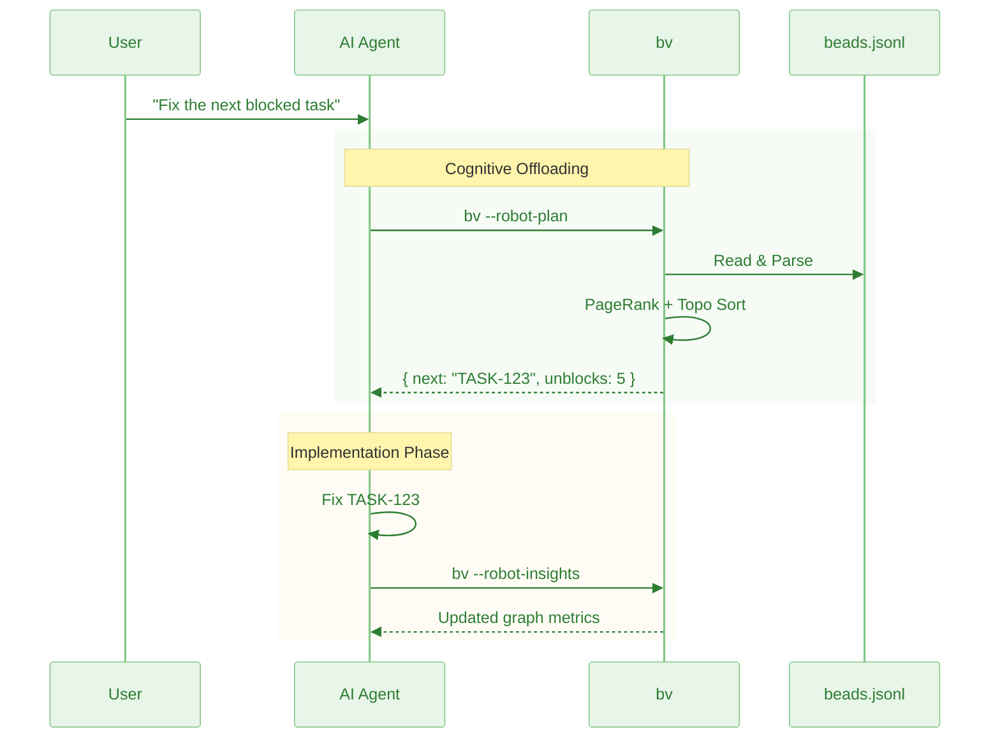

# Robot Mode: AI Agent Protocol & Integration

This document is the comprehensive guide for integrating AI agents with beadwork's robot mode. It covers the robot protocol, CLI reference, output schemas, and advanced topics for building agent workflows on top of `bw`.

> **Credit:** The robot protocol, cognitive offloading architecture, and all robot commands described here were designed and implemented by [@Dicklesworthstone](https://github.com/Dicklesworthstone) in the original [beads_viewer](https://github.com/Dicklesworthstone/beads_viewer). Beadwork is a community fork that builds on this foundation.

← [Back to README](../README.md)

---

## Table of Contents

1. [Quick Start](#quick-start)
2. [The Robot Protocol](#the-robot-protocol)
3. [AGENTS.md Integration](#agentsmd-integration)
4. [Complete CLI Reference](#complete-cli-reference)
5. [Output Schemas & Examples](#output-schemas--examples)
6. [Advanced Topics](#advanced-topics)
7. [Troubleshooting](#troubleshooting)

---

## Quick Start

**Never run bare `bw` in an agent context** --- it launches the interactive TUI. Always use `--robot-*`.

```bash
# 1) Start with triage (single-call mega-command)
bw --robot-triage

# 2) Minimal mode: just the top pick + claim command
bw --robot-next

# 3) Token-optimized output (TOON)
bw --robot-triage --format toon
export BW_OUTPUT_FORMAT=toon

# 4) Full robot help
bw --robot-help
```

**Output conventions**
- stdout = JSON/TOON data only
- stderr = diagnostics
- exit 0 = success

---

## The Robot Protocol

`bw` bridges the gap between raw data and AI agents. Agents struggle with graph algorithms; `bw` solves this by acting as a deterministic "sidecar" that offloads the cognitive burden of graph traversal.



### The "Cognitive Offloading" Strategy
The primary design goal of the Robot Protocol is **Cognitive Offloading**.
Large Language Models (LLMs) are probabilistic engines; they are excellent at semantic reasoning (coding, writing) but notoriously unreliable at algorithmic graph traversal (finding cycles, computing shortest paths). The two-phase analyzer returns degree/topo/density immediately and completes PageRank/Betweenness/HITS/Eigenvector/Critical Path/Cycles asynchronously with size-aware timeouts and hashed caching, so repeat robot calls stay fast when the graph hasn't changed.

If you feed an Agent raw `beads.jsonl` data, you are forcing the Agent to:
1.  Parse thousands of lines of JSON.
2.  Reconstruct the dependency graph in its context window.
3.  "Hallucinate" a path traversal or cycle check.

`bw` solves this by providing a deterministic graph engine sidecar.

### Why `bw` vs. Raw Beads?
Using `beads` directly gives an agent *data*. Using `bw --robot-insights` gives an agent *intelligence*.

| Capability | Raw Beads (JSONL) | `bw` Robot Mode |
| :--- | :--- | :--- |
| **Query** | "List all issues." | "List the top 5 bottlenecks blocking the release." |
| **Context Cost** | High (Linear with issue count). | Low (Fixed summary struct). |
| **Graph Logic** | Agent must infer/compute. | Pre-computed (PageRank/Brandes). |
| **Safety** | Agent might miss a cycle. | Cycles explicitly flagged. |

### Why Robots Love bv
- Deterministic JSON contracts: robot commands emit stable field names, stable ordering (ties broken by ID), and include `data_hash`, `analysis_config`, and `computed_at` so multiple calls can be correlated safely.
- Health flags: every expensive metric reports status (`computed`, `approx`, `timeout`, `skipped`) plus elapsed ms and (when sampled) the sample size used.
- Consistent cache: robot subcommands share the same analyzer/cache keyed by the issue data hash, avoiding divergent outputs across `--robot-insights`, `--robot-plan`, and `--robot-priority`.
- Instant + eventual completeness: Phase 1 metrics are available immediately; Phase 2 fills in and the status flags tell you when it is done or if it degraded.

### Agent Usage Patterns
Agents typically use `bw` in three phases:

1.  **Triage & Orientation:**
    Before starting a session, the agent runs `bw --robot-insights`. It receives a lightweight JSON summary of the project's structural health. It immediately knows:
    *   "I should not work on Task C yet because it depends on Task B, which is a Bottleneck."
    *   "The graph has a cycle (A->B->A); I must fix this structural error before adding new features."

2.  **Impact Analysis:**
    When asked to "refactor the login module," the agent checks the **PageRank** and **Impact Scores** of the relevant beads. If the scores are high, the agent knows this is a high-risk change with many downstream dependents, prompting it to run more comprehensive tests.

3.  **Execution Planning:**
    Instead of guessing the order of operations, the agent uses `bw`'s topological sort to generate a strictly linearized plan.

---

## AGENTS.md Integration

### Ready-made Blurb

Drop this into your `AGENTS.md` or `CLAUDE.md` files:

```
### Using bv as an AI sidecar

bw is a graph-aware triage engine for Beads projects (.beads/beads.jsonl). Instead of parsing JSONL or hallucinating graph traversal, use robot flags for deterministic, dependency-aware outputs with precomputed metrics (PageRank, betweenness, critical path, cycles, HITS, eigenvector, k-core).

**Scope boundary:** bv handles *what to work on* (triage, priority, planning). For agent-to-agent coordination (messaging, work claiming, file reservations), use [MCP Agent Mail](https://github.com/Dicklesworthstone/mcp_agent_mail).

**CRITICAL: Use ONLY `--robot-*` flags. Bare `bw` launches an interactive TUI that blocks your session.**

#### The Workflow: Start With Triage

**`bw --robot-triage` is your single entry point.** It returns everything you need in one call:
- `quick_ref`: at-a-glance counts + top 3 picks
- `recommendations`: ranked actionable items with scores, reasons, unblock info
- `quick_wins`: low-effort high-impact items
- `blockers_to_clear`: items that unblock the most downstream work
- `project_health`: status/type/priority distributions, graph metrics
- `commands`: copy-paste shell commands for next steps

bw --robot-triage        # THE MEGA-COMMAND: start here
bw --robot-next          # Minimal: just the single top pick + claim command

# Token-optimized output (TOON) for lower LLM context usage:
bw --robot-triage --format toon
export BW_OUTPUT_FORMAT=toon
bw --robot-next

#### Other Commands

**Planning:**
| Command | Returns |
|---------|---------|
| `--robot-plan` | Parallel execution tracks with `unblocks` lists |
| `--robot-priority` | Priority misalignment detection with confidence |

**Graph Analysis:**
| Command | Returns |
|---------|---------|
| `--robot-insights` | Full metrics: PageRank, betweenness, HITS (hubs/authorities), eigenvector, critical path, cycles, k-core, articulation points, slack |
| `--robot-label-health` | Per-label health: `health_level` (healthy|warning|critical), `velocity_score`, `staleness`, `blocked_count` |
| `--robot-label-flow` | Cross-label dependency: `flow_matrix`, `dependencies`, `bottleneck_labels` |
| `--robot-label-attention [--attention-limit=N]` | Attention-ranked labels by: (pagerank x staleness x block_impact) / velocity |

**History & Change Tracking:**
| Command | Returns |
|---------|---------|
| `--robot-history` | Bead-to-commit correlations: `stats`, `histories` (per-bead events/commits/milestones), `commit_index` |
| `--robot-diff --diff-since <ref>` | Changes since ref: new/closed/modified issues, cycles introduced/resolved |

**Other Commands:**
| Command | Returns |
|---------|---------|
| `--robot-burndown <sprint>` | Sprint burndown, scope changes, at-risk items |
| `--robot-forecast <id|all>` | ETA predictions with dependency-aware scheduling |
| `--robot-alerts` | Stale issues, blocking cascades, priority mismatches |
| `--robot-suggest` | Hygiene: duplicates, missing deps, label suggestions, cycle breaks |
| `--robot-graph [--graph-format=json|dot|mermaid]` | Dependency graph export |
| `--export-graph <file.html>` | Self-contained interactive HTML visualization |

#### Scoping & Filtering

bw --robot-plan --label backend              # Scope to label's subgraph
bw --robot-insights --as-of HEAD~30          # Historical point-in-time
bw --recipe actionable --robot-plan          # Pre-filter: ready to work (no blockers)
bw --recipe high-impact --robot-triage       # Pre-filter: top PageRank scores
bw --robot-triage --robot-triage-by-track    # Group by parallel work streams
bw --robot-triage --robot-triage-by-label    # Group by domain

#### Understanding Robot Output

**All robot JSON includes:**
- `data_hash` — Fingerprint of source beads.jsonl (verify consistency across calls)
- `status` — Per-metric state: `computed|approx|timeout|skipped` + elapsed ms
- `as_of` / `as_of_commit` — Present when using `--as-of`; contains ref and resolved SHA

**Two-phase analysis:**
- **Phase 1 (instant):** degree, topo sort, density — always available immediately
- **Phase 2 (async, 500ms timeout):** PageRank, betweenness, HITS, eigenvector, cycles — check `status` flags

**For large graphs (>500 nodes):** Some metrics may be approximated or skipped. Always check `status`.

#### jq Quick Reference

bw --robot-triage | jq '.quick_ref'                        # At-a-glance summary
bw --robot-triage | jq '.recommendations[0]'               # Top recommendation
bw --robot-plan | jq '.plan.summary.highest_impact'        # Best unblock target
bw --robot-insights | jq '.status'                         # Check metric readiness
bw --robot-insights | jq '.Cycles'                         # Circular deps (must fix!)
bw --robot-label-health | jq '.results.labels[] | select(.health_level == "critical")'

**Performance:** Phase 1 instant, Phase 2 async (500ms timeout). Prefer `--robot-plan` over `--robot-insights` when speed matters. Results cached by data hash.

Use bv instead of parsing beads.jsonl—it computes PageRank, critical paths, cycles, and parallel tracks deterministically.
```

### Automatic Integration

`bw` can automatically add the above instructions to your project's agent file:

- **On first run**, bv checks for AGENTS.md (or similar files) and offers to inject the blurb if not present
- Choose **"Yes"** to add the instructions, **"No"** to skip, or **"Don't ask again"** to remember your preference
- Preferences are stored per-project in `~/.config/bv/agent-prompts/`

**Supported Files** (checked in order):
1. `AGENTS.md` (preferred)
2. `CLAUDE.md`
3. `agents.md`
4. `claude.md`

**Manual Control:**

```bash
bd agents --show              # Display current blurb content
bd agents --check             # Check if blurb is present in agent file
bd agents --add               # Add blurb to agent file
bd agents --remove            # Remove blurb from agent file
bd agents --clear-preference  # Reset the "don't ask again" preference
```

**Version Tracking:**

The blurb uses HTML comment markers for version tracking:
```
<!-- bv-agent-instructions-v1 -->
... content ...
<!-- end-bv-agent-instructions -->
```

When a new version of the blurb is released, `bw` can detect the outdated version and offer to update it.

---

## Complete CLI Reference

Beyond the interactive TUI, `bw` provides a comprehensive **command-line interface** for scripting, automation, and AI agent integration.

### Core Commands

```bash
bw                      # Launch interactive TUI
bw --help               # Show all options
bw --version            # Show version
```

### Robot Protocol Commands

These commands output **structured JSON** designed for programmatic consumption:

| Command | Output | Use Case |
|---------|--------|----------|
| `--robot-triage` | **THE MEGA-COMMAND**: unified triage with all analysis | Single entry point for agents |
| `--robot-next` | Single top recommendation + claim command | Quick "what's next?" answer |
| `--robot-insights` | Graph metrics + top N lists | Project health assessment |
| `--robot-plan` | Actionable tracks + dependencies | Work queue generation |
| `--robot-priority` | Priority recommendations | Automated priority fixing |
| `--robot-history` | Bead-to-commit correlations | Code change tracking |
| `--robot-label-health` | Per-label health metrics | Domain health monitoring |
| `--robot-label-flow` | Cross-label dependency matrix | Inter-domain analysis |
| `--robot-label-attention` | Attention-ranked labels | Domain prioritization |
| `--robot-sprint-list` | All sprints as JSON | Sprint planning |
| `--robot-burndown` | Sprint burndown data | Progress tracking |
| `--robot-suggest` | Hygiene suggestions (deps/dupes/labels/cycles) | Project cleanup automation |
| `--robot-diff` | JSON diff (with `--diff-since`) | Change tracking |
| `--robot-recipes` | Available recipe list | Recipe discovery |
| `--robot-graph` | Dependency graph as JSON/DOT/Mermaid | Graph visualization & export |
| `--robot-forecast` | ETA predictions per issue | Completion timeline estimates |
| `--robot-capacity` | Team capacity simulation | Resource planning |
| `--robot-alerts` | Drift + proactive warnings | Health monitoring |
| `--robot-help` | Detailed AI agent documentation | Agent onboarding |

All robot commands support `--as-of <ref>` for historical analysis. Output includes `as_of` and `as_of_commit` metadata fields when specified.

### Time-Travel Commands

The `--as-of` flag lets you view project state at any historical point without modifying your working tree. It works with both the interactive TUI and all robot commands.

```bash
# View historical state (TUI)
bw --as-of HEAD~10              # 10 commits ago
bw --as-of v1.0.0               # At release tag
bw --as-of 2024-01-15           # At specific date
bw --as-of main@{2024-01-15}    # Branch at date

# Historical analysis with robot commands
bw --robot-insights --as-of HEAD~30    # Graph metrics from 30 commits ago
bw --robot-plan --as-of v1.0.0         # Execution plan at release
bw --robot-triage --as-of 2024-06-01   # Full triage from specific date
bw --robot-priority --as-of HEAD~5     # Priority recs from 5 commits ago

# Compare changes
bw --diff-since HEAD~5          # Changes in last 5 commits
bw --diff-since v1.0.0          # Changes since release
bw --diff-since 2024-01-01      # Changes since date

# JSON diff output (combines --as-of for "to" snapshot)
bw --diff-since HEAD~10 --robot-diff                # From HEAD~10 to current
bw --diff-since HEAD~10 --as-of HEAD~5 --robot-diff # From HEAD~10 to HEAD~5
```

When using `--as-of` with robot commands, the JSON output includes additional metadata:
- `as_of`: The ref you specified (e.g., "HEAD~30", "v1.0.0")
- `as_of_commit`: The resolved commit SHA for reproducibility

### Recipe Commands

```bash
# List available recipes
bw --robot-recipes

# Apply built-in recipes
bw --recipe actionable          # Ready to work
bw --recipe high-impact         # Top PageRank scores
bw --recipe stale               # Untouched 30+ days
bw --recipe blocked             # Waiting on dependencies
bw -r recent                    # Short flag, updated in 7 days

# Apply custom recipe
bw --recipe .beads/recipes/sprint.yaml
```

### Export Commands

```bash
# Generate Markdown report with Mermaid diagrams
bw --export-md report.md

# Export priority brief (focused summary)
bw --priority-brief brief.md

# Export complete agent brief bundle
bw --agent-brief ./agent-bundle/
# Creates: triage.json, insights.json, brief.md, helpers.md
```

### ETA Forecasting & Capacity Planning

```bash
# Forecast completion ETA for a specific issue
bw --robot-forecast bv-123

# Forecast all open issues with filtering
bw --robot-forecast all --forecast-label=backend
bw --robot-forecast all --forecast-sprint=sprint-1
bw --robot-forecast all --forecast-agents=2     # Multi-agent parallelism

# Capacity simulation: when will everything be done?
bw --robot-capacity                              # Default: 1 agent
bw --robot-capacity --agents=3                   # 3 parallel agents
bw --robot-capacity --capacity-label=frontend    # Scoped to label
```

### Alerts & Health Monitoring

```bash
# Get all alerts (drift warnings + proactive health checks)
bw --robot-alerts

# Filter by severity
bw --robot-alerts --severity=critical
bw --robot-alerts --severity=warning

# Filter by alert type
bw --robot-alerts --alert-type=stale_issue
bw --robot-alerts --alert-type=blocking_cascade

# Filter by label scope
bw --robot-alerts --alert-label=backend
```

### Triage Grouping (Multi-Agent Coordination)

```bash
# Group recommendations by execution track (parallel work streams)
bw --robot-triage --robot-triage-by-track

# Group recommendations by label (domain-focused agents)
bw --robot-triage --robot-triage-by-label
```

### Shell Script Emission

Generate executable shell scripts from recommendations for automated workflows:

```bash
# Emit bash script for top 5 recommendations
bw --robot-triage --emit-script --script-limit=5

# Different shell formats
bw --robot-triage --emit-script --script-format=fish
bw --robot-triage --emit-script --script-format=zsh
```

### Feedback System (Adaptive Recommendations)

The feedback system learns from your accept/ignore decisions to tune recommendation weights:

```bash
# Record positive feedback (you worked on this recommendation)
bw --feedback-accept bv-123

# Record negative feedback (you skipped this recommendation)
bw --feedback-ignore bv-456

# View current feedback state and weight adjustments
bw --feedback-show

# Reset feedback to defaults
bw --feedback-reset
```

### Baseline & Drift Detection

```bash
# Save current state as baseline
bw --save-baseline "Pre-release v2.0"

# Show baseline information
bw --baseline-info

# Check for drift from baseline
bw --check-drift                    # Exit codes: 0=OK, 1=critical, 2=warning
bw --check-drift --robot-drift      # JSON output
```

### Semantic Search

```bash
# Semantic vector search over titles/descriptions
bw --search "login oauth"

# JSON output for automation
bw --search "login oauth" --robot-search

# Hybrid search (text + graph metrics)
bw --search "login oauth" --search-mode hybrid --search-preset impact-first

# Hybrid with custom weights
bw --search "login oauth" --search-mode hybrid \
  --search-weights '{"text":0.4,"pagerank":0.2,"status":0.15,"impact":0.1,"priority":0.1,"recency":0.05}'
```

Semantic search builds a lightweight vector index from a weighted issue document (ID and title repeated, labels and description included). This keeps lookup fast while still behaving like a human-readable search.

Hybrid mode is a two-stage pipeline: it first retrieves the top candidates by semantic similarity, then re-ranks those candidates using graph-aware signals (PageRank, status, impact, priority, recency). That keeps results anchored to your query while surfacing items that matter most in the dependency graph.

Short, intent-heavy queries (e.g., "benchmarks", "oauth") are treated differently on purpose. bv widens the candidate pool, boosts literal matches, and raises the text weight so quick lookups behave like a precise search. Longer, descriptive queries lean more on graph signals for smart tie-breaking and prioritization.

Hybrid defaults can be set via:
- `BW_SEARCH_MODE` (text|hybrid)
- `BW_SEARCH_PRESET` (default|bug-hunting|sprint-planning|impact-first|text-only)
- `BW_SEARCH_WEIGHTS` (JSON string, overrides preset)

In `--robot-search` JSON, hybrid results include `mode`, `preset`, `weights`, plus per-result `text_score` and `component_scores`.

### Example: AI Agent Workflow

```bash
#!/bin/bash
# agent-workflow.sh - Autonomous task selection

# 1. Get the execution plan
PLAN=$(bv --robot-plan)

# 2. Extract highest-impact actionable task
TASK=$(echo "$PLAN" | jq -r '.plan.summary.highest_impact')

# 3. Get full insights for context
INSIGHTS=$(bv --robot-insights)

# 4. Check if completing this introduces regressions
BASELINE=$(bv --diff-since HEAD~1 --robot-diff)

echo "Working on: $TASK"
echo "Unblocks: $(echo "$PLAN" | jq '.plan.summary.unblocks_count') tasks"
```

---

## Output Schemas & Examples

### JSON Output Schema (`--robot-insights`)

The output is designed to be strictly typed and easily parseable by tools like `jq` or standard JSON libraries.

```json
{
  "bottlenecks": [
    { "id": "CORE-123", "value": 0.45 }
  ],
  "keystones": [
    { "id": "API-001", "value": 12.0 }
  ],
  "influencers": [
    { "id": "AUTH-007", "value": 0.82 }
  ],
  "hubs": [
    { "id": "EPIC-100", "value": 0.67 }
  ],
  "authorities": [
    { "id": "UTIL-050", "value": 0.91 }
  ],
  "cycles": [
    ["TASK-A", "TASK-B", "TASK-A"]
  ],
  "clusterDensity": 0.045,
  "stats": {
    "pageRank": { "CORE-123": 0.15, "...": "..." },
    "betweenness": { "CORE-123": 0.45, "...": "..." },
    "eigenvector": { "AUTH-007": 0.82, "...": "..." },
    "hubs": { "EPIC-100": 0.67, "...": "..." },
    "authorities": { "UTIL-050": 0.91, "...": "..." },
    "inDegree": { "CORE-123": 5, "...": "..." },
    "outDegree": { "CORE-123": 2, "...": "..." },
    "criticalPathScore": { "API-001": 12.0, "...": "..." },
    "density": 0.045,
    "topologicalOrder": ["CORE-123", "API-001", "..."]
  }
}
```

| Field | Metric | What It Contains |
|-------|--------|------------------|
| `bottlenecks` | Betweenness | Top nodes bridging graph clusters |
| `keystones` | Critical Path | Top nodes on longest dependency chains |
| `influencers` | Eigenvector | Top nodes connected to important neighbors |
| `hubs` | HITS Hub | Top dependency aggregators (Epics) |
| `authorities` | HITS Authority | Top prerequisite providers (Utilities) |
| `cycles` | Cycle Detection | All circular dependency paths |
| `clusterDensity` | Density | Overall graph interconnectedness |
| `stats` | All Metrics | Full raw data for custom analysis |

### Robot JSON Contract Cheat Sheet

**Shared across all robots**
- `data_hash`: hash of the beads file driving the response (use to correlate multiple calls).
- `analysis_config`: exact analysis settings (timeouts, modes, cycle caps) for reproducibility.
- `status`: per-metric state `computed|approx|timeout|skipped` with elapsed ms/reason; always check before trusting heavy metrics like PageRank/Betweenness/HITS.
- `as_of` / `as_of_commit`: present when using `--as-of`; contains the ref you specified and the resolved commit SHA for reproducibility.

**Schemas in 5 seconds (jq-friendly)**
- `bw --robot-insights` -> `.status`, `.analysis_config`, metric maps (capped by `BW_INSIGHTS_MAP_LIMIT`), `Bottlenecks`, `CriticalPath`, `Cycles`, plus advanced signals: `Cores` (k-core), `Articulation` (cut vertices), `Slack` (longest-path slack).
- `bw --robot-plan` -> `.plan.tracks[].items[].{id,unblocks}` for downstream unlocks; `.plan.summary.highest_impact`.
- `bw --robot-priority` -> `.recommendations[].{id,current_priority,suggested_priority,confidence,reasoning}`.
- `bw --robot-suggest` -> `.suggestions.suggestions[]` (ranked suggestions) + `.suggestions.stats` (counts) + `.usage_hints`.
- `bw --robot-diff --diff-since <ref>` -> `{from_data_hash,to_data_hash,diff.summary,diff.new_issues,diff.cycle_*}`.
- `bw --robot-history` -> `.histories[ID].events` + `.commit_index` for reverse lookup; `.stats.method_distribution` shows how correlations were inferred.

**Copy/paste guardrails**
```bash
# Ensure metrics are ready
bw --robot-insights | jq '.status'

# Top unblockers from plan
bw --robot-plan | jq '.plan.tracks[].items[] | {id, unblocks}'

# High-confidence priority fixes
bw --robot-priority | jq '.recommendations[] | select(.confidence > 0.6)'

# Structural strength and parallelism
bw --robot-insights | jq '.full_stats.core_number | to_entries | sort_by(-.value)[:5]'
bw --robot-insights | jq '.Articulation'
bw --robot-insights | jq '.Slack[:5]'

# Verify diff hashes match expectations
bw --robot-diff --diff-since HEAD~1 | jq '{from: .from_data_hash, to: .to_data_hash}'

# Historical analysis (verify as_of metadata)
bw --robot-insights --as-of HEAD~30 | jq '{as_of, as_of_commit, data_hash}'
```

### Output Examples

**`--robot-priority` Output:**
```json
{
  "generated_at": "2025-01-15T10:30:00Z",
  "recommendations": [
    {
      "issue_id": "CORE-123",
      "current_priority": 3,
      "suggested_priority": 1,
      "confidence": 0.87,
      "direction": "increase",
      "reasoning": "High PageRank (0.15) + High Betweenness (0.45) indicates foundational blocker"
    }
  ],
  "summary": {
    "total_issues": 58,
    "recommendations": 12,
    "high_confidence": 5
  }
}
```

**`--robot-recipes` Output:**
```json
{
  "recipes": [
    { "name": "actionable", "description": "Ready to work (no blockers)", "source": "builtin" },
    { "name": "high-impact", "description": "Top PageRank scores", "source": "builtin" },
    { "name": "sprint-review", "description": "Current sprint issues", "source": "project" }
  ]
}
```

---

## Advanced Topics

### Execution Plan Logic
- Actionable set: open/in-progress issues with no open blocking dependencies.
- Unblocks: for each actionable, list of issues that would become actionable if it closed (no other open blockers).
- Tracks: undirected connected components group actionable items into parallelizable streams.
- Summary: highest-impact item = max unblocks, then priority, then ID for determinism.

### Priority Recommendation Model
- Composite score weights: PageRank 30%, Betweenness 30%, blocker ratio 20%, staleness 10%, priority boost 10%.
- Thresholds: high PR >0.30, high BW >0.50, staleness ~14 days, min confidence 0.30 by default.
- Direction: "increase" or "decrease" priority derived from score vs current priority; confidence blends signal count, strength, and score delta.

### Diff & Time-Travel Safety Notes
- When stdout is non-TTY or `BW_ROBOT=1`, `--diff-since` auto-emits JSON (or requires `--robot-diff` in strict setups); resolved revision is echoed in the payload.
- TUI time-travel badges: `[NEW]`, `[CLOSED]`, `[MODIFIED]`, `[REOPENED]`, matching the robot diff summary.

### Integrating with CI & Agents
- Typical pipeline:
  ```bash
  bv --robot-insights > insights.json
  bv --robot-plan | jq '.plan.summary'
  bv --robot-priority | jq '.recommendations[0]'
  bv --check-drift --robot-drift --diff-since HEAD~5 > drift.json
  ```
- Use `data_hash` to ensure all artifacts come from the same analysis run; fail CI if hashes diverge.
- Exit codes: drift check (0 ok, 1 critical, 2 warning).

---

## Troubleshooting

| Symptom | Cause | Fix |
|---------|-------|-----|
| Empty metric maps | Phase 2 still running or timed out | Check `status` flags |
| Large payloads | Too many items in output | Use `jq` to slice top items; re-run after filtering via recipes |
| Missing cycles | Likely skipped/timeout | See `status.cycles` |
| Inconsistent outputs between commands | Data changed between calls | Compare `data_hash`; rerun if different |
