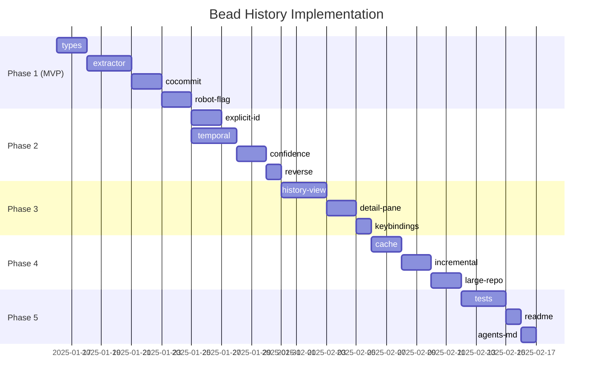

# Bead History & Code Correlation Feature Plan

> **Purpose**: This document contains the comprehensive implementation plan for the bead-to-commit correlation feature, organized as a hierarchy of beads with detailed specifications, dependencies, and rationale.

## Executive Summary

### The Problem
When working with AI agents or multiple developers on a codebase using beads for task tracking, there's no easy way to answer:
- "What code changes were made for bead AUTH-123?"
- "Who worked on this bead and when?"
- "Which bead drove this particular commit?"

### The Solution
Parse the git history of `beads.jsonl` to extract bead lifecycle events, then correlate them with code commits using multiple matching strategies (co-committed files, explicit ID references, temporal proximity).

### Key Insight: The Git History IS the Source of Truth
When we run `git log -p -- .beads/beads.jsonl`, we get:
1. **Exact timestamps** when each bead was created, modified, closed
2. **Git author** = the agent/person who made the change
3. **Commit SHA** = link to all other files changed in that commit

This creates a **direct, mechanical** correlation chain with no LLM inference needed.

---

## Design Principles

### 1. Reliability Over Completeness
When we DO report a correlation, it should be RIGHT the vast majority of the time.
Better to miss some correlations than to report false ones.

### 2. Confidence Transparency
Every correlation includes a confidence score and method explanation.
Users can filter by confidence threshold.

### 3. Two Query Directions
- **Bead → Code**: "Given bead X, what commits relate to it?"
- **Code → Bead**: "Given commit Y, what bead(s) does it relate to?"

### 4. Incremental Value
Each phase delivers standalone value. MVP is useful immediately.

---

## Correlation Methods (Ranked by Reliability)

| Method | Confidence | Description |
|--------|------------|-------------|
| **Co-committed** | 95-99% | Code files changed in SAME commit as bead status change |
| **Explicit ID** | 90-95% | Commit message contains bead ID pattern |
| **Temporal+Author** | 40-70% | Same git author, within bead's active time window |
| **Temporal+Path** | 30-50% | Within time window, files match bead title/description hints |

### Confidence Score Calculation
```
confidence = base_confidence * context_modifier

where context_modifier accounts for:
- How many beads were active for this author simultaneously
- How long the time window is
- How specific the path hints are
```

---

## Bead Hierarchy

```
EPIC: bv-history-epic
├── PHASE 1: Core Infrastructure (MVP)
│   ├── bv-history-types         [no deps]
│   ├── bv-history-extractor     [depends: types]
│   ├── bv-history-cocommit      [depends: extractor]
│   └── bv-history-robot-flag    [depends: cocommit]
│
├── PHASE 2: Enhanced Correlation
│   ├── bv-history-explicit-id   [depends: robot-flag]
│   ├── bv-history-temporal      [depends: robot-flag]
│   ├── bv-history-confidence    [depends: explicit-id, temporal]
│   └── bv-history-reverse       [depends: confidence]
│
├── PHASE 3: TUI Integration
│   ├── bv-history-view          [depends: confidence]
│   ├── bv-history-detail        [depends: history-view]
│   └── bv-history-keybind       [depends: detail]
│
├── PHASE 4: Performance & Polish
│   ├── bv-history-cache         [depends: keybind]
│   ├── bv-history-incremental   [depends: cache]
│   └── bv-history-large-repo    [depends: incremental]
│
└── PHASE 5: Documentation & Testing
    ├── bv-history-tests         [depends: large-repo]
    ├── bv-history-readme        [depends: tests]
    └── bv-history-agents-md     [depends: readme]
```

---

## Detailed Bead Specifications

### EPIC: bv-history-epic

```yaml
id: bv-history-epic
title: "Bead History & Code Correlation System"
type: epic
priority: 1
status: open

description: |
  # Bead History & Code Correlation System

  ## Overview
  Implement a system to track the full lifecycle of beads (creation, claim,
  modification, closure) and correlate them with the code commits that
  implemented the work.

  ## User Stories
  - As a project lead, I want to see what code changes were made for each bead
  - As a developer, I want to know which bead drove a particular commit
  - As an AI agent, I want structured JSON data about bead-to-commit relationships
  - As a code reviewer, I want to understand the context behind changes

  ## Success Criteria
  - [ ] `bv --robot-history` outputs structured JSON of all correlations
  - [ ] `bv --bead-history <id>` shows history for a specific bead
  - [ ] TUI shows history in detail pane and dedicated view
  - [ ] Co-committed correlations have >95% accuracy
  - [ ] Performance: <2s for repos with 1000 commits

  ## Non-Goals (for initial release)
  - Real-time commit watching (future enhancement)
  - GitHub/GitLab PR integration (future enhancement)
  - Automatic bead creation from commits (different feature)

  ## Technical Approach
  Parse git history of beads.jsonl to extract lifecycle events, then correlate
  using multiple methods with confidence scoring. No LLM required.

acceptance_criteria: |
  1. Robot flag outputs valid JSON with all correlations
  2. TUI displays bead history in intuitive interface
  3. Documentation updated for all new features
  4. Test coverage >80% for new code
  5. No performance regression for existing features

labels:
  - epic
  - feature
  - v0.11
```

---

### PHASE 1: Core Infrastructure (MVP)

#### bv-history-types

```yaml
id: bv-history-types
title: "Define data types for bead history correlation"
type: task
priority: 1
status: open
depends_on: []

description: |
  # Data Types for Bead History Correlation

  ## Context
  This is the foundational task - all other history features depend on these
  types being well-designed. Getting this right is critical.

  ## Types to Define

  ### BeadEvent
  Represents a single lifecycle event for a bead, extracted from git history.

  ```go
  type BeadEvent struct {
      BeadID      string    `json:"bead_id"`
      EventType   EventType `json:"event_type"`
      Timestamp   time.Time `json:"timestamp"`
      CommitSHA   string    `json:"commit_sha"`
      CommitMsg   string    `json:"commit_message"`
      Author      string    `json:"author"`       // Git author name
      AuthorEmail string    `json:"author_email"` // Git author email
  }

  type EventType string
  const (
      EventCreated  EventType = "created"      // Bead first appears in file
      EventClaimed  EventType = "claimed"      // Status changed to in_progress
      EventClosed   EventType = "closed"       // Status changed to closed
      EventReopened EventType = "reopened"     // Status changed FROM closed
      EventModified EventType = "modified"     // Other significant changes
  )
  ```

  ### CorrelatedCommit
  A code commit linked to a bead with confidence metadata.

  ```go
  type CorrelatedCommit struct {
      SHA           string            `json:"sha"`
      ShortSHA      string            `json:"short_sha"`      // First 7 chars
      Message       string            `json:"message"`
      Author        string            `json:"author"`
      AuthorEmail   string            `json:"author_email"`
      Timestamp     time.Time         `json:"timestamp"`
      Files         []FileChange      `json:"files"`

      // Correlation metadata
      Method        CorrelationMethod `json:"method"`
      Confidence    float64           `json:"confidence"`      // 0.0 - 1.0
      Reason        string            `json:"reason"`          // Human-readable
  }

  type FileChange struct {
      Path       string `json:"path"`
      Action     string `json:"action"`     // A=added, M=modified, D=deleted
      Insertions int    `json:"insertions"`
      Deletions  int    `json:"deletions"`
  }

  type CorrelationMethod string
  const (
      MethodCoCommitted    CorrelationMethod = "co_committed"
      MethodExplicitID     CorrelationMethod = "explicit_id"
      MethodTemporalAuthor CorrelationMethod = "temporal_author"
      MethodTemporalPath   CorrelationMethod = "temporal_path"
  )
  ```

  ### BeadHistory
  The complete correlation record for a single bead.

  ```go
  type BeadHistory struct {
      BeadID        string             `json:"bead_id"`
      BeadTitle     string             `json:"bead_title"`
      CurrentStatus string             `json:"current_status"`

      // Lifecycle milestones
      Created       *BeadEvent         `json:"created,omitempty"`
      Claimed       *BeadEvent         `json:"claimed,omitempty"`
      Closed        *BeadEvent         `json:"closed,omitempty"`

      // All events (for detailed view)
      Events        []BeadEvent        `json:"events"`

      // Correlated code changes
      CodeCommits   []CorrelatedCommit `json:"code_commits"`

      // Computed metrics
      CycleTime     *time.Duration     `json:"cycle_time_seconds,omitempty"` // Claim to close
      Contributors  []string           `json:"contributors"`                  // Unique authors
  }
  ```

  ### HistoryReport
  The top-level output structure for --robot-history.

  ```go
  type HistoryReport struct {
      GeneratedAt   time.Time      `json:"generated_at"`
      RepoPath      string         `json:"repo_path"`
      CommitRange   string         `json:"commit_range"`   // e.g., "abc123..def456"

      Correlations  []BeadHistory  `json:"correlations"`

      // Reverse index: commit SHA -> bead IDs
      CommitIndex   map[string][]string `json:"commit_index"`

      // Summary statistics
      Summary       HistorySummary `json:"summary"`
  }

  type HistorySummary struct {
      TotalBeads           int     `json:"total_beads"`
      BeadsWithCorrelation int     `json:"beads_with_correlation"`
      TotalCommits         int     `json:"total_commits"`
      OrphanCommits        int     `json:"orphan_commits"`  // Commits with no bead
      AvgConfidence        float64 `json:"avg_confidence"`
      AvgCycleTimeHours    float64 `json:"avg_cycle_time_hours"`
  }
  ```

  ## Design Decisions

  ### Why separate Events from milestones (Created/Claimed/Closed)?
  - Milestones give quick access to key lifecycle points
  - Events array preserves full history for detailed views
  - Both are useful for different query patterns

  ### Why include CommitIndex in HistoryReport?
  Enables reverse lookup: "Which beads relate to commit X?"
  This is O(1) lookup vs O(n) scan through all correlations.

  ### Why CycleTime as pointer?
  Not all beads have been closed. Nil indicates "still open".

  ## File Location
  `pkg/correlation/types.go`

  ## Testing Notes
  - Test JSON marshaling/unmarshaling roundtrips
  - Test EventType.String() and CorrelationMethod.String()
  - Test edge cases: empty fields, nil pointers

acceptance_criteria: |
  1. All types compile without errors
  2. JSON tags are consistent and documented
  3. String methods implemented for enum types
  4. Unit tests for serialization roundtrips
  5. Go doc comments on all exported types

labels:
  - phase-1
  - types
  - foundation
```

#### bv-history-extractor

```yaml
id: bv-history-extractor
title: "Implement git history parser for beads.jsonl"
type: task
priority: 1
status: open
depends_on:
  - bv-history-types

description: |
  # Git History Parser for beads.jsonl

  ## Context
  This is the core extraction logic. We parse `git log -p -- .beads/beads.jsonl`
  to extract bead lifecycle events.

  ## Git Command
  ```bash
  git log -p --follow --format="%H|%aI|%an|%ae|%s" -- .beads/beads.jsonl
  ```

  Output format:
  ```
  abc123def456|2025-01-15T10:30:00-05:00|Alice Dev|alice@dev.com|Close AUTH-123

  diff --git a/.beads/beads.jsonl b/.beads/beads.jsonl
  --- a/.beads/beads.jsonl
  +++ b/.beads/beads.jsonl
  @@ -10,7 +10,7 @@
  -{"id":"AUTH-123","status":"in_progress",...}
  +{"id":"AUTH-123","status":"closed",...}
  ```

  ## Parsing Algorithm

  ```go
  func ExtractBeadEvents(repoPath string, opts ExtractOptions) ([]BeadEvent, error) {
      // 1. Run git log command
      cmd := exec.Command("git", "log", "-p", "--follow",
          "--format=%H|%aI|%an|%ae|%s", "--", ".beads/beads.jsonl")

      // 2. Parse output commit by commit
      // 3. For each commit:
      //    a. Parse commit metadata (SHA, timestamp, author, message)
      //    b. Parse the diff section
      //    c. For each changed line in diff:
      //       - Parse old JSON (lines starting with -)
      //       - Parse new JSON (lines starting with +)
      //       - Detect what changed (new bead, status change, other)
      //       - Create BeadEvent records

      // 4. Return chronologically sorted events
  }
  ```

  ## Diff Parsing Details

  ### Detecting Bead Creation
  ```diff
  +{"id":"AUTH-123","title":"Fix login","status":"open",...}
  ```
  A line starting with `+` containing valid JSON that wasn't in the old version
  = EventCreated

  ### Detecting Status Changes
  ```diff
  -{"id":"AUTH-123",...,"status":"open",...}
  +{"id":"AUTH-123",...,"status":"in_progress",...}
  ```
  Same bead ID, different status = appropriate event type:
  - open/blocked → in_progress = EventClaimed
  - anything → closed = EventClosed
  - closed → anything else = EventReopened

  ### Detecting Modifications
  Same bead ID, same status, but other fields changed = EventModified
  (Only track "significant" changes: priority, assignee, dependencies)

  ## Edge Cases to Handle

  1. **Malformed JSON lines**: Skip with warning, don't crash
  2. **Multiple beads changed in one commit**: Generate event for each
  3. **Binary files in diff**: Skip (shouldn't happen for JSONL)
  4. **Renamed beads file**: `--follow` handles this
  5. **Empty commits**: No events generated
  6. **Merge commits**: Parse like regular commits (may have larger diffs)

  ## Options Structure

  ```go
  type ExtractOptions struct {
      Since     time.Time  // Only commits after this time
      Until     time.Time  // Only commits before this time
      Limit     int        // Max commits to process (0 = unlimited)
      BeadID    string     // Filter to single bead ID (empty = all)
  }
  ```

  ## Performance Considerations

  - For large repos, `git log` can be slow
  - Default limit: 500 commits (configurable)
  - Support `--since` flag to limit time range
  - Consider streaming parser for very large outputs

  ## File Location
  `pkg/correlation/extractor.go`

acceptance_criteria: |
  1. Correctly parses sample git log output
  2. Handles all edge cases without panic
  3. Returns chronologically sorted events
  4. Supports filtering options (since, until, limit, beadID)
  5. Unit tests with mock git output
  6. Integration test with real git repo

labels:
  - phase-1
  - extraction
  - git
```

#### bv-history-cocommit

```yaml
id: bv-history-cocommit
title: "Implement co-committed file extraction"
type: task
priority: 1
status: open
depends_on:
  - bv-history-extractor

description: |
  # Co-Committed File Extraction

  ## Context
  This is the highest-confidence correlation method. When a bead status changes
  and code files change in THE SAME COMMIT, that's a direct causal link.

  ## Why This Works
  Developer workflow:
  1. Write code to implement feature
  2. Mark bead as closed
  3. Commit both changes together

  The code files in that commit ARE the implementation of the bead.

  ## Git Command
  ```bash
  git show --name-status --format="" <sha>
  ```

  Output:
  ```
  M       pkg/auth/login.go
  M       pkg/auth/session.go
  A       pkg/auth/oauth.go
  D       pkg/auth/legacy.go
  M       .beads/beads.jsonl
  ```

  ## Algorithm

  ```go
  func GetCoCommittedFiles(sha string) ([]FileChange, error) {
      // 1. Run git show command
      // 2. Parse output lines
      // 3. Filter OUT bead files (.beads/*)
      // 4. Return code files only
  }

  func EnrichWithCoCommitted(events []BeadEvent) []CorrelatedCommit {
      commits := make(map[string]*CorrelatedCommit)

      for _, event := range events {
          if commits[event.CommitSHA] == nil {
              files := GetCoCommittedFiles(event.CommitSHA)

              // Filter to only include code files
              codeFiles := filterCodeFiles(files)

              if len(codeFiles) > 0 {
                  commits[event.CommitSHA] = &CorrelatedCommit{
                      SHA:        event.CommitSHA,
                      Message:    event.CommitMsg,
                      Author:     event.Author,
                      Timestamp:  event.Timestamp,
                      Files:      codeFiles,
                      Method:     MethodCoCommitted,
                      Confidence: 0.95,
                      Reason:     "Files changed in same commit as bead status change",
                  }
              }
          }
      }

      return mapValues(commits)
  }
  ```

  ## What Counts as "Code Files"?

  Include:
  - Source code: .go, .py, .js, .ts, .rs, .java, etc.
  - Tests: *_test.go, *.test.js, etc.
  - Config: .yaml, .json, .toml (non-bead)
  - Documentation: .md (non-README in .beads/)

  Exclude:
  - .beads/* (bead files themselves)
  - .bv/* (bv config)
  - .git/* (git internals)
  - Generated files: node_modules/, vendor/, dist/, etc.

  ## Getting Line Stats

  For richer output, also get insertion/deletion counts:
  ```bash
  git show --numstat --format="" <sha>
  ```

  Output:
  ```
  45      12      pkg/auth/login.go
  8       3       pkg/auth/session.go
  ```

  ## Confidence Scoring

  Base confidence: 0.95 (very high)

  Adjustments:
  - If commit message explicitly mentions bead ID: +0.04 → 0.99
  - If commit has >20 files changed (shotgun commit): -0.10 → 0.85
  - If only test files changed: -0.05 → 0.90 (might be follow-up)

  ## File Location
  `pkg/correlation/cocommit.go`

acceptance_criteria: |
  1. Correctly extracts co-committed files for any commit
  2. Filters out bead files and common non-code files
  3. Includes insertion/deletion stats
  4. Applies confidence adjustments correctly
  5. Handles commits with no code files gracefully
  6. Unit tests with mock git output

labels:
  - phase-1
  - correlation
  - high-confidence
```

#### bv-history-robot-flag

```yaml
id: bv-history-robot-flag
title: "Add --robot-history CLI flag"
type: task
priority: 1
status: open
depends_on:
  - bv-history-cocommit

description: |
  # Robot History CLI Flag

  ## Context
  This completes the MVP. With this flag, AI agents can get structured
  JSON output of bead-to-commit correlations.

  ## New Flags

  ```go
  robotHistory := flag.Bool("robot-history", false,
      "Output bead-to-commit correlations as JSON")
  beadHistory := flag.String("bead-history", "",
      "Show history for specific bead ID")
  historySince := flag.String("history-since", "",
      "Limit history to commits after this date/ref")
  historyLimit := flag.Int("history-limit", 500,
      "Max commits to analyze (0 = unlimited)")
  ```

  ## Usage Examples

  ```bash
  # All bead correlations
  bv --robot-history

  # Specific bead
  bv --bead-history AUTH-123

  # Last 30 days
  bv --robot-history --history-since "30 days ago"

  # Combined with recipe
  bv --robot-history --recipe actionable
  ```

  ## Implementation

  ```go
  if *robotHistory || *beadHistory != "" {
      // Build correlator
      correlator := correlation.NewCorrelator(repoPath, correlation.Options{
          Since: parseHistorySince(*historySince),
          Limit: *historyLimit,
          BeadID: *beadHistory,
      })

      // Generate report
      report, err := correlator.GenerateReport(issues)
      if err != nil {
          fmt.Fprintf(os.Stderr, "Error generating history: %v\n", err)
          os.Exit(1)
      }

      // Output JSON
      enc := json.NewEncoder(os.Stdout)
      enc.SetIndent("", "  ")
      enc.Encode(report)
      os.Exit(0)
  }
  ```

  ## Output Format

  See HistoryReport type from bv-history-types. Example:

  ```json
  {
    "generated_at": "2025-01-15T10:30:00Z",
    "repo_path": "/path/to/repo",
    "commit_range": "abc123..HEAD",
    "correlations": [
      {
        "bead_id": "AUTH-123",
        "bead_title": "Fix login race condition",
        "current_status": "closed",
        "created": {
          "timestamp": "2025-01-10T14:32:00Z",
          "commit_sha": "abc1234",
          "author": "alice@dev"
        },
        "claimed": {
          "timestamp": "2025-01-11T09:15:00Z",
          "commit_sha": "def5678",
          "author": "bob@dev"
        },
        "closed": {
          "timestamp": "2025-01-11T16:42:00Z",
          "commit_sha": "ghi9012",
          "author": "bob@dev"
        },
        "code_commits": [
          {
            "sha": "ghi9012",
            "short_sha": "ghi9012",
            "message": "fix(auth): resolve race condition",
            "author": "bob@dev",
            "timestamp": "2025-01-11T16:42:00Z",
            "files": [
              {"path": "pkg/auth/login.go", "action": "M", "insertions": 45, "deletions": 12}
            ],
            "method": "co_committed",
            "confidence": 0.95,
            "reason": "Changed in same commit as bead closure"
          }
        ],
        "cycle_time_seconds": 26820,
        "contributors": ["alice@dev", "bob@dev"]
      }
    ],
    "commit_index": {
      "ghi9012": ["AUTH-123"]
    },
    "summary": {
      "total_beads": 58,
      "beads_with_correlation": 45,
      "total_commits": 120,
      "orphan_commits": 15,
      "avg_confidence": 0.87,
      "avg_cycle_time_hours": 18.5
    }
  }
  ```

  ## Update --robot-help

  Add documentation for new flags in the robot help output.

  ## Error Handling

  - If not in git repo: Error with helpful message
  - If beads.jsonl doesn't exist: Error (use regular bv commands)
  - If git history is empty: Return empty correlations array
  - If specific bead not found: Error with "bead not found" message

  ## File Location
  - Main logic: `cmd/bw/main.go` (add flag handling)
  - Correlator: `pkg/correlation/correlator.go` (orchestration)

acceptance_criteria: |
  1. `bv --robot-history` outputs valid JSON
  2. `bv --bead-history <id>` filters to single bead
  3. `--history-since` and `--history-limit` work correctly
  4. Error messages are helpful and actionable
  5. `--robot-help` documents new flags
  6. Integration test with real repo

labels:
  - phase-1
  - cli
  - mvp
```

---

### PHASE 2: Enhanced Correlation

#### bv-history-explicit-id

```yaml
id: bv-history-explicit-id
title: "Implement explicit bead ID matching in commit messages"
type: task
priority: 2
status: open
depends_on:
  - bv-history-robot-flag

description: |
  # Explicit Bead ID Matching

  ## Context
  Many developers include bead/issue IDs in commit messages:
  - "fix(auth): resolve login bug [AUTH-123]"
  - "Closes AUTH-123"
  - "Refs: beads-456, beads-789"

  This is high-confidence (90-95%) because the developer explicitly linked them.

  ## Pattern Matching

  ```go
  var beadIDPatterns = []*regexp.Regexp{
      // [ID] format
      regexp.MustCompile(`\[([A-Z]+-\d+)\]`),
      regexp.MustCompile(`\[([a-z]+-\d+)\]`),

      // Closes/Fixes/Refs keywords
      regexp.MustCompile(`(?i)closes?\s+#?([A-Z]+-\d+)`),
      regexp.MustCompile(`(?i)fix(?:es|ed)?\s+#?([A-Z]+-\d+)`),
      regexp.MustCompile(`(?i)refs?\s+#?([A-Z]+-\d+)`),
      regexp.MustCompile(`(?i)implements?\s+#?([A-Z]+-\d+)`),

      // beads-123 format
      regexp.MustCompile(`(?i)beads?[-_](\d+)`),

      // Generic ID at word boundary
      regexp.MustCompile(`\b([A-Z]{2,10}-\d+)\b`),
  }

  func ExtractBeadIDsFromMessage(msg string) []string {
      seen := make(map[string]bool)
      var ids []string

      for _, pattern := range beadIDPatterns {
          matches := pattern.FindAllStringSubmatch(msg, -1)
          for _, m := range matches {
              if len(m) > 1 && !seen[m[1]] {
                  seen[m[1]] = true
                  ids = append(ids, m[1])
              }
          }
      }

      return ids
  }
  ```

  ## Finding Commits with Explicit References

  ```go
  func FindExplicitReferences(repoPath string, beadID string) ([]CorrelatedCommit, error) {
      // Use git log --grep for efficiency
      cmd := exec.Command("git", "log",
          "--grep="+beadID,
          "--format=%H|%aI|%an|%ae|%s",
          "--all")

      // Parse output and create CorrelatedCommit records
      // For each match, get file changes with git show
  }
  ```

  ## Confidence Scoring

  Base: 0.90

  Adjustments:
  - "Closes" or "Fixes" keyword: +0.05 → 0.95 (explicit completion)
  - Multiple IDs in message: -0.02 per extra ID (less specific)
  - ID in brackets [AUTH-123]: +0.02 (intentional formatting)
  - ID only appears in branch name portion: -0.10 (might be automatic)

  ## Avoiding Duplicates

  A commit might be correlated via BOTH co-committed AND explicit-id.
  Rules:
  - If already correlated via co-committed, don't add explicit-id duplicate
  - If only explicit-id, add it
  - If both, keep co-committed (higher confidence) and note "also explicit"

  ## Configurable Patterns

  Allow users to add custom patterns in .bv/config.yaml:

  ```yaml
  history:
    id_patterns:
      - '\bJIRA-\d+\b'
      - '\bGH-\d+\b'
  ```

  ## File Location
  `pkg/correlation/explicit.go`

acceptance_criteria: |
  1. Extracts bead IDs from various message formats
  2. Uses git --grep for efficient searching
  3. Avoids duplicate correlations
  4. Supports custom patterns from config
  5. Unit tests for pattern matching
  6. Integration test with sample commits

labels:
  - phase-2
  - correlation
  - pattern-matching
```

#### bv-history-temporal

```yaml
id: bv-history-temporal
title: "Implement temporal correlation with author matching"
type: task
priority: 2
status: open
depends_on:
  - bv-history-robot-flag

description: |
  # Temporal Correlation

  ## Context
  When a bead was "in progress" from T1 to T2 by author "bob@dev",
  commits by bob@dev between T1 and T2 are LIKELY related to that bead.

  This is lower confidence (40-70%) because:
  - Bob might have multiple beads in progress
  - The commit might be unrelated refactoring

  But it's still useful as a fallback when other methods don't apply.

  ## Algorithm

  ```go
  func FindTemporalCorrelations(beadHistory *BeadHistory, allCommits []CommitInfo) []CorrelatedCommit {
      if beadHistory.Claimed == nil {
          return nil  // Can't do temporal without claim time
      }

      startTime := beadHistory.Claimed.Timestamp
      endTime := time.Now()
      if beadHistory.Closed != nil {
          endTime = beadHistory.Closed.Timestamp.Add(1 * time.Hour)  // Small buffer
      }

      author := beadHistory.Claimed.Author

      var candidates []CorrelatedCommit
      for _, commit := range allCommits {
          if commit.Timestamp.After(startTime) && commit.Timestamp.Before(endTime) {
              if commit.Author == author || commit.AuthorEmail == beadHistory.Claimed.AuthorEmail {
                  // Check it's not already correlated via higher-confidence method
                  if !isAlreadyCorrelated(beadHistory, commit.SHA) {
                      candidates = append(candidates, CorrelatedCommit{
                          SHA:        commit.SHA,
                          // ... other fields
                          Method:     MethodTemporalAuthor,
                          Confidence: calculateTemporalConfidence(beadHistory, commit, allCommits),
                          Reason:     fmt.Sprintf("Same author (%s), within active window", author),
                      })
                  }
              }
          }
      }

      return candidates
  }
  ```

  ## Dynamic Confidence Calculation

  ```go
  func calculateTemporalConfidence(bead *BeadHistory, commit CommitInfo, allCommits []CommitInfo) float64 {
      base := 0.50

      // Factor 1: How many beads was this author working on?
      activeBeads := countActiveBeadsForAuthor(bead.Claimed.Author, commit.Timestamp)
      if activeBeads == 1 {
          base += 0.20  // Only one bead = higher confidence
      } else if activeBeads > 3 {
          base -= 0.10  // Many beads = lower confidence
      }

      // Factor 2: How long is the time window?
      windowDuration := bead.Closed.Timestamp.Sub(bead.Claimed.Timestamp)
      if windowDuration < 4*time.Hour {
          base += 0.10  // Short window = more focused
      } else if windowDuration > 7*24*time.Hour {
          base -= 0.15  // Week+ window = lots of potential commits
      }

      // Factor 3: Does commit touch files related to bead?
      if pathsMatchBeadHints(commit.Files, bead.BeadTitle) {
          base += 0.15  // File paths match keywords in title
      }

      // Clamp to valid range
      if base > 0.85 {
          base = 0.85  // Never higher than co-committed
      }
      if base < 0.20 {
          base = 0.20  // Always some chance if in window
      }

      return base
  }
  ```

  ## Path Hint Extraction

  Extract potential file paths from bead title/description:

  ```go
  func extractPathHints(title, description string) []string {
      text := title + " " + description

      var hints []string

      // File paths: path/to/file.go
      pathPattern := regexp.MustCompile(`[\w/]+\.\w+`)
      hints = append(hints, pathPattern.FindAllString(text, -1)...)

      // Package names: pkg/auth, src/components
      pkgPattern := regexp.MustCompile(`(?:pkg|src|lib|app)/\w+`)
      hints = append(hints, pkgPattern.FindAllString(text, -1)...)

      // Keywords that might appear in paths
      keywords := []string{"auth", "login", "user", "api", "db", "config"}
      for _, kw := range keywords {
          if strings.Contains(strings.ToLower(text), kw) {
              hints = append(hints, kw)
          }
      }

      return hints
  }

  func pathsMatchBeadHints(files []FileChange, title string) bool {
      hints := extractPathHints(title, "")
      for _, file := range files {
          for _, hint := range hints {
              if strings.Contains(strings.ToLower(file.Path), strings.ToLower(hint)) {
                  return true
              }
          }
      }
      return false
  }
  ```

  ## File Location
  `pkg/correlation/temporal.go`

acceptance_criteria: |
  1. Finds commits within bead's active window
  2. Matches by author/email
  3. Dynamic confidence based on context
  4. Extracts and uses path hints
  5. Never overwrites higher-confidence correlations
  6. Unit tests for confidence calculation

labels:
  - phase-2
  - correlation
  - heuristic
```

#### bv-history-confidence

```yaml
id: bv-history-confidence
title: "Implement confidence scoring model"
type: task
priority: 2
status: open
depends_on:
  - bv-history-explicit-id
  - bv-history-temporal

description: |
  # Confidence Scoring Model

  ## Context
  Different correlation methods have different reliability. We need a
  consistent model for expressing and combining confidence scores.

  ## Confidence Ranges by Method

  | Method | Range | Description |
  |--------|-------|-------------|
  | co_committed | 0.90-0.99 | Direct causation |
  | explicit_id | 0.85-0.95 | Developer intent |
  | temporal_author | 0.40-0.75 | Same person, right time |
  | temporal_path | 0.25-0.55 | Right time, path hints match |

  ## Scorer Interface

  ```go
  type ConfidenceScorer interface {
      Score(commit CommitInfo, bead *BeadHistory, context *ScoringContext) float64
  }

  type ScoringContext struct {
      ActiveBeadsForAuthor int
      TotalCommitsInWindow int
      MethodsUsed          []CorrelationMethod
  }
  ```

  ## Combining Multiple Signals

  If a commit matches multiple methods:

  ```go
  func CombineConfidence(scores []float64) float64 {
      if len(scores) == 0 {
          return 0
      }

      // Use highest as base
      sort.Float64s(scores)
      base := scores[len(scores)-1]

      // Boost slightly for each additional signal
      for i := 0; i < len(scores)-1; i++ {
          boost := (1.0 - base) * 0.1 * scores[i]
          base += boost
      }

      // Cap at 0.99
      if base > 0.99 {
          base = 0.99
      }

      return base
  }
  ```

  ## Filtering by Confidence

  Support `--min-confidence` flag:

  ```bash
  bv --robot-history --min-confidence 0.7
  ```

  Only include correlations at or above threshold.

  ## Confidence Explanation

  Generate human-readable explanations:

  ```go
  func ExplainConfidence(commit CorrelatedCommit, bead *BeadHistory) string {
      var parts []string

      switch commit.Method {
      case MethodCoCommitted:
          parts = append(parts, "Changed in same commit as bead update")
      case MethodExplicitID:
          parts = append(parts, fmt.Sprintf("Commit message mentions %s", bead.BeadID))
      case MethodTemporalAuthor:
          parts = append(parts, fmt.Sprintf("By %s during active window", commit.Author))
      case MethodTemporalPath:
          parts = append(parts, "In time window, files match bead keywords")
      }

      // Add any adjustments
      if commit.Confidence > 0.85 && commit.Method == MethodCoCommitted {
          parts = append(parts, "+high: only a few files changed")
      }

      return strings.Join(parts, "; ")
  }
  ```

  ## File Location
  `pkg/correlation/scorer.go`

acceptance_criteria: |
  1. Each method has defined confidence range
  2. Multiple signals combine correctly
  3. `--min-confidence` filter works
  4. Explanations are human-readable
  5. Unit tests for edge cases
  6. Scores are deterministic (same input = same output)

labels:
  - phase-2
  - scoring
  - reliability
```

#### bv-history-reverse

```yaml
id: bv-history-reverse
title: "Implement reverse lookup (commit → bead)"
type: task
priority: 2
status: open
depends_on:
  - bv-history-confidence

description: |
  # Reverse Lookup: Commit → Bead

  ## Context
  Sometimes you're looking at a commit and want to know which bead it relates to.
  "Why was this change made? What bead drove it?"

  ## Two Access Patterns

  1. **Via commit_index in HistoryReport**
     Already built into the report structure.

  2. **Direct CLI query**
     New flag: `bv --commit-bead <sha>`

  ## CLI Flag

  ```bash
  # Which bead(s) relate to this commit?
  bv --commit-bead abc1234

  # Output:
  {
    "commit": "abc1234",
    "message": "fix(auth): resolve race condition",
    "related_beads": [
      {
        "bead_id": "AUTH-123",
        "bead_title": "Fix login race condition",
        "method": "co_committed",
        "confidence": 0.95
      }
    ]
  }
  ```

  ## Orphan Commit Detection

  Commits that don't correlate to ANY bead:

  ```go
  func FindOrphanCommits(report *HistoryReport) []CommitInfo {
      correlated := make(map[string]bool)
      for sha := range report.CommitIndex {
          correlated[sha] = true
      }

      var orphans []CommitInfo
      for _, commit := range getAllCodeCommits() {
          if !correlated[commit.SHA] {
              orphans = append(orphans, commit)
          }
      }

      return orphans
  }
  ```

  This is useful for code hygiene: "These commits have no associated bead!"

  ## Summary Stats Update

  Add to HistorySummary:
  - `orphan_commits`: Count of commits with no bead
  - `orphan_ratio`: orphan_commits / total_commits

  ## File Location
  - `cmd/bw/main.go` (new flag)
  - `pkg/correlation/reverse.go` (lookup logic)

acceptance_criteria: |
  1. `--commit-bead <sha>` outputs correct JSON
  2. commit_index in report is accurate
  3. Orphan detection works
  4. Handles commits with multiple related beads
  5. Handles commits with no related beads gracefully

labels:
  - phase-2
  - reverse-lookup
  - code-hygiene
```

---

### PHASE 3: TUI Integration

#### bv-history-view

```yaml
id: bv-history-view
title: "Create dedicated TUI history view"
type: task
priority: 2
status: open
depends_on:
  - bv-history-confidence

description: |
  # TUI History View

  ## Context
  A dedicated view (accessible via 'H' key) showing all bead correlations
  in a browsable interface.

  ## Layout

  ```
  ┌─────────────────────────────────────────────────────────────────────┐
  │  📜 BEAD HISTORY                                         [H] to close │
  ├─────────────────────────────────────────────────────────────────────┤
  │  Filter: [All ▾] Author: [All ▾] Confidence: [≥50% ▾]              │
  ├────────────────────────────────────────────┬────────────────────────┤
  │  BEADS WITH HISTORY (45/58)                │  COMMIT DETAILS         │
  │  ──────────────────────────────            │  ──────────────         │
  │  ▸ AUTH-123 Fix login race     2 commits   │  SHA: ghi9012           │
  │    AUTH-456 Add OAuth support  4 commits   │  Author: bob@dev        │
  │    DB-789   Schema migration   1 commit    │  Date: 2025-01-11       │
  │    UI-101   Button styling     0 commits   │                         │
  │    ...                                     │  fix(auth): resolve     │
  │                                            │  race condition         │
  │                                            │                         │
  │                                            │  Files:                 │
  │                                            │  M pkg/auth/login.go    │
  │                                            │  M pkg/auth/session.go  │
  │                                            │                         │
  │                                            │  Correlation: 95%       │
  │                                            │  (co-committed)         │
  └────────────────────────────────────────────┴────────────────────────┘
  ```

  ## Model Structure

  ```go
  type HistoryViewModel struct {
      report      *correlation.HistoryReport
      histories   []correlation.BeadHistory  // Filtered list
      selected    int                         // Selected bead index
      commitIdx   int                         // Selected commit within bead

      // Filters
      authorFilter     string
      minConfidence    float64
      showOrphans      bool

      // UI state
      width, height    int
      focused          historyFocus  // list or detail
  }

  type historyFocus int
  const (
      focusBeadList historyFocus = iota
      focusCommitDetail
  )
  ```

  ## Key Bindings

  | Key | Action |
  |-----|--------|
  | j/k | Navigate bead list |
  | Tab | Switch focus (list ↔ detail) |
  | Enter | Expand/collapse bead commits |
  | f | Open filter menu |
  | / | Search beads |
  | H | Close history view |
  | ? | Show help |

  ## Integration Points

  - Add HistoryViewModel to main Model
  - Toggle with 'H' key in main view
  - Load correlation data lazily on first access

  ## File Location
  `pkg/ui/history.go`

acceptance_criteria: |
  1. 'H' key opens history view
  2. Bead list is navigable with j/k
  3. Commit details shown for selected bead
  4. Filters work correctly
  5. Responsive layout at different terminal sizes
  6. Keyboard navigation is intuitive

labels:
  - phase-3
  - tui
  - view
```

#### bv-history-detail

```yaml
id: bv-history-detail
title: "Integrate history into bead detail pane"
type: task
priority: 2
status: open
depends_on:
  - bv-history-view

description: |
  # History in Detail Pane

  ## Context
  When viewing a bead's details (right pane in split view), show its
  history and correlated commits at the bottom.

  ## Layout Addition

  ```
  ┌─────────────────────────────────────────────────────────────────────┐
  │  AUTH-123: Fix login race condition                                 │
  │  ═══════════════════════════════════════                           │
  │                                                                     │
  │  Status: closed    Priority: P1    Type: bug                       │
  │  Assignee: bob@dev                                                  │
  │                                                                     │
  │  Description:                                                       │
  │  When multiple requests hit the login endpoint simultaneously...   │
  │                                                                     │
  │  Dependencies: (none)                                               │
  │                                                                     │
  │  ─────────────────────────────────────────────────────────────     │
  │  📜 HISTORY                                                         │
  │  ─────────────────────────────────────────────────────────────     │
  │  🟢 Created    Jan 10, 14:32    alice@dev                          │
  │  🔵 Claimed    Jan 11, 09:15    bob@dev                            │
  │  ⚫ Closed     Jan 11, 16:42    bob@dev    (7h 27m cycle time)     │
  │                                                                     │
  │  Related Commits:                                                   │
  │  ████ 95% ghi9012 fix(auth): resolve race condition                │
  │            └── pkg/auth/login.go (+45, -12)                        │
  │            └── pkg/auth/session.go (+8, -3)                        │
  └─────────────────────────────────────────────────────────────────────┘
  ```

  ## Implementation

  ```go
  func (m *Model) renderDetailPane() string {
      // ... existing detail rendering ...

      // Add history section if available
      if m.historyLoaded && m.currentBeadHistory != nil {
          sb.WriteString(m.renderBeadHistory(m.currentBeadHistory))
      }
  }

  func (m *Model) renderBeadHistory(h *correlation.BeadHistory) string {
      var sb strings.Builder

      sb.WriteString("\n")
      sb.WriteString(RenderDivider(m.detailWidth))
      sb.WriteString("\n📜 HISTORY\n")
      sb.WriteString(RenderDivider(m.detailWidth))
      sb.WriteString("\n")

      // Lifecycle events
      if h.Created != nil {
          sb.WriteString(fmt.Sprintf("🟢 Created    %s    %s\n",
              h.Created.Timestamp.Format("Jan 02, 15:04"),
              h.Created.Author))
      }
      // ... claimed, closed ...

      // Correlated commits
      if len(h.CodeCommits) > 0 {
          sb.WriteString("\nRelated Commits:\n")
          for _, c := range h.CodeCommits {
              sb.WriteString(renderCommitLine(c))
          }
      }

      return sb.String()
  }
  ```

  ## Lazy Loading

  Don't load history until:
  - User presses 'h' on a bead, OR
  - User scrolls to history section in detail pane

  Cache loaded history in model.

  ## File Location
  - `pkg/ui/detail.go` (new file or extend view.go)
  - Modify `pkg/ui/model.go` for state

acceptance_criteria: |
  1. History section appears in detail pane
  2. Lifecycle events displayed chronologically
  3. Commits shown with confidence bars
  4. Lazy loading prevents startup slowdown
  5. Scrollable if content is long
  6. Works in both split and full-width modes

labels:
  - phase-3
  - tui
  - detail-pane
```

#### bv-history-keybind

```yaml
id: bv-history-keybind
title: "Add keybindings for history navigation"
type: task
priority: 2
status: open
depends_on:
  - bv-history-detail

description: |
  # History Keybindings

  ## New Global Keys

  | Key | Action |
  |-----|--------|
  | H | Toggle dedicated history view |
  | h | (on selected bead) Jump to history in detail pane |

  ## History View Keys

  | Key | Action |
  |-----|--------|
  | j/k | Navigate bead list |
  | J/K | Navigate commits within selected bead |
  | Tab | Toggle focus: bead list ↔ commit detail |
  | Enter | Open commit in browser (if remote configured) |
  | y | Copy commit SHA to clipboard |
  | f | Open filter menu |
  | / | Search beads by title/ID |
  | c | Toggle confidence threshold |
  | H or Esc | Close history view |

  ## Update Help Overlay

  Add history keys to the '?' help overlay.

  ## Implementation

  ```go
  func (m Model) Update(msg tea.Msg) (tea.Model, tea.Cmd) {
      switch msg := msg.(type) {
      case tea.KeyMsg:
          switch msg.String() {
          case "H":
              if m.isHistoryView {
                  m.isHistoryView = false
              } else {
                  m.isHistoryView = true
                  return m, m.loadHistoryCmd()
              }
          // ... other keys ...
          }
      }
  }
  ```

  ## File Location
  - `pkg/ui/update.go` (key handling)
  - `pkg/ui/help.go` (help text)

acceptance_criteria: |
  1. H toggles history view
  2. All history-specific keys work
  3. Help overlay updated
  4. Keys don't conflict with existing bindings
  5. Intuitive navigation flow

labels:
  - phase-3
  - tui
  - keybindings
```

---

### PHASE 4: Performance & Polish

#### bv-history-cache

```yaml
id: bv-history-cache
title: "Implement caching layer for history data"
type: task
priority: 3
status: open
depends_on:
  - bv-history-keybind

description: |
  # History Caching Layer

  ## Context
  Parsing git history is expensive. We need to cache results to avoid
  re-parsing on every access.

  ## Cache Key

  ```go
  type CacheKey struct {
      HeadSHA       string  // Current git HEAD
      BeadsHash     string  // Hash of beads.jsonl content
      Options       string  // Serialized filter options
  }

  func (k CacheKey) String() string {
      return fmt.Sprintf("%s:%s:%s", k.HeadSHA[:8], k.BeadsHash[:8], k.Options)
  }
  ```

  ## Cache Structure

  ```go
  type HistoryCache struct {
      mu      sync.RWMutex
      entries map[string]*CacheEntry
      maxAge  time.Duration
      maxSize int  // Max entries
  }

  type CacheEntry struct {
      Key       CacheKey
      Report    *HistoryReport
      LoadedAt  time.Time
  }
  ```

  ## Invalidation Strategy

  Cache is invalid when:
  - git HEAD changed (new commits)
  - beads.jsonl content changed
  - Cache entry older than maxAge (default: 5 minutes)

  ## Memory Management

  - Default max entries: 10
  - LRU eviction when full
  - Clear oldest when adding new entry

  ## File Location
  `pkg/correlation/cache.go`

acceptance_criteria: |
  1. Cache hit returns data without git calls
  2. Cache invalidates on HEAD change
  3. Cache invalidates on beads.jsonl change
  4. LRU eviction works correctly
  5. Thread-safe for concurrent access
  6. Significant speedup on repeated access

labels:
  - phase-4
  - performance
  - caching
```

#### bv-history-incremental

```yaml
id: bv-history-incremental
title: "Support incremental history updates"
type: task
priority: 3
status: open
depends_on:
  - bv-history-cache

description: |
  # Incremental History Updates

  ## Context
  When only a few new commits exist since last cache, we shouldn't
  re-parse the entire history. Parse only new commits and merge.

  ## Algorithm

  ```go
  func (c *Correlator) IncrementalUpdate(cached *HistoryReport) (*HistoryReport, error) {
      // 1. Find new commits since cached report
      newCommits := getCommitsSince(cached.LatestCommitSHA)

      if len(newCommits) == 0 {
          return cached, nil  // No changes
      }

      if len(newCommits) > 100 {
          // Too many new commits, full refresh is more efficient
          return c.GenerateReport()
      }

      // 2. Parse only new commits
      newEvents := extractEventsFromCommits(newCommits)

      // 3. Merge with existing correlations
      merged := mergeReports(cached, newEvents)

      return merged, nil
  }
  ```

  ## Merge Logic

  - New beads: Add to correlations
  - Updated beads: Merge events, re-correlate if needed
  - Existing correlations: Keep if still valid

  ## Track Latest Commit

  Add to HistoryReport:
  ```go
  LatestCommitSHA string `json:"latest_commit_sha"`
  ```

  ## File Location
  `pkg/correlation/incremental.go`

acceptance_criteria: |
  1. Detects when incremental update is possible
  2. Only parses new commits
  3. Correctly merges with existing data
  4. Falls back to full refresh when appropriate
  5. Performance improvement measurable

labels:
  - phase-4
  - performance
  - incremental
```

#### bv-history-large-repo

```yaml
id: bv-history-large-repo
title: "Optimize for large repositories"
type: task
priority: 3
status: open
depends_on:
  - bv-history-incremental

description: |
  # Large Repository Optimization

  ## Context
  For repos with 10,000+ commits, naive parsing is too slow.
  Need smarter strategies.

  ## Strategies

  ### 1. Default Commit Limit
  ```go
  const DefaultHistoryLimit = 500  // Only last 500 commits by default
  ```

  ### 2. Streaming Parser
  Don't load all git output into memory. Stream and parse line-by-line.

  ### 3. Parallel File Stats
  Getting file change stats for each commit is slow. Batch requests.

  ```go
  func BatchGetFileStats(shas []string) map[string][]FileChange {
      // Use git show with multiple shas
      // Parse all output at once
  }
  ```

  ### 4. Skip Old Beads
  For --robot-history, skip beads that were closed more than N days ago.

  ```go
  --history-closed-since "90 days"  // Only beads closed in last 90 days
  ```

  ### 5. Progress Indicator
  For TUI, show progress while loading:
  ```
  Loading history... 234/500 commits
  ```

  ## Benchmarking

  Test with:
  - 100 commits: should be instant (<100ms)
  - 1,000 commits: should be fast (<1s)
  - 10,000 commits: should be acceptable (<5s)

  ## File Location
  - `pkg/correlation/stream.go` (streaming parser)
  - `pkg/correlation/batch.go` (batched git calls)

acceptance_criteria: |
  1. 500 commit default limit
  2. Streaming parser doesn't OOM
  3. Batch file stats is faster than sequential
  4. Progress indicator in TUI
  5. Meets benchmark targets

labels:
  - phase-4
  - performance
  - scale
```

---

### PHASE 5: Documentation & Testing

#### bv-history-tests

```yaml
id: bv-history-tests
title: "Comprehensive test suite for history feature"
type: task
priority: 2
status: open
depends_on:
  - bv-history-large-repo

description: |
  # History Feature Test Suite

  ## Test Categories

  ### Unit Tests
  - Type serialization roundtrips
  - Git output parsing
  - Confidence scoring
  - Pattern matching for explicit IDs
  - Temporal window calculations

  ### Integration Tests
  - Real git repo with sample history
  - End-to-end --robot-history
  - Cache invalidation
  - Incremental updates

  ### Edge Case Tests
  - Empty git history
  - No beads.jsonl in history
  - Malformed JSON in old commits
  - Merge commits
  - Rebased history
  - Binary files in diff

  ## Test Fixtures

  Create test fixtures in `tests/testdata/history/`:
  - `sample_git_log.txt` - Realistic git log output
  - `sample_diff.txt` - Diff with various change types
  - `edge_cases/` - Malformed inputs

  ## Coverage Target

  Aim for >80% coverage on new correlation package.

  ## File Location
  - `pkg/correlation/*_test.go`
  - `tests/testdata/history/`

acceptance_criteria: |
  1. Unit tests for all public functions
  2. Integration tests with real git operations
  3. Edge cases documented and tested
  4. Coverage >80%
  5. Tests run in CI

labels:
  - phase-5
  - testing
  - quality
```

#### bv-history-readme

```yaml
id: bv-history-readme
title: "Update README with history feature documentation"
type: task
priority: 3
status: open
depends_on:
  - bv-history-tests

description: |
  # README Documentation Update

  ## Sections to Add

  ### Bead History & Code Correlation

  New section explaining:
  - What the feature does
  - How to use CLI flags
  - How to use TUI view
  - Confidence scoring explained
  - Example output

  ### Example

  ```markdown
  ## 📜 Bead History & Code Correlation

  bv can correlate beads with the git commits that implemented them,
  providing full traceability from issue to code.

  ### CLI Usage

  ```bash
  # See all correlations
  bv --robot-history

  # History for specific bead
  bv --bead-history AUTH-123

  # Filter by time
  bv --robot-history --history-since "30 days ago"
  ```

  ### TUI Usage

  Press `H` to open the history view, or `h` on a selected bead
  to see its history in the detail pane.

  ### How It Works

  bv parses the git history of your beads.jsonl file to extract:
  - When each bead was created, claimed, and closed
  - Who made each change (git author)
  - What code files changed in the same commits

  No LLM or AI inference is used - correlations are purely mechanical.
  ```

  ## File Location
  `README.md`

acceptance_criteria: |
  1. Clear explanation of feature
  2. CLI examples
  3. TUI instructions
  4. Confidence model explained
  5. Screenshots of TUI view

labels:
  - phase-5
  - documentation
  - readme
```

#### bv-history-agents-md

```yaml
id: bv-history-agents-md
title: "Update AGENTS.md with robot-history documentation"
type: task
priority: 3
status: open
depends_on:
  - bv-history-readme

description: |
  # AGENTS.md Update for Robot History

  ## Add to AGENTS.md

  ```markdown
  ### Bead-to-Commit Correlation

  bv provides mechanical correlation between beads and git commits,
  enabling agents to understand the code changes associated with each task.

  - `bv --robot-history` — JSON output of all bead-to-commit correlations
  - `bv --bead-history <id>` — History for a specific bead
  - `bv --commit-bead <sha>` — Which bead(s) relate to a commit

  **Correlation Methods (by confidence):**

  | Method | Confidence | Description |
  |--------|------------|-------------|
  | co_committed | 95% | Code changed in same commit as bead |
  | explicit_id | 90% | Commit message contains bead ID |
  | temporal_author | 50-70% | Same author, in bead's active window |

  **Example: Find commits for a bead**
  ```bash
  bv --bead-history AUTH-123 | jq '.code_commits[].sha'
  ```

  **Example: Check for orphan commits**
  ```bash
  bv --robot-history | jq '.summary.orphan_commits'
  ```
  ```

  ## File Location
  Add to existing AGENTS.md in repo root

acceptance_criteria: |
  1. All history flags documented
  2. Example jq queries
  3. Confidence model explained
  4. Consistent with existing AGENTS.md style

labels:
  - phase-5
  - documentation
  - agents
```

---

## Implementation Order



## Summary

| Phase | Beads | Core Deliverable |
|-------|-------|------------------|
| 1 | 4 | `--robot-history` with co-committed correlation |
| 2 | 4 | Full correlation methods + confidence scoring |
| 3 | 3 | TUI history view and detail integration |
| 4 | 3 | Performance optimization for large repos |
| 5 | 3 | Testing and documentation |
| **Total** | **17** | Complete bead history feature |

Each phase delivers standalone value. Phase 1 alone provides useful
functionality for AI agents.
